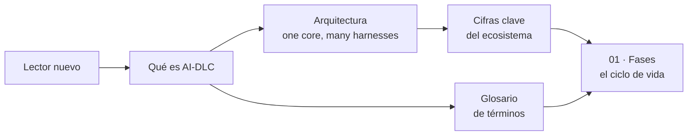

> [Inicio](README) › **Visión**

# 00 · Visión — el qué y el por qué

Esta área responde las preguntas generales antes de bajar al detalle: qué problema resuelve AI-DLC, cómo se organiza su implementación y qué cifras definen su escala. Es el punto de entrada recomendado para cualquier lector; desde aquí se ramifica todo lo demás.

| Página | Qué contiene |
|---|---|
| [Qué es AI-DLC](00-vision/que-es-aidlc) | Definición, los 7 principios, el modelo mob, origen en AWS y comparación conceptual con agile clásico |
| [Arquitectura: one core, many harnesses](00-vision/arquitectura-one-core) | Las tres zonas del repo (core/harness/dist), el build determinista y los 7 harnesses soportados |
| [Cifras clave](00-vision/cifras-clave) | Los 12 números del ecosistema con su significado exacto y de dónde sale cada uno |
| [Glosario](00-vision/glosario) | Terminología oficial del protocolo §9 + vocabulario interno del conductor y del engine |
