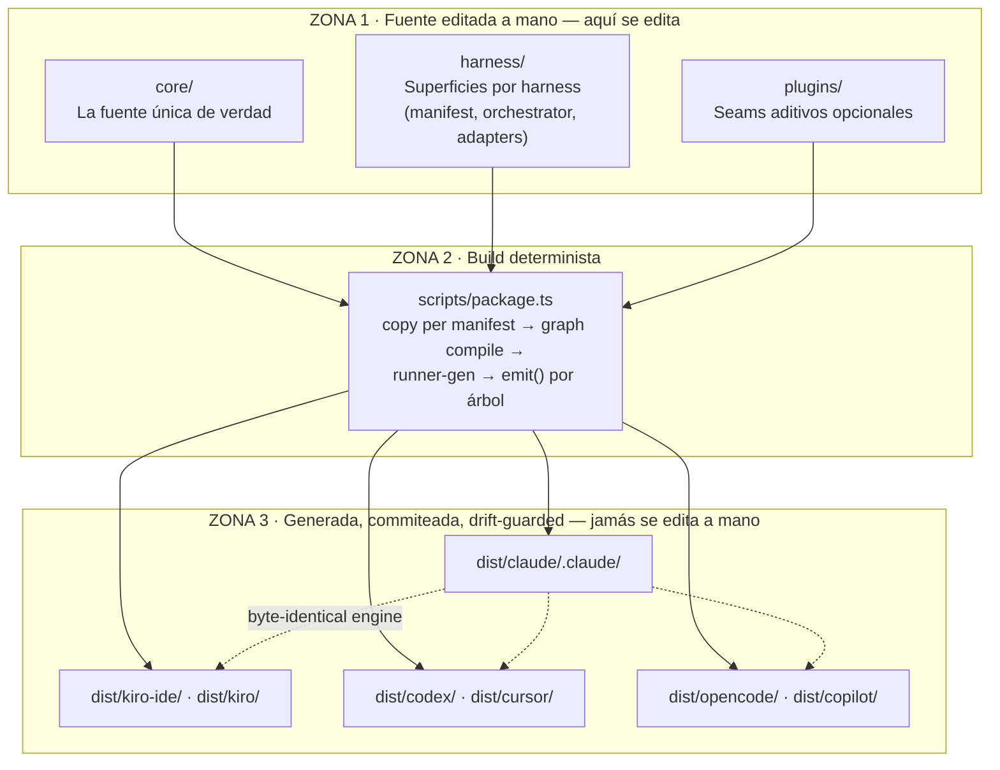
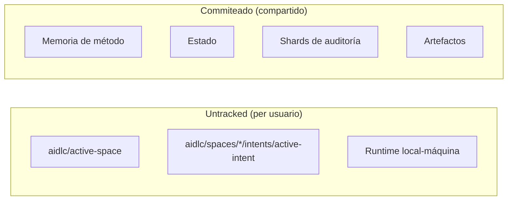
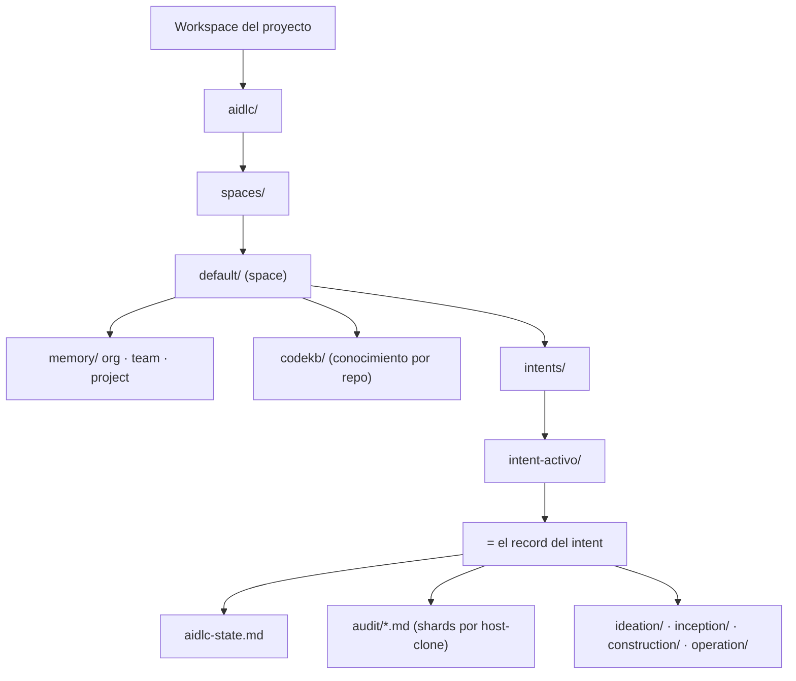

> [Inicio](README) › [Visión](00-vision/README) › **Arquitectura one-core**

# Arquitectura: one core, many harnesses

La decisión arquitectónica central del repo: **la metodología se define una sola vez**, en un `core/` neutral al harness; cada harness agrega una superficie delgada que decide cómo se presenta. Se edita la metodología en un lugar y toda distribución de todo harness se regenera de ahí. Ningún harness recibe trato especial.



## Las tres zonas

| Zona | Rol | Regla |
|---|---|---|
| **`core/`** | Lo que AI-DLC **ES** | Fuente única de verdad: tools, stage protocol + 33 etapas + conductor, 14 agentes, knowledge, memory, scopes, sensors, hooks, skills |
| **`harness/`** | Cómo cada harness **HABLA** | Superficies delgadas por harness: manifest, skill orquestador, settings, adapters de hooks, onboarding |
| **`dist/`** | Lo que los usuarios **COPIAN** | Generada y commiteada; un edit manual a `dist/` es un fallo de CI (drift guard `--check` de paridad de bytes) |

El **engine determinista** (la máquina de estados, el log de auditoría y el referee que coordina agentes paralelos) es **byte-identical en todos los harnesses**; solo cambia la cáscara. La regla de build:

```bash
bun scripts/package.ts            # regenera cada dist/<harness>/ desde core/ + harness/
bun scripts/package.ts <name>     # regenera un solo harness
bun scripts/package.ts --check    # drift guard (byte-parity, corre en CI)
```

## Los 7 harnesses soportados

| Harness | Invocación | Nota distintiva |
|---|---|---|
| **Claude Code** | `/aidlc` | Config de ejemplo en AWS Bedrock; subagents nativos |
| **Kiro IDE** | `/aidlc` | Agentes Markdown + hooks v2 (.json) y legacy (.kiro.hook) |
| **Kiro CLI** (≥ 2.6) | `/aidlc` | Agentes agent-v1 JSON + settings/cli.json con defaultAgent |
| **Codex CLI** (≥ 0.145.0) | `$aidlc` | Requiere git repo; hooks trust; config.toml Bedrock |
| **Cursor** | `/aidlc` | Instalador idempotente `bun dist/cursor/install.ts` |
| **opencode** (≥ 1.17) | `/aidlc` | El engine vive en `.aidlc/` (opencode no lo escanea) |
| **GitHub Copilot** (CLI ≥ 1.0.74 / VS Code ≥ 1.130) | `/aidlc` | Descubre vía `.github/` prefijado aidlc; folder trust |

El requisito compartido: **bun**. Todos los hooks y CLI tools ejecutan TypeScript vía bun, que debe estar en el PATH de shells *no interactivos* (`~/.zshenv` / `~/.bashrc`, no `~/.zshrc`).

## El workspace del usuario: la cáscara `aidlc/`

Cada instalación copia, junto al directorio nativo del harness, una cáscara de workspace `aidlc/` hermana (no anidada). Contiene el árbol de memoria de método pre-construido (`aidlc/spaces/default/memory/`) que el engine lee. Sin él, `/aidlc --doctor` falla su chequeo "workspace shell ready". El split de git es deliberado:



## Espacios, intents y records

- **Space** (`aidlc/spaces/<space>/`): la unidad de método de un equipo. Comprende su memoria (org/team/project), su knowledge y su codekb. Default: `default`; el cursor vive en `aidlc/active-space`.
- **Intent** (`aidlc/spaces/<space>/intents/<intent>/`): una corrida del workflow. Cada `/aidlc <descripción>` crea o reusa un intent; el activo vive en `active-intent`.
- **Record** (el `<record>` de los protocolos): el directorio de artefactos del intent: `<record>/<fase>/<etapa>/*.md`, más `audit/`, `verification/` y `aidlc-state.md`.



## Extendiendo sin romper: plugins y seams

- **Plugins** (`plugins/<name>/`): stages + contribuciones aditivas con su propio ciclo de vida (`/aidlc plugin sync` tras copiar un dist nuevo).
- **Knowledge de equipo** (`aidlc/spaces/<space>/knowledge/`): documentación propia sin tocar el framework.
- **Learnings** (§13): reglas aprendidas que se escriben en la memoria del space y en sensores propios, sin editar los stage files (inmutables por diseño: framework-upgrade-safe).

> La recomendación oficial de modelo: **Claude Opus 4.8**; en modelos más débiles el conductor puede omitir pasos opcionales o acelerar gates.
>
> Siguiente: [Cifras clave](00-vision/cifras-clave) · o ve al [ciclo de vida](01-fases/README).
