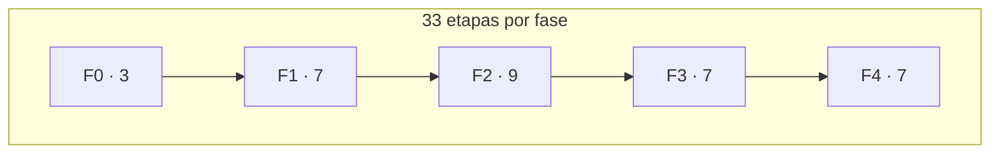
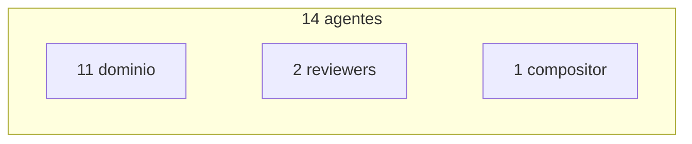

> [Inicio](README) › [Visión](00-vision/README) › **Cifras clave**

# Cifras clave del ecosistema

Cada número de AI-DLC es verificable contra el repo oficial. Aquí se presenta el desglose exacto de cada uno y su significado operativo.

## Los 12 números

| Número | Qué es | Origen | Detalle |
|---|---|---|---|
| **5 fases** | Grupos de nivel superior del ciclo | stage graph compilado | Initialization, Ideation, Inception, Construction, Operation — ver [fases](01-fases/README) |
| **33 etapas** | Pasos discretos con gate | el grafo compilado de etapas (33 slugs numerados 0.1–4.7) | 3 + 7 + 9 + 7 + 7 por fase — ver [índice maestro](02-etapas/README) |
| **14 agentes** | Roster total | el roster de agentes | 11 dominio + 2 review-only + 1 compositor — ver [roster](03-agentes/README) |
| **11 scopes** | Rejillas EXECUTE/SKIP | la rejilla compilada de scopes | enterprise (33/33) → express/poc (8–10) — ver [matriz](05-scopes/README) |
| **3 depths** | Nivel de detalle por etapa | stage-protocol §8 | Minimal / Standard / Comprehensive, sobreescribibles en 3 puntos |
| **8 protocolos** | Contratos de ejecución | el sistema de protocolos | stage-protocol (maestro) + 7 módulos condicionales |
| **91 eventos** | Taxonomía de auditoría | la especificación de auditoría | 22 categorías; cada evento con sus campos y su emisor dueño |
| **6 sensores** | Checks verificables | los sensores declarados | claim-sources, linter, required-sections, traceability, type-check, upstream-coverage |
| **17 hooks** | Refuerzo determinista | los hooks del engine | SessionStart/End, PreToolUse guards, PostToolUse sync, Stop loop |
| **~48 tools** | Motor determinista | las ~48 tools del engine | state, orchestrate, log, audit, swarm, worktree, learnings, plugins… |
| **59 knowledge docs** | Metodología de dos niveles | la base de conocimiento | 51 por agente + 8 shared |
| **7 harnesses** | Superficies generadas | las superficies generadas | Claude, Kiro IDE, Kiro CLI, Codex, Cursor, opencode, Copilot |

## Distribución visual

| Participación de agentes en etapas | Cuenta |
|---|---|
| Etapas **inline** (corren en la sesión) | 29 de 33 |
| Etapas **subagent** (hub-and-spoke) | 2: practices-discovery, code-generation |
| Etapas **pipeline** (cadena) | 1: reverse-engineering |
| Etapas **mob** (mesh por rondas) | 1: user-stories |

| Alcance de scopes | Cuenta |
|---|---|
| Ejecutan las 33 | enterprise, feature |
| Ciclo sin ideation (26) | classic, workshop |
| Core sin operation (23) | mvp |
| Incrementales (8–10) | poc, express, bugfix, refactor, security-patch |
| Trasera del grafo (13) | infra |

## ¿Por qué importan estas cifras?

- **33 con gates**: cada etapa dispone de contrato de entrada (consumes), de salida (produces) y de verificación (sensors + reviewer + gate). Esa densidad de contrato constituye el diseño.
- **91 eventos**: trazabilidad auditable. Cada lifecycle, gate, pregunta, review, swarm y merge dispone de un evento con emisor determinista, incluido el `HUMAN_TURN` que prueba presencia humana.
- **29/2/1/1 topologías**: el default es conversación (inline); las topologías despachadas se reservan para donde el paralelismo o la independencia aportan valor (prácticas con voces a ciegas, código por unidades, síntesis RE, elaboración de stories).
- **11 scopes**: adaptatividad. De 33/33 (enterprise, regulado) a 8/33 (poc, desechable) con la misma estructura base y los mismos artefactos.

> Siguiente: [Glosario](00-vision/glosario) · [Fases del ciclo](01-fases/README)
