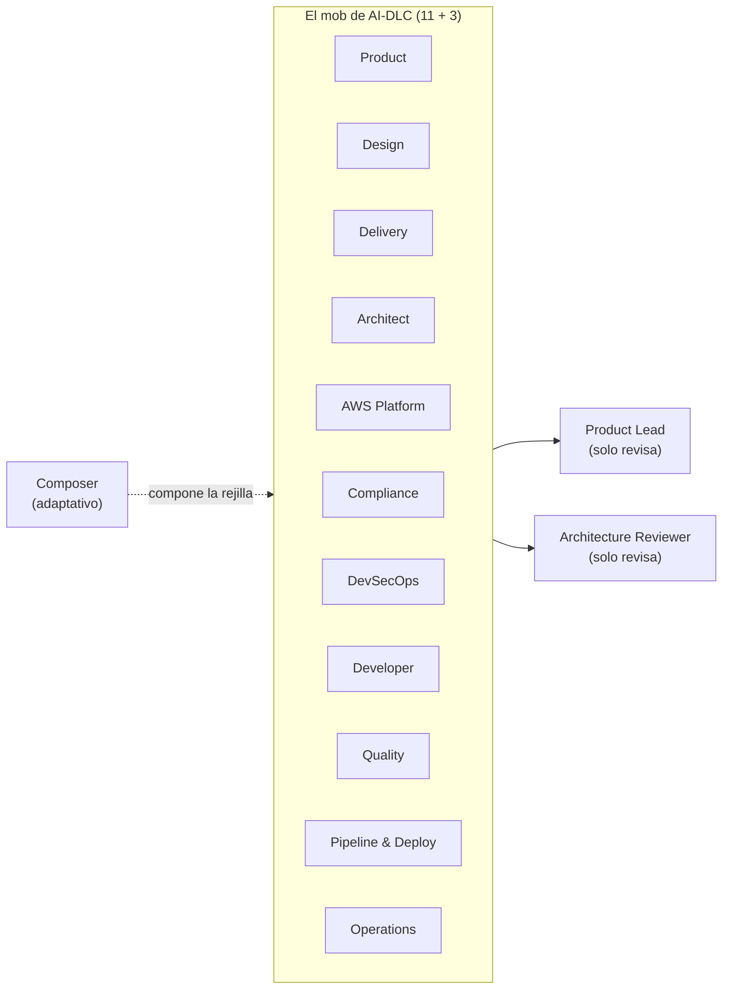

> [Inicio](README) › [Visión](00-vision/README) › **Qué es AI-DLC**

# Qué es AI-DLC

**AI-DLC (AI-Driven Development Life Cycle)** es una metodología de AWS para desarrollar software **con agentes de IA como ejecutores y humanos como aprobadores**. Constituye un ciclo de vida completo, con fases, etapas, gates de aprobación explícitos, artefactos versionados, auditoría estructurada y un bucle de aprendizaje que convierte las correcciones humanas en reglas persistentes.

La formulación del repo oficial: *"turns AI agents into verifiable, self-correcting engineering workflows"*, que convierte agentes de IA en workflows de ingeniería **verificables y auto-correctivos**, ejecutando un ciclo completo de desarrollo con un roster de 14 agentes y 33 etapas, **con el humano aprobando cada gate**.

## El problema que resuelve

El desarrollo asistido por IA sin estructura produce tres patologías: salidas sin trazabilidad (nadie sabe por qué se decidió algo), drift de calidad (el agente "confirma" su propio trabajo) y pérdida de conocimiento (las correcciones humanas viven solo en el chat y se evaporan). AI-DLC aborda las tres mediante diseño:

1. **Trazabilidad**: cada etapa produce artefactos markdown versionados bajo un record por intent; cada FR (requisito) traza a user stories, reglas de negocio, unidades y tests vía IDs estables (`FR1.2 → US1.3 → AC1.3.2 → U1 → BR1.1`).
2. **Verificación real**: agentes review-only que **refutan en vez de confirmar** (el veredicto READY solo existe si el reviewer falló en romper el artefacto), más sensores deterministas que se ejecutan en los gates.
3. **Memoria**: las correcciones del humano se capturan en el *learnings ritual* de cada etapa y se escriben como reglas en la memoria de método (`org.md` / `team.md` / `project.md`). La próxima corrida las carga automáticamente.

## Los 7 principios

| # | Principio | En la práctica |
|---|---|---|
| 1 | **User decides, AI executes** | Cada decisión material pasa por un approval gate; HARD STOP: el conductor termina su turno y espera |
| 2 | **Adaptive depth** | Los scopes saltan etapas; el depth calibra el detalle: un bugfix no corre ceremonia enterprise |
| 3 | **Traceable artifacts** | Todo es markdown versionado en el record del intent — la decisión ES el documento |
| 4 | **Multi-role expertise** | Personas de dominio por etapa: el architect diseña, el quality verifica, el reviewer desafía |
| 5 | **No emergent behavior** | Menús estandarizados de 2 opciones; prohibido inventar navegación; protocolo estricto |
| 6 | **Questions before assumptions** | Ante la duda se pregunta; el archivo de preguntas con `[Answer]:` es la fuente de verdad |
| 7 | **Contradiction detection** | Cross-check obligatorio de respuestas: scope vs riesgo, tecnología vs requisito |

## Diseño: small mob, broad agents

AI-DLC está construido sobre el **modelo mob**, un grupo pequeño multifuncional que avanza de forma conjunta. Los 11 agentes de dominio lo replican: en vez de decenas de especialistas estrechos (que recrean cadenas de handoff tipo waterfall), cada agente es **ampliamente capaz** y participa en múltiples etapas y fases, como lo haría un architect o un developer real en una sesión mob. Cada agente carga contexto a través de las etapas porque está presente en todo el ciclo: eso elimina handoffs, reduce el costo de coordinación y mantiene el proceso ágil.

## Metodología vs implementación

AI-DLC es **una metodología**, un enfoque estructurado y con gates para el desarrollo dirigido por IA, definida por AWS (blog + paper del método). **Este repositorio es su implementación nativa multi-harness**: la metodología renderizada como skills, agentes, hooks y herramientas a partir de un `core/` neutral al harness, de modo que se ejecuta de forma nativa dentro de Claude Code, Kiro IDE/CLI, Codex CLI, Cursor, opencode o GitHub Copilot. La metodología es el *qué*; cada harness agrega el *cómo* para un runtime, y toda distribución se genera de la misma fuente. Ver [arquitectura one-core](00-vision/arquitectura-one-core).

## Ejemplo de ejecución

1. El usuario invoca `/aidlc <descripción>` en su harness.
2. El engine determinista (tools TS) inicializa workspace y estado; detecta o compone el scope (rejilla de etapas).
3. El conductor (persona del orquestador) recibe directivas: una por etapa. Ejecuta la etapa, reporta y recibe la siguiente.
4. Cada etapa: preguntas → artefactos → reviewer (si declarado) → learnings → **gate humano** (Approve / Request Changes).
5. Construction puede pasar a autonomía tras el walking skeleton (ladder prompt), pero los fallos siempre detienen y preguntan.
6. Operation despliega y observa; el feedback cierra el ciclo y alimenta el siguiente intent.

> Siguiente lectura recomendada: [Arquitectura: one core, many harnesses](00-vision/arquitectura-one-core) o, como alternativa centrada en el ciclo, [las 5 fases](01-fases/README).
