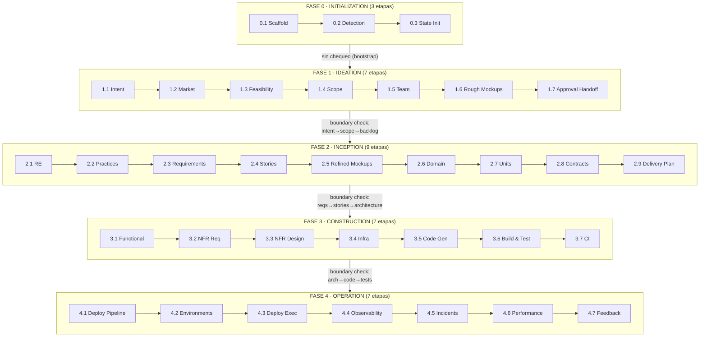

> [Inicio](README) › **Fases**

# 01 · Las 5 fases del ciclo de vida

AI-DLC organiza las 33 etapas en **cinco fases** con propósito y outcome propios. Cada fase termina en una **verificación de frontera** (governance) que valida la trazabilidad antes de pasar a la siguiente, salvo Initialization→Ideation, sin chequeo por tratarse de bootstrap.

## Tabla maestra

| Fase | Propósito | Outcome clave | Etapas | Siempre in-scope |
|---|---|---|---|---|
| [0 · Inicialización](01-fases/fase-0-inicializacion) | Bootstrap: scaffold, detección, estado | Workspace configurado y listo | 3 | 0.1 0.2 0.3 (en todos los scopes) |
| [1 · Ideation](01-fases/fase-1-ideacion) | Validar la iniciativa | Initiative brief aprobado | 7 | 1.1, 1.4, 1.7 |
| [2 · Inception](01-fases/fase-2-inception) | Elaborar el plan | Plan de ejecución detallado | 9 | 2.3, 2.7, 2.9 |
| [3 · Construction](01-fases/fase-3-construccion) | Construir | Código funcionando y testeado | 7 | 3.5, 3.6 |
| [4 · Operation](01-fases/fase-4-operacion) | Desplegar y operar | Sistema en producción con monitoreo | 7 | (condicionales según scope) |

## Las tres fronteras de gobernanza

| Frontera | Transición | Qué se verifica |
|---|---|---|
| Ideation → Inception | approval-handoff → reverse-engineering | Intent capturado, scope definido, viabilidad confirmada, iniciativa aprobada |
| Inception → Construction | delivery-planning → functional-design | Toda story traza a requisito, la arquitectura cubre todas las stories, units definidas, plan aprobado |
| Construction → Operation | ci-pipeline → deployment-pipeline | Todas las units built+tested, CI configurado, infra diseñada |

Cada frontera produce `<record>/verification/[fase]-verification.md` y emite `PHASE_VERIFIED`. Ver el [protocolo de governance](04-protocolos/protocolo-governance).

## Guardrails por fase

Cada fase tiene su archivo de reglas en la memoria de método (`memory/phases/<fase>.md`), que las etapas importan automáticamente. Por ejemplo, inception exige: requisitos testeables (sin admitir "fast" sin umbral), ADRs con ≥2 alternativas, stories Given/When/Then, y prohibición de introducir requisitos sin documentar su origen.

## El pipeline según tu scope

Las 33 etapas constituyen el grafo completo; el scope recorta la rejilla. `enterprise` y `feature` ejecutan la totalidad; `classic`/`workshop` saltan ideation; `mvp` además salta operation; los incrementales (bugfix, refactor, security-patch, poc, express) recortan al mínimo. Ver la [matriz de scopes](05-scopes/README).
