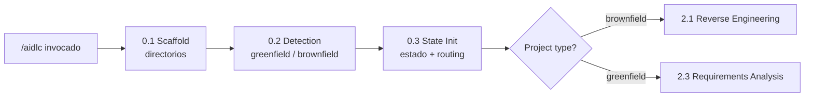

> [Inicio](README) › [Fases](01-fases/README) › **Fase 0 · Inicialización**

# Fase 0 · Inicialización (Initialization)

**Propósito:** bootstrap: preparar workspace, clasificar el proyecto y crear el estado. **Outcome:** un workspace configurado, clasificado y con el estado del workflow listo para el primer `/aidlc`.

## Por qué existe

Todo lo que viene después escribe en directorios y lee de un estado; esta fase garantiza que ambos existan antes de que cualquier agente requiera utilizarlos. Es deliberadamente simple y determinista, sin preguntas ni gates ni ambigüedad, y constituye el terreno donde se apoya el resto.

## Las 3 etapas

| # | Etapa | Ejecución | Qué hace |
|---|---|---|---|
| 0.1 | [Workspace Scaffold](02-etapas/initialization/workspace-scaffold) | ALWAYS | Crea (idempotente) los directorios del record por fase en-scope + verification/ |
| 0.2 | [Workspace Detection](02-etapas/initialization/workspace-detection) | ALWAYS | Escanea y clasifica: greenfield vs brownfield; stack tecnológico |
| 0.3 | [State Init](02-etapas/initialization/state-init) | ALWAYS | Crea `aidlc-state.md` completo + determina el routing inicial |

## Particularidades de la fase

- **Las 3 etapas auto-proceden**: son las únicas del ciclo sin gate de aprobación (§1 del stage protocol). El engine audita (`WORKSPACE_SCAFFOLDED`, `WORKSPACE_SCANNED`, `WORKSPACE_INITIALISED`) y avanza.
- **Están en los 11 scopes**: cualquier corrida, del enterprise al bugfix, pasa por aquí. Ningún scope las salta.
- **La clasificación de 0.2 es la decisión de enrutamiento**: un brownfield necesita entender el código heredado antes de diseñar (entra por 2.1); un greenfield diseña desde cero (entra por 2.3).
- **La descripción del proyecto se preserva sin alteraciones**: 0.3 la persiste como JSON exacto (`project-description.json`); las etapas siguientes la leen con un comando fijo y jamás la reconstruyen de otras fuentes. Ese contrato elimina la deriva sobre lo solicitado por el usuario.
- El routing de state-init (brownfield → 2.1) explica por qué `infra` es el único scope donde 2.1 es SKIP: los cambios de infra parten de la topología de despliegue, no del código de aplicación.

## Estado tras la fase

`aidlc-state.md` nace completo: Project Information (con descripción y tipo), Scope Configuration (etapas a ejecutar/saltar, depth, test strategy), Workspace State (lenguajes/frameworks/build), Phase Progress, los 33 checkboxes del scope, Current Status = READY. El primer `next` directive del engine ya tiene todo lo que necesita.
