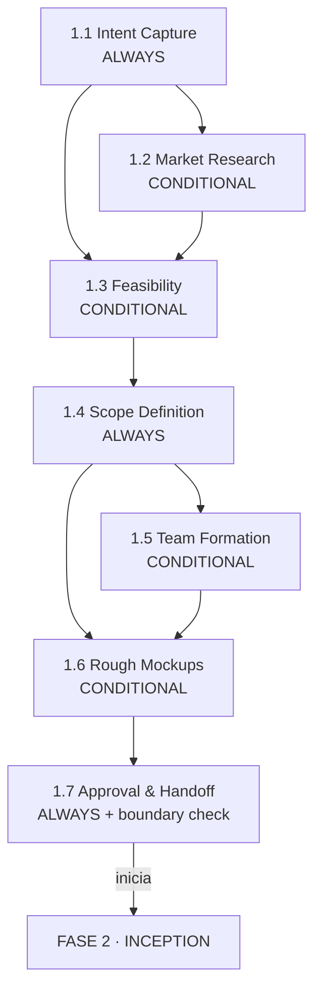

> [Inicio](README) › [Fases](01-fases/README) › **Fase 1 · Ideation**

# Fase 1 · Ideation

**Propósito:** validar la iniciativa. Capturar el intent, investigar el mercado, evaluar viabilidad, definir el scope de negocio, formar el equipo y bosquejar la UX. **Outcome:** el **initiative brief** aprobado que abre Inception.

## De lo general a lo particular

La fase se inicia con una idea libre y la precisa de forma progresiva: el intent se encuadra (1.1), se contrasta con el mercado (1.2), se somete a viabilidad técnica y regulatoria (1.3), se recorta a un scope priorizado (1.4), se dota de equipo (1.5), se visualiza (1.6) y se compila todo en el brief que el humano aprueba (1.7). Cada etapa consume las anteriores y las questions files detectan contradicciones antes de que se conviertan en diseño.

## Las 7 etapas

| # | Etapa | Ejec. | Lead | Produce |
|---|---|---|---|---|
| 1.1 | [Intent Capture](02-etapas/ideation/intent-capture) | ALWAYS | Product | intent-statement, stakeholder-map |
| 1.2 | [Market Research](02-etapas/ideation/market-research) | COND | Product | competitive-analysis, market-trends, build-vs-buy |
| 1.3 | [Feasibility](02-etapas/ideation/feasibility) | COND | Architect | feasibility-assessment, constraint-register, raid-log |
| 1.4 | [Scope Definition](02-etapas/ideation/scope-definition) | ALWAYS | Product | scope-document, intent-backlog |
| 1.5 | [Team Formation](02-etapas/ideation/team-formation) | COND | Delivery | team-assessment, skill-matrix, mob-composition |
| 1.6 | [Rough Mockups](02-etapas/ideation/rough-mockups) | COND | Design | wireframes, user-flow |
| 1.7 | [Approval & Handoff](02-etapas/ideation/approval-handoff) | ALWAYS | Delivery | initiative-brief, decision-log |

## Particularidades de la fase

- **Es la fase con más preguntas** del ciclo: business/estratégicas ("¿por qué?", "¿para quién?", "¿qué mercado?"). El protocolo reduce su número por fase; ideation concentra la mayor interacción humana.
- **Es la fase más recortada por scopes**: `classic` y `workshop` la saltan entera (26/33); `mvp` le recorta la ceremonia (sin 1.2/1.5/1.7); `poc`/`express`/incrementales solo conservan 1.1 o nada.
- **Gates de 3 opciones permitidos**: junto con inception, es la única fase donde un gate puede ofrecer 3ª opción (recuperar una etapa saltada). Construction/Operation son estrictamente 2 opciones.
- **1.3 es el primer multi-agente**: Architect lead con AWS Platform y Compliance como voces inline. Así se evalúa infra y regulación en el mismo análisis.
- **1.7 es un gate de iniciativa, no de artefacto**: se aprueba el paquete completo; la aprobación dispara la transición de fase auditable.

## Boundary check (governance)

Al final de 1.7 corren los checks de trazabilidad de la frontera: **Intent → Scope → Intent Backlog consistency** y **todo scope item con respaldo de viabilidad**. Resultado a `<record>/verification/`, evento `PHASE_VERIFIED`. Ver [protocolo de governance](04-protocolos/protocolo-governance).

## Guardrails de la fase (memory/phases/ideation.md)

El archivo de reglas de ideation exige: alinear el scope con el intent (sin features coladas), documentar supuestos como supuestos (no como hechos), y que las preguntas de viabilidad cubran regulación e integraciones ANTES de comprometer el scope.
