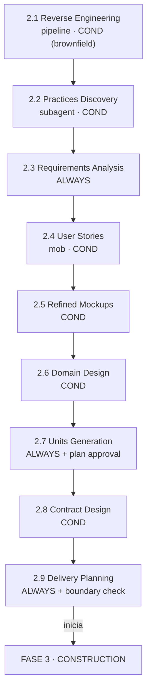

> [Inicio](README) › [Fases](01-fases/README) › **Fase 2 · Inception**

# Fase 2 · Inception

**Propósito:** elaborar. Convertir la iniciativa aprobada en un plan de ejecución detallado: requisitos, historias, diseño de dominio, unidades, contratos y plan de entrega. **Outcome:** el plan detallado que Construction ejecuta.

## La fase más densa del ciclo

Nueve etapas que van de entender lo existente (RE) a fijar cómo se va a construir (delivery plan). Esta fase incluye el único **pipeline** del grafo (2.1), el único **mob** (2.4), y la mitad de la trazabilidad total del ciclo: los IDs estables `FR`/`US`/`AC`/`U`/`BR` se generan aquí y se propagan hasta los tests.

## Las 9 etapas

| # | Etapa | Ejec. | Lead | Topología | Produce |
|---|---|---|---|---|---|
| 2.1 | [Reverse Engineering](02-etapas/inception/reverse-engineering) | COND | Developer | **pipeline** | 9 CodeKB artifacts por repo |
| 2.2 | [Practices Discovery](02-etapas/inception/practices-discovery) | COND | Pipeline & Deploy | **subagent** | team-practices → team.md |
| 2.3 | [Requirements Analysis](02-etapas/inception/requirements-analysis) | ALWAYS | Product | inline | requirements (FR/NFR) |
| 2.4 | [User Stories](02-etapas/inception/user-stories) | COND | Product | **mob** | stories, personas, traceability |
| 2.5 | [Refined Mockups](02-etapas/inception/refined-mockups) | COND | Design | inline | mockups, interaction-spec |
| 2.6 | [Domain Design](02-etapas/inception/domain-design) | COND | Architect | inline | components, ADRs |
| 2.7 | [Units Generation](02-etapas/inception/units-generation) | ALWAYS | Architect | inline | unit-of-work + DAG |
| 2.8 | [Contract Design](02-etapas/inception/contract-design) | COND | Architect | inline | contract-summary |
| 2.9 | [Delivery Planning](02-etapas/inception/delivery-planning) | ALWAYS | Delivery | inline | bolt-plan, team-allocation |

## Los tres hitos estructurales

1. **CodeKB (2.1)**: el conocimiento del código existente se materializa en 9 artefactos por repo, reutilizables entre intents del space, con guard de frescura (scope-diff) para no re-escanear lo vigente.
2. **El DAG de unidades (2.7)**: la decisión que gobierna Construction. Define qué se construye en paralelo, qué depende de qué y qué historia pertenece a qué unidad, y dispone de plan approval propio antes de la generación.
3. **El plan de entrega (2.9)**: Bolts con Definition of Done y confidence hypothesis ("¿qué valida enviar esto?"), más el boundary check que abre Construction.

## Particularidades

- **Inception consume la totalidad de ideation y CodeKB**: las questions files heredan respuestas previas; el protocolo prohíbe re-preguntar lo ya respondido (chequeo recursivo de `*-questions.md` y audit).
- **Prácticas antes que requisitos formales (2.2 → 2.3)**: conocer cómo trabaja el equipo (metodología de tests, branching, gates) calibra cómo se escriben los requisitos y el plan.
- **El mob de 2.4 concentra la colaboración**: Product redacta; Design, Developer y Quality revisan el borrador en paralelo; el triage de objeciones separa juicio (→ humano) de disputa de conocimiento (→ ronda 2 con objetores).
- **Preguntas moderadas**: diseño/arquitectura ("¿qué requisitos?", "¿qué patrones?"). Menos que ideation y más que construction.

## Boundary check (governance)

En 2.9: **Requirements → Stories → Architecture alignment**. Toda story traza a requisito y la arquitectura cubre todas las stories. Evento `PHASE_VERIFIED` + archivo en `verification/`.

## Guardrails de la fase (memory/phases/inception.md)

Requisitos testeables (pas/fail claro, sin "fast/easy/user-friendly" sin umbral); ADRs con ≥2 alternativas y Alternatives Rejected; stories Given/When/Then; ninguna new requirement sin origen documentado.
