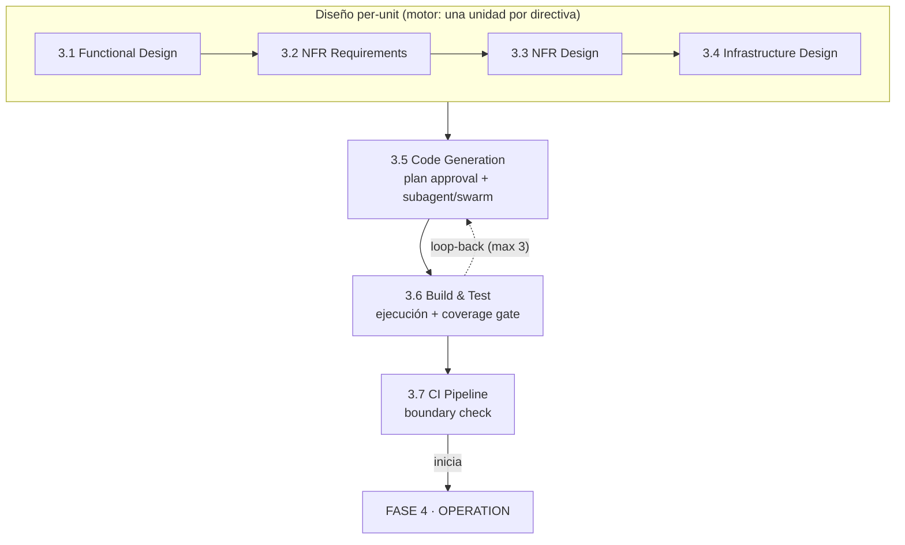

> [Inicio](README) › [Fases](01-fases/README) › **Fase 3 · Construction**

# Fase 3 · Construction

**Propósito:** construir. Diseñar por unidad, generar código, probar y montar CI. **Outcome:** código funcionando, testeado, con cobertura trazada a requisitos y pipeline de integración.

## La fase con más maquinaria

Construction es donde AI-DLC se diferencia del prompting sin estructura. Cuatro etapas de diseño per-unit preceden al código; la generación tiene **plan approval protegido** con contrato de testing; el build/test ejecuta la suite y el coverage gate; y todo el andamiaje de autonomía (walking skeleton, ladder, swarm, worktrees, loop-back de fallos) se concentra aquí.

## Las 7 etapas

| # | Etapa | Ejec. | Lead | Nota distintiva |
|---|---|---|---|---|
| 3.1 | [Functional Design](02-etapas/construction/functional-design) | COND | Architect | entities/rules/functional-spec por unidad |
| 3.2 | [NFR Requirements](02-etapas/construction/nfr-requirements) | COND | Architect | targets medibles + tech stack |
| 3.3 | [NFR Design](02-etapas/construction/nfr-design) | COND | Architect | patrones: caching, circuit breakers, zero trust |
| 3.4 | [Infrastructure Design](02-etapas/construction/infrastructure-design) | COND | AWS Platform | deployment + servicios + monitoring |
| 3.5 | [Code Generation](02-etapas/construction/code-generation) | ALWAYS | Developer | plan approval, testing contract, source-manifest |
| 3.6 | [Build & Test](02-etapas/construction/build-and-test) | ALWAYS | Quality | ejecución real + coverage gate FR/NFR/AC |
| 3.7 | [CI Pipeline](02-etapas/construction/ci-pipeline) | COND | Pipeline & Deploy | quality gates + boundary check a Operation |

## La iteración per-unit (engine-driven)

Las cuatro etapas de diseño (3.1–3.4) y 3.5 son **per-unit**: el engine emite una directiva por unidad en orden de build del DAG; el gate por unidad se suprime (`gate: false`) y una única gate de stage al final cubre todas. Report-approve se niega mientras quede alguna unidad sin settle. Tres modos de walk:

| Modo | Cómo recorre | Gates |
|---|---|---|
| **stage-major** (default) | Un stage para TODAS las units, luego el siguiente | Late cascade: una gate por stage al final del grid |
| **unit-major** (opt-in) | Una unit cruza TODOS sus stages, luego la siguiente | Mismo número de gates, en cascada al final del bloque |
| **swarm autónomo** (3.5) | Worktrees aislados por unit, fan-out paralelo | Settle gate único tras converger (auto-aprobada bajo autonomía) |

## Las cinco ceremonias de Construction

1. **Walking skeleton**: el primer slice end-to-end más delgado; siempre gated e interactivo (decisión de stance: org → team → project).
2. **Ladder prompt**: única pregunta tras el skeleton: ¿continuar autónomo o gate por stage? Queda como `Construction Autonomy Mode` (evento `AUTONOMY_MODE_SET`).
3. **Halt-and-ask**: cualquier fallo de code generation DETIENE todo (retry/skip/abort) sin importar el modo de autonomía.
4. **Loop-back 3.6→3.5**: si Build & Test diagnostica root cause en el código generado, se salta atrás con fix planificado (max 3 por intent, ledger append-only).
5. **Unit lifecycle receipts**: `unit start/complete/pause/resume` con verificación de artefactos en disco: un Unit pausado hard-stopa el loop hasta resume explícito.

## Review adversarial

Todas las etapas de construction incluyen reviewer **Architecture Reviewer en modo adversarial** (excepto 3.6/3.7 sin reviewer declarado): refute-and-repair, hasta `reviewer_max_iterations` (2 por defecto), findings anclados a evidencia. El per-unit review tiene **read-scope bloqueado** (hook reviewer-scope): no puede leer unidades hermanas salvo integration points explícitos.

## Boundary check (governance)

En 3.7: **Architecture → Code → Tests**. Todo código traza a diseño, con cobertura contra acceptance criteria. `PHASE_VERIFIED` + archivo en `verification/`.

## Guardrails de la fase (memory/phases/construction.md)

El testing posture se afirma en team.md (2.2) y se resuelve en cada plan de 3.5 (Methodology + Ordering independientes); Build & Test verifica los floors definidos, sin debilitarlos para que un step pase; brownfield: baseline de tests antes de cambiar, diff preview, blast radius.
