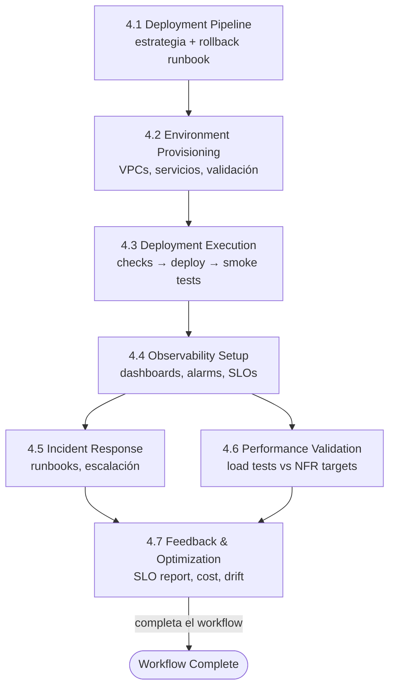

> [Inicio](README) › [Fases](01-fases/README) › **Fase 4 · Operation**

# Fase 4 · Operation

**Propósito:** desplegar y operar. Pipelines de CD, entornos, despliegue real, observabilidad, incidentes, validación de performance y feedback. **Outcome:** sistema en producción con monitoreo, runbooks y lazo de retroalimentación.

## La fase del SRE

Todas las etapas son CONDITIONAL y se auto-seleccionan del contexto operativo: si no hay pipeline que configurar, se omite; si no hay nada que desplegar, se omite. Pero cuando el scope las incluye, la fase se ejecuta en su totalidad: desplegar (4.1–4.3), observar (4.4–4.5), validar (4.6) y aprender (4.7).

## Las 7 etapas

| # | Etapa | Lead | Produce |
|---|---|---|---|
| 4.1 | [Deployment Pipeline](02-etapas/operation/deployment-pipeline) | Pipeline & Deploy | cd-config, deployment-strategy, rollback-runbook |
| 4.2 | [Environment Provisioning](02-etapas/operation/environment-provisioning) | AWS Platform | environment-inventory, validation-report |
| 4.3 | [Deployment Execution](02-etapas/operation/deployment-execution) | Pipeline & Deploy | deployment-log, smoke-test-results, health-check |
| 4.4 | [Observability Setup](02-etapas/operation/observability-setup) | Operations | dashboards, alarms, slo-config, tracing |
| 4.5 | [Incident Response](02-etapas/operation/incident-response) | Operations | runbooks, incident-plan, escalation-matrix |
| 4.6 | [Performance Validation](02-etapas/operation/performance-validation) | Quality | load-test-results, nfr-validation-matrix |
| 4.7 | [Feedback & Optimization](02-etapas/operation/feedback-optimization) | Operations | slo-report, cost-analysis, drift-report |

## Particularidades

- **Gates estrictos de 2 opciones** (Approve / Request Changes): en Construction y Operation está prohibido el menú de 3 opciones. Cero navegación emergente.
- **4.3 implica ejecución real**: pre-checks (migraciones probadas, rollback listo), despliegue según estrategia (blue/green, canary, rolling), smoke tests y health checks post-deploy. El brownfield safeguard exige rollback documentado antes.
- **4.7 cierra el ciclo**: el drift report compara lo desplegado con el repo; el feedback-loop lista aprendizajes accionables que alimentan futuros intents. El ciclo de vida completo se repite por intent.
- **Es la fase con mayor recorte**: `mvp`, `poc`, `bugfix` (parcial), `refactor`, `security-patch` la saltan total o parcialmente. `express` conserva 4.1/4.3/4.4 mínimos. `classic`, `workshop`, `infra`, `feature`, `enterprise` la ejecutan.
- **Preguntas ocasionales y dirigidas**: solo parámetros operativos no establecidos antes (umbrales de alarma, percentiles objetivo, rotaciones on-call).

## Sin boundary check final

Operation no tiene transición saliente: la aprobación de la última etapa in-scope dispara `Workflow Complete`. El engine completa el estado y emite las filas de auditoría de cierre de fase y workflow. La frontera efectiva es el siguiente intent, que hereda memory, rules y CodeKB del space.
