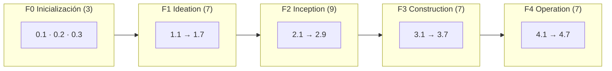

> [Inicio](README) › [Fases](01-fases/README) › **Las 33 etapas**

# Las 33 etapas — índice maestro

Cada etapa tiene su ficha atómica: metadatos, posición en el flujo, paso a paso, artefactos, agentes, topología, mecánica de gate, sensores y scopes.

## Fase 0 · Inicialización

| # | Etapa | Ejecución | Modo | Lead | Reviewer |
|---|---|---|---|---|---|
| **0.1** | [Workspace Scaffold](02-etapas/initialization/workspace-scaffold) | ALWAYS | inline | `orchestrator` | — |
| **0.2** | [Workspace Detection](02-etapas/initialization/workspace-detection) | ALWAYS | inline | `orchestrator` | — |
| **0.3** | [State Init](02-etapas/initialization/state-init) | ALWAYS | inline | `orchestrator` | — |

## Fase 1 · Ideation

| # | Etapa | Ejecución | Modo | Lead | Reviewer |
|---|---|---|---|---|---|
| **1.1** | [Intent Capture & Framing](02-etapas/ideation/intent-capture) | ALWAYS | inline | `product` | `product-lead-agent` (advisory) |
| **1.2** | [Market Research](02-etapas/ideation/market-research) | CONDITIONAL | inline | `product` | — |
| **1.3** | [Feasibility & Constraint Analysis](02-etapas/ideation/feasibility) | CONDITIONAL | inline | `architect` | — |
| **1.4** | [Scope Definition](02-etapas/ideation/scope-definition) | ALWAYS | inline | `product` | — |
| **1.5** | [Team Formation](02-etapas/ideation/team-formation) | CONDITIONAL | inline | `delivery` | — |
| **1.6** | [Rough Mockups](02-etapas/ideation/rough-mockups) | CONDITIONAL | inline | `design` | `product-lead-agent` (advisory) |
| **1.7** | [Initiative Approval & Handoff](02-etapas/ideation/approval-handoff) | ALWAYS | inline | `delivery` | — |

## Fase 2 · Inception

| # | Etapa | Ejecución | Modo | Lead | Reviewer |
|---|---|---|---|---|---|
| **2.1** | [Reverse Engineering](02-etapas/inception/reverse-engineering) | CONDITIONAL | pipeline | `developer` | — |
| **2.2** | [Practices Discovery](02-etapas/inception/practices-discovery) | CONDITIONAL | subagent | `pipeline-deploy` | — |
| **2.3** | [Requirements Analysis](02-etapas/inception/requirements-analysis) | ALWAYS | inline | `product` | `product-lead-agent` (advisory) |
| **2.4** | [User Stories](02-etapas/inception/user-stories) | CONDITIONAL | mob | `product` | `product-lead-agent` (advisory) |
| **2.5** | [Refined Mockups](02-etapas/inception/refined-mockups) | CONDITIONAL | inline | `design` | `product-lead-agent` (advisory) |
| **2.6** | [Domain Design](02-etapas/inception/domain-design) | CONDITIONAL | inline | `architect` | `architecture-reviewer-agent` (advisory) |
| **2.7** | [Units Generation](02-etapas/inception/units-generation) | ALWAYS | inline | `architect` | `architecture-reviewer-agent` (advisory) |
| **2.8** | [Contract Design](02-etapas/inception/contract-design) | CONDITIONAL | inline | `architect` | `architecture-reviewer-agent` (advisory) |
| **2.9** | [Delivery Planning](02-etapas/inception/delivery-planning) | ALWAYS | inline | `delivery` | — |

## Fase 3 · Construction

| # | Etapa | Ejecución | Modo | Lead | Reviewer |
|---|---|---|---|---|---|
| **3.1** | [Functional Design](02-etapas/construction/functional-design) | CONDITIONAL | inline | `architect` | `architecture-reviewer-agent` (adversarial) |
| **3.2** | [NFR Requirements](02-etapas/construction/nfr-requirements) | CONDITIONAL | inline | `architect` | `architecture-reviewer-agent` (adversarial) |
| **3.3** | [NFR Design](02-etapas/construction/nfr-design) | CONDITIONAL | inline | `architect` | `architecture-reviewer-agent` (adversarial) |
| **3.4** | [Infrastructure Design](02-etapas/construction/infrastructure-design) | CONDITIONAL | inline | `aws-platform` | `architecture-reviewer-agent` (adversarial) |
| **3.5** | [Code Generation](02-etapas/construction/code-generation) | ALWAYS | subagent | `developer` | `architecture-reviewer-agent` (adversarial) |
| **3.6** | [Build & Test](02-etapas/construction/build-and-test) | ALWAYS | inline | `quality` | — |
| **3.7** | [CI Pipeline](02-etapas/construction/ci-pipeline) | CONDITIONAL | inline | `pipeline-deploy` | — |

## Fase 4 · Operation

| # | Etapa | Ejecución | Modo | Lead | Reviewer |
|---|---|---|---|---|---|
| **4.1** | [Deployment Pipeline](02-etapas/operation/deployment-pipeline) | CONDITIONAL | inline | `pipeline-deploy` | — |
| **4.2** | [Environment Provisioning](02-etapas/operation/environment-provisioning) | CONDITIONAL | inline | `aws-platform` | — |
| **4.3** | [Deployment Execution](02-etapas/operation/deployment-execution) | CONDITIONAL | inline | `pipeline-deploy` | — |
| **4.4** | [Observability Setup](02-etapas/operation/observability-setup) | CONDITIONAL | inline | `operations` | — |
| **4.5** | [Incident Response](02-etapas/operation/incident-response) | CONDITIONAL | inline | `operations` | — |
| **4.6** | [Performance Validation](02-etapas/operation/performance-validation) | CONDITIONAL | inline | `quality` | — |
| **4.7** | [Feedback & Optimization](02-etapas/operation/feedback-optimization) | CONDITIONAL | inline | `operations` | — |

## Cómo leer una ficha de etapa

Cada ficha sigue la misma estructura de seis bloques, de lo general a lo particular: (1) **ficha de metadatos**: el frontmatter exacto del archivo de etapa; (2) **qué hace**: propósito y mecánica; (3) **posición en el flujo**: vecinos y condición; (4) **paso a paso**: los Steps reales del archivo; (5) **artefactos, agentes, topología y gate**: la mecánica de ejecución; (6) **sensores y scopes**: verificación y en qué rejillas corre.
