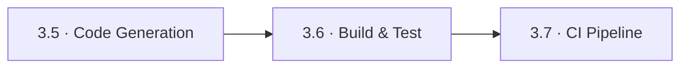
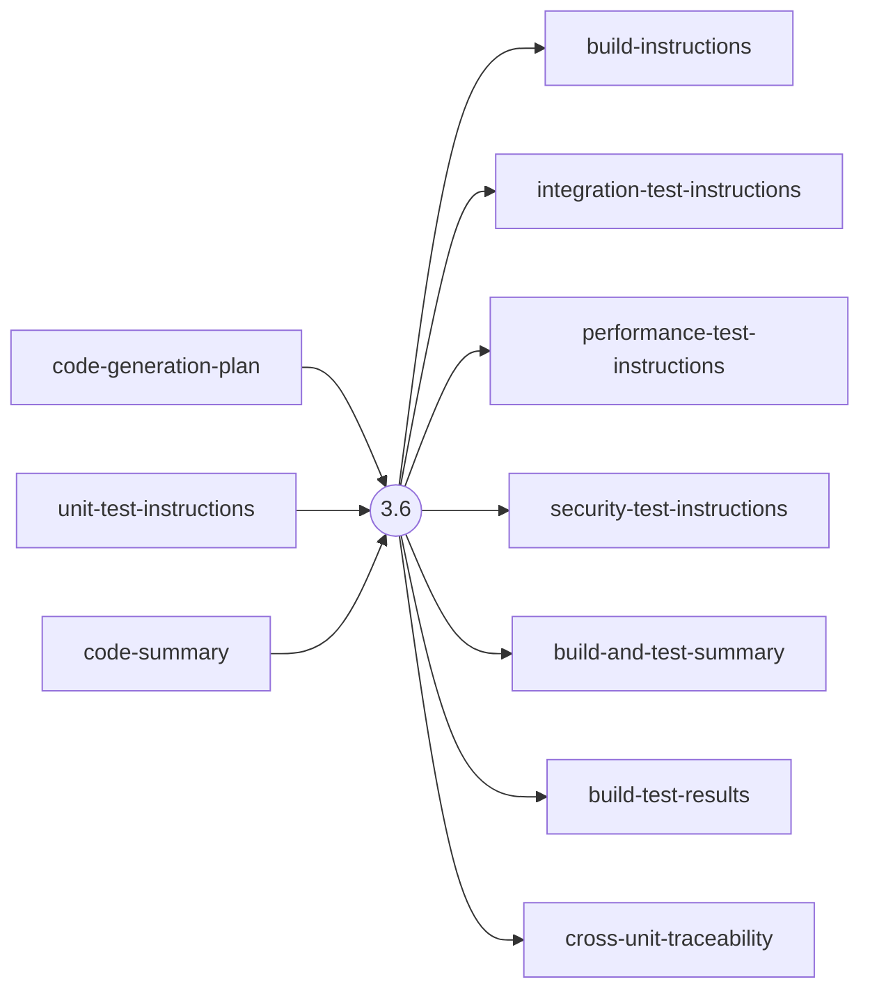
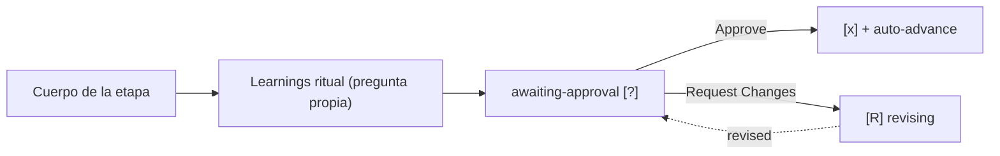

> [Inicio](README) › [Fases](01-fases/README) › [Fase 3 · Construction](01-fases/fase-3-construccion) › **Build & Test**

# 3.6 · Build & Test

**ALWAYS** · **Fase 3 · Construction** · Lead **quality** · Modo **inline**

> Condición: Always executes once after all per-unit stages are finished.

## Ficha de metadatos

| Campo | Valor |
|---|---|
| Número | **3.6** |
| Fase | Fase 3 · Construction |
| slug | `build-and-test` |
| execution | **ALWAYS** |
| lead_agent | `aidlc-quality-agent` |
| support_agents | `aidlc-devsecops-agent` |
| mode (topología) | **inline** |
| sensors | `required-sections`, `upstream-coverage`, `type-check` |
| requires_stage | `code-generation` |

## Qué hace esta etapa

Etapa ALWAYS (lead Quality Agent) que corre UNA VEZ tras completar todas las unidades: genera las instrucciones de build y toda la suite de tests según la test strategy activa (pyramid 75/20/5 en Standard+), EJECUTA el build y los tests, y opera el **cross-unit final coverage gate**: cada FR, NFR y AC de tres segmentos debe estar cubierto. Aquí vive el **failure loop-back 3.6→3.5**: si el root cause está en el código generado (no en el scaffolding), el flujo puede saltar a code-generation con un fix planificado, máx. 3 loop-backs por intent (ledger append-only en test-results.md).

- El loop-back es una excepción SANCIONADA al NO EMERGENT BEHAVIOR: la etapa queda deliberadamente in-flight (sin gate) mientras salta a 3.5.
- Guard de reanudación: si el ledger tiene una entrada con fix planeado pero no hay STAGE_JUMPED, la sesión murió entre log y jump, re-ejecutar el jump.
- En autonomous el loop-back aplica Modify a unidades objetivo y Keep al resto, Redo está PROHIBIDO (borraría el Loop-Back Log).

## Posición en el flujo

*Posición dentro de Fase 3 · Construction: 6 de 7.*

**Anterior:** [3.5 · Code Generation](02-etapas/construction/code-generation) · **Siguiente:** [3.7 · CI Pipeline](02-etapas/construction/ci-pipeline)

## Paso a paso

**Step 1: Analyze Testing Requirements**: Lee todos los nfr-requirements/design de todas las unidades + functional specs.

**Step 2: Generate Build Instructions**: Dependencias, setup de entorno, comandos, build-instructions.md.

**Steps 3-7: Generate Test Instructions (Strategy-Aware)**: Suite por nivel: unit-test-instructions (por unidad), integration-test-instructions (boundaries clave), performance/security si NFRs existen, según Minimal (Nyquist: 1 test por requisito + happy-path floor), Standard (5-8 por componente) o Comprehensive (10-15).

**Step 8: Generate Build and Test Summary**: Inventario de tipos de test generados + prerequisitos.

**Step 9: Execute Build and Tests**: Corre build + tests; registra resultados en test-results.md (total/passed/failed/skipped + Loop-Back Log).

**Step 10: Cross-Unit Final Coverage Gate**: Cobertura final: cada FR/NFR/AC cubierto; gaps listados como findings.

**Steps 11-12: Completion Handoff + Completion**: Escalera de fallo (Step 9): clasifica root cause → loop-back / accept failure / abort; learnings ritual difiere al loop-back exitoso.

## Artefactos

| Dirección | Artefactos |
|---|---|
| **produce** | `build-instructions`, `integration-test-instructions`, `performance-test-instructions`, `security-test-instructions`, `build-and-test-summary`, `build-test-results`, `cross-unit-traceability` |
| **consume** | `code-generation-plan`, `unit-test-instructions`, `code-summary` |

## Agentes implicados

- **Lead:** [aidlc-quality-agent](03-agentes/aidlc-quality-agent), posee los artefactos `produces[]` de la etapa.
- **Soporte:** [aidlc-devsecops-agent](03-agentes/aidlc-devsecops-agent), voz inline en la sesión
- **Conductor:** el orquestador es el bus: los agentes NUNCA se invocan entre sí, solo el conductor delega. Ver [el oficio del conductor](06-maquinaria/conductor).

## Topología y ejecución

**Inline.** El lead corre en la propia sesión del conductor, cargando su persona; los supports (si los hay) son voces que el conductor adopta. Sin contribution files. 29 de las 33 etapas usan esta topología.

## Mecánica del gate

Sin reviewer declarado, el gate es directo:

Reglas de oro: HARD STOP (el conductor termina su turno y espera al humano), NO EMERGENT BEHAVIOR (menús de 2 opciones en Construction/Operation; 3ª opción solo en ideation/inception para recuperar etapas saltadas), y tras 3 ciclos de Request Changes aparece **Accept as-is** (escape hatch). Detalle completo en [ciclo de gate](06-maquinaria/ciclo-de-gate).

## Sensores declarados

| Sensor | dispara en | categoría | qué verifica |
|---|---|---|---|
| `required-sections` | gate | document-shape | Chequea que el output contenga los encabezados H2 requeridos (default: ≥2 H2) o los del template resuelto. |
| `upstream-coverage` | gate | document-shape | Compara la prosa del output con el `consumes:` declarado: cada artefacto upstream debe aparecer referenciado. |
| `type-check` | (write) | code-quality | Corre el type-checker (tsc) sobre .ts/.tsx coincidentes. |

Un sensor `fire_on: gate` corre al entrar el gate; `advisory` solo emite findings; un sensor **blocking** exige pass verificado (o el override respaldado por humano) antes de abrir la gate. Detalle en [sensores](06-maquinaria/sensores).

## En qué scopes ejecuta

**Ejecutan esta etapa:** `bugfix`, `classic`, `enterprise`, `express`, `feature`, `mvp`, `poc`, `refactor`, `security-patch`, `workshop`

**La saltan:** `infra`

Cada scope es una rejilla EXECUTE/SKIP sobre las 33 etapas. Ver [la matriz completa de scopes](05-scopes/README).

## Conexiones

- [Ficha de la Fase 3 · Construction](01-fases/fase-3-construccion)
- [Etapa anterior: 3.5](02-etapas/construction/code-generation)
- [Etapa siguiente: 3.7](02-etapas/construction/ci-pipeline)
- [Ficha del lead: aidlc-quality-agent](03-agentes/aidlc-quality-agent)
- [Protocolos que gobiernan la etapa](04-protocolos/README)
