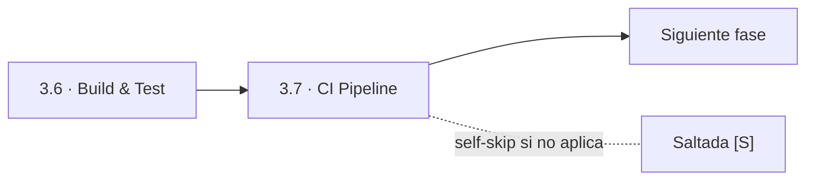
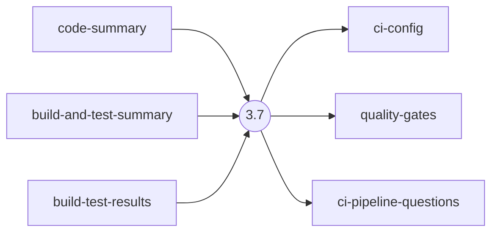
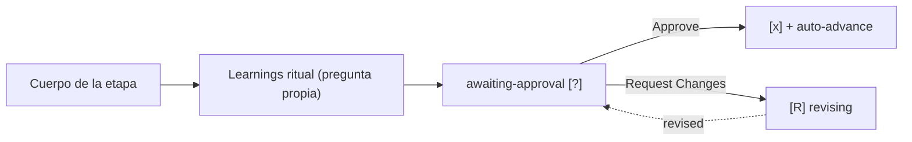

> [Inicio](README) › [Fases](01-fases/README) › [Fase 3 · Construction](01-fases/fase-3-construccion) › **CI Pipeline**

# 3.7 · CI Pipeline

**CONDITIONAL** · **Fase 3 · Construction** · Lead **pipeline-deploy** · Modo **inline**

> Condición: Execute when CI pipeline needs creation or significant modification. Skip if CI already exists and is adequate.

## Ficha de metadatos

| Campo | Valor |
|---|---|
| Número | **3.7** |
| Fase | Fase 3 · Construction |
| slug | `ci-pipeline` |
| execution | **CONDITIONAL** |
| lead_agent | `aidlc-pipeline-deploy-agent` |
| mode (topología) | **inline** |
| summary_confirmation | `required` (checkpoint consolidado obligatorio) |
| sensors | `required-sections`, `upstream-coverage`, `linter`, `type-check` |
| requires_stage | `build-and-test` |

## Qué hace esta etapa

Etapa CONDITIONAL del Pipeline & Deploy Agent: crea o moderniza el pipeline de CI, configuración (ci-config.md), quality gates y su política de fallo, integración con la estrategia de branching. Ejecuta el phase boundary verification Construction→Operation (todas las unidades built+tested, CI configurado, infra diseñada) y emite PHASE_VERIFIED. En infra es obligatoria; en express/poc se salta (no hay pipeline que montar).

- La transición Construction→Operation es ci-pipeline → deployment-pipeline.
- El sensor type-check/linter corren típicamente aquí sobre el código generado.

## Posición en el flujo

*Posición dentro de Fase 3 · Construction: 7 de 7. Es la última de su fase: precede al salto de fase.*

**Anterior:** [3.6 · Build & Test](02-etapas/construction/build-and-test)

## Paso a paso

**Step 1: Load Prior Context**: build/test results y code summaries de todas las unidades.

**Step 2: Generate Clarifying Questions**: Herramienta CI (CodePipeline/CodeBuild/GitHub Actions/Jenkins), estrategia de branching, gates de merge.

**Step 3: Collect and Analyze Answers**: Protocolo estándar.

**Step 4: Generate Artifacts**: ci-config.md, quality-gates.md (cobertura, lint, type-check, security scan), ci-pipeline-questions.md.

**Step 5: Phase Boundary Verification**: Architecture → Code → Tests: todo código traza a diseño; cobertura contra ACs. Escribe verification/ + PHASE_VERIFIED.

**Steps 6-7: Handoff + Gate**: Learnings + gate de cierre de Construction.

## Artefactos

| Dirección | Artefactos |
|---|---|
| **produce** | `ci-config`, `quality-gates`, `ci-pipeline-questions` |
| **consume** | `code-summary`, `build-and-test-summary`, `build-test-results` |

## Agentes implicados

- **Lead:** [aidlc-pipeline-deploy-agent](03-agentes/aidlc-pipeline-deploy-agent), posee los artefactos `produces[]` de la etapa.
- **Conductor:** el orquestador es el bus: los agentes NUNCA se invocan entre sí, solo el conductor delega. Ver [el oficio del conductor](06-maquinaria/conductor).

## Topología y ejecución

**Inline.** El lead corre en la propia sesión del conductor, cargando su persona; los supports (si los hay) son voces que el conductor adopta. Sin contribution files. 29 de las 33 etapas usan esta topología.

## Mecánica del gate

Sin reviewer declarado, el gate es directo:

Reglas de oro: HARD STOP (el conductor termina su turno y espera al humano), NO EMERGENT BEHAVIOR (menús de 2 opciones en Construction/Operation; 3ª opción solo en ideation/inception para recuperar etapas saltadas), y tras 3 ciclos de Request Changes aparece **Accept as-is** (escape hatch). Detalle completo en [ciclo de gate](06-maquinaria/ciclo-de-gate).

## Sensores declarados

| Sensor | dispara en | categoría | qué verifica |
|---|---|---|---|
| `required-sections` | gate | document-shape | Chequea que el output contenga los encabezados H2 requeridos (default: ≥2 H2) o los del template resuelto. |
| `upstream-coverage` | gate | document-shape | Compara la prosa del output con el `consumes:` declarado: cada artefacto upstream debe aparecer referenciado. |
| `linter` | (write) | code-quality | Corre el linter del proyecto sobre archivos .ts/.js coincidentes con el glob. |
| `type-check` | (write) | code-quality | Corre el type-checker (tsc) sobre .ts/.tsx coincidentes. |

Un sensor `fire_on: gate` corre al entrar el gate; `advisory` solo emite findings; un sensor **blocking** exige pass verificado (o el override respaldado por humano) antes de abrir la gate. Detalle en [sensores](06-maquinaria/sensores).

## En qué scopes ejecuta

**Ejecutan esta etapa:** `classic`, `enterprise`, `feature`, `infra`, `mvp`, `workshop`

**La saltan:** `bugfix`, `express`, `poc`, `refactor`, `security-patch`

Cada scope es una rejilla EXECUTE/SKIP sobre las 33 etapas. Ver [la matriz completa de scopes](05-scopes/README).

## Conexiones

- [Ficha de la Fase 3 · Construction](01-fases/fase-3-construccion)
- [Etapa anterior: 3.6](02-etapas/construction/build-and-test)
- [Ficha del lead: aidlc-pipeline-deploy-agent](03-agentes/aidlc-pipeline-deploy-agent)
- [Protocolos que gobiernan la etapa](04-protocolos/README)
