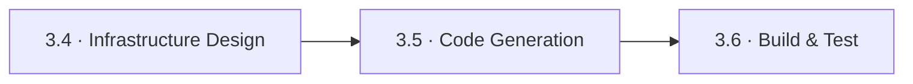
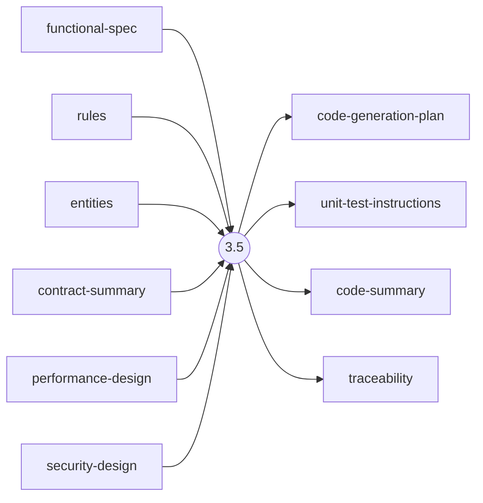
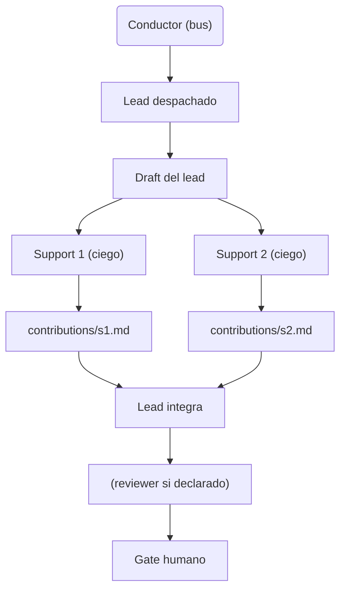
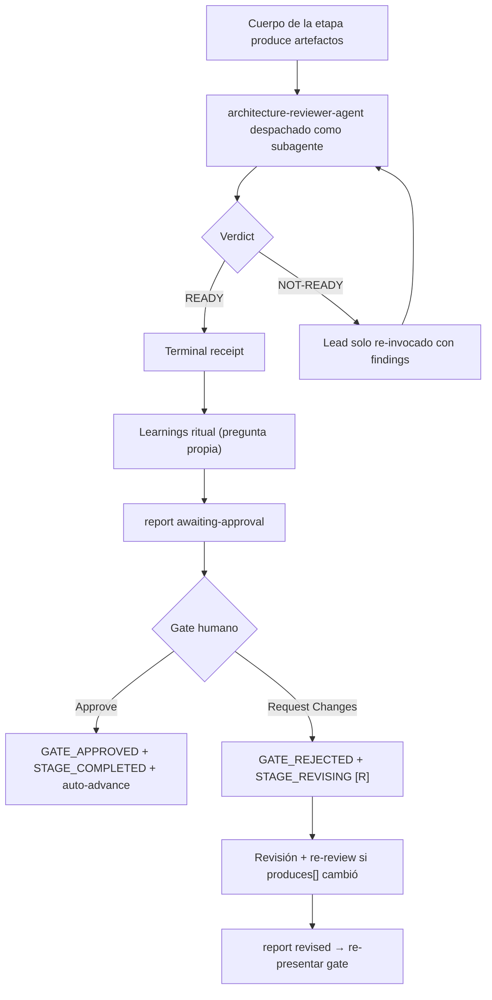

> [Inicio](README) › [Fases](01-fases/README) › [Fase 3 · Construction](01-fases/fase-3-construccion) › **Code Generation**

# 3.5 · Code Generation

**ALWAYS** · **Fase 3 · Construction** · Lead **developer** · Modo **subagent**

> Condición: Always executes for every unit in the execution plan.

## Ficha de metadatos

| Campo | Valor |
|---|---|
| Número | **3.5** |
| Fase | Fase 3 · Construction |
| slug | `code-generation` |
| execution | **ALWAYS** |
| lead_agent | `aidlc-developer-agent` |
| mode (topología) | **subagent** |
| reviewer | `aidlc-architecture-reviewer-agent` (**adversarial**, max 2 iter.) |
| review_artifact | `code-generation-plan` |
| sensors | `required-sections`, `linter`, `type-check`, `traceability` |
| requires_stage | `units-generation`, `functional-design`, `nfr-requirements`, `nfr-design`, `infrastructure-design` |

## Qué hace esta etapa

Etapa ALWAYS por unidad, topología **subagent**, lead Developer Agent, review **adversarial** del Architecture Reviewer. Es la etapa más controlada del ciclo: Plan Approval protegido (huella de aprobación + receipts), contrato de testing embebido, worker briefs con marcadores AIDLC-UNIT y AIDLC-TESTING-CONTRACT, y source-manifest.json por unidad. En modo autonomous corre como **swarm** en worktrees aislados por unidad con merge squash al converger. Regla crítica: el código va al workspace root, NUNCA al record; en brownfield se modifica in-place (jamás duplicados `_modified`).

- 1 de las 2 etapas subagent; en autonomía se convierte en swarm completo (prepare → fan-out → check → review → finalize → merge).
- Halt-and-ask OBLIGATORIO ante fallo de generación, en cualquier modo de autonomía (retry/skip/abort).
- La instancia de Plan Approval de un replay de loop-back SIEMPRE vuelve a preguntar (nueva época de directiva).
- Los gate inputs son: plan aprobado + testing contract + fingerprints; los outputs auditan hasta el SHA del plan.

## Posición en el flujo

*Posición dentro de Fase 3 · Construction: 5 de 7.*

**Anterior:** [3.4 · Infrastructure Design](02-etapas/construction/infrastructure-design) · **Siguiente:** [3.6 · Build & Test](02-etapas/construction/build-and-test)

## Paso a paso

**Critical Rules**: Código → workspace root. Brownfield: modify in-place. Todo plan pasa por Plan Approval antes de generar.

**Step 1: Read All Unit Artifacts**: Todos los diseños por unidad: functional, NFR req/design, infra, contract, units.

**PART 1 Planning, Step 2: Build the Plan**: code-generation-plan.md: checklist de implementación por capa (business logic, API, data, UI), riesgos, y **Testing Contract** renderizado por `aidlc-testing-posture.ts` (postura afirmada de team.md). unit-test-instructions.md con [Approval Fingerprint].

**Step 3: Plan Approval**: Gate humano por unidad: 'Approve Plan' / 'Request Changes'. El receipt PLAN_APPROVAL_RECORDED protege la generación; el hook plan-approval-guard bloquea dispatches sin plan aprobado.

**PART 2 Generation, Step 4: Execute**: El worker/subagent genera el código con brief marcado; produce source-manifest.json (paths worktree-relative creados/modificados/borrados). En swarm: worktree `bolt-<slug>` por unidad.

**Step 5: Generate Code Summary**: code-summary.md: archivos, decisiones clave, deudas.

**Step 6-7: Completion Handoff + Completion**: Review adversarial por unidad (receipts REVIEW_COMPLETED por unidad en el worktree) + receipts de lifecycle.

## Artefactos

| Dirección | Artefactos |
|---|---|
| **produce** | `code-generation-plan`, `unit-test-instructions`, `code-summary`, `traceability` |
| **consume** | `functional-spec`, `rules`, `entities`, `contract-summary`, `performance-design`, `security-design`, `infrastructure-specification`, `unit-of-work`, `requirements` |

## Agentes implicados

- **Lead:** [aidlc-developer-agent](03-agentes/aidlc-developer-agent), posee los artefactos `produces[]` de la etapa.
- **Reviewer:** [aidlc-architecture-reviewer-agent](03-agentes/aidlc-architecture-reviewer-agent), verifica desde fuera; su veredicto llega al gate.
- **Conductor:** el orquestador es el bus: los agentes NUNCA se invocan entre sí, solo el conductor delega. Ver [el oficio del conductor](06-maquinaria/conductor).

## Topología y ejecución

**Subagent (hub-and-spoke).** El lead se despacha como subagente (carga su persona automáticamente); si hay supports, cada uno se despacha EN PARALELO contra el draft del lead, mutuamente ciegos, y escribe su contribution file; una pasada final del lead integra. 2 etapas: practices-discovery y code-generation.

## Mecánica del gate

Con reviewer **adversarial** declarado, el flujo es:

Reglas de oro: HARD STOP (el conductor termina su turno y espera al humano), NO EMERGENT BEHAVIOR (menús de 2 opciones en Construction/Operation; 3ª opción solo en ideation/inception para recuperar etapas saltadas), y tras 3 ciclos de Request Changes aparece **Accept as-is** (escape hatch). Detalle completo en [ciclo de gate](06-maquinaria/ciclo-de-gate).

## Sensores declarados

| Sensor | dispara en | categoría | qué verifica |
|---|---|---|---|
| `required-sections` | gate | document-shape | Chequea que el output contenga los encabezados H2 requeridos (default: ≥2 H2) o los del template resuelto. |
| `linter` | (write) | code-quality | Corre el linter del proyecto sobre archivos .ts/.js coincidentes con el glob. |
| `type-check` | (write) | code-quality | Corre el type-checker (tsc) sobre .ts/.tsx coincidentes. |
| `traceability` | (write/gate) | document-traceability | Valida el traceability.json: cobertura upstream, targets downstream y huérfanos derivados por elemento (FR/US/AC/U/BR). |

Un sensor `fire_on: gate` corre al entrar el gate; `advisory` solo emite findings; un sensor **blocking** exige pass verificado (o el override respaldado por humano) antes de abrir la gate. Detalle en [sensores](06-maquinaria/sensores).

## En qué scopes ejecuta

**Ejecutan esta etapa:** `bugfix`, `classic`, `enterprise`, `express`, `feature`, `mvp`, `poc`, `refactor`, `security-patch`, `workshop`

**La saltan:** `infra`

Cada scope es una rejilla EXECUTE/SKIP sobre las 33 etapas. Ver [la matriz completa de scopes](05-scopes/README).

## Conexiones

- [Ficha de la Fase 3 · Construction](01-fases/fase-3-construccion)
- [Etapa anterior: 3.4](02-etapas/construction/infrastructure-design)
- [Etapa siguiente: 3.6](02-etapas/construction/build-and-test)
- [Ficha del lead: aidlc-developer-agent](03-agentes/aidlc-developer-agent)
- [Ficha del reviewer: aidlc-architecture-reviewer-agent](03-agentes/aidlc-architecture-reviewer-agent)
- [Protocolos que gobiernan la etapa](04-protocolos/README)
