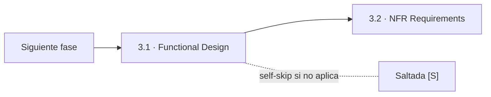
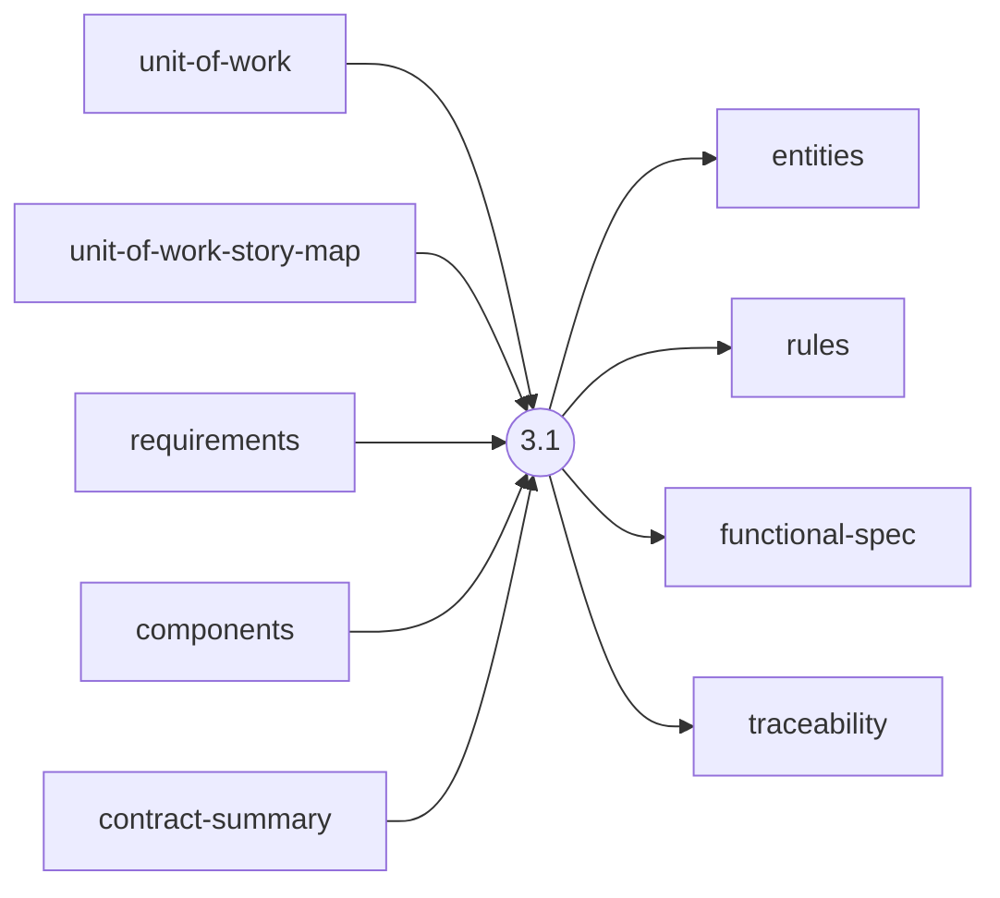
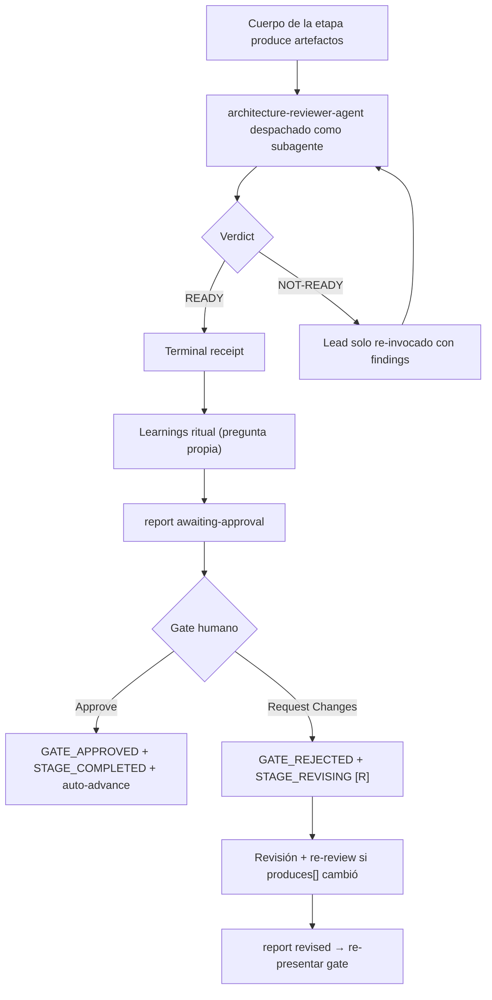

> [Inicio](README) › [Fases](01-fases/README) › [Fase 3 · Construction](01-fases/fase-3-construccion) › **Functional Design**

# 3.1 · Functional Design

**CONDITIONAL** · **Fase 3 · Construction** · Lead **architect** · Modo **inline**

> Condición: New data models, complex business logic, or business rules need design. Skip if simple logic changes with no new business logic.

## Ficha de metadatos

| Campo | Valor |
|---|---|
| Número | **3.1** |
| Fase | Fase 3 · Construction |
| slug | `functional-design` |
| execution | **CONDITIONAL** |
| lead_agent | `aidlc-architect-agent` |
| support_agents | `aidlc-developer-agent` |
| mode (topología) | **inline** |
| reviewer | `aidlc-architecture-reviewer-agent` (**adversarial**, max 2 iter.) |
| review_artifact | `functional-spec` |
| summary_confirmation | `required` (checkpoint consolidado obligatorio) |
| sensors | `required-sections`, `upstream-coverage`, `linter`, `type-check`, `traceability` |
| requires_stage | `units-generation`, `contract-design` |

## Qué hace esta etapa

Primera etapa per-unit de Construction (CONDITIONAL): traduce cada unidad en diseño funcional, modelos de entidades con bloque YAML fuente-de-verdad (entities.md), reglas de negocio numeradas `BRx.y` (rules.md) y workflows/comportamiento (functional-spec.md). Se ejecuta UNA VEZ POR UNIDAD en orden de build del DAG (engine-driven per-unit iteration): el gate por unidad se suprime (`gate: false`) y una única gate de stage cubre todas las unidades al final. Review adversarial del Architecture Reviewer (loop refute-and-repair con el lead solo).

- Skip si: cambios simples sin lógica de negocio nueva.
- Per-unit wave: el engine puede emitir `directive.wave` con varias unidades listas en paralelo (sin code-generation, que es wave-ineligible).
- El reviewer per-unit tiene read-scope bloqueado a la unidad + contratos compartidos (hook reviewer-scope).

## Posición en el flujo

*Posición dentro de Fase 3 · Construction: 1 de 7.*

**Siguiente:** [3.2 · NFR Requirements](02-etapas/construction/nfr-requirements)

## Paso a paso

**Execution Modes**: QUESTION-ONLY / ARTIFACT-ONLY / Full: los modos permiten separar recolección de preguntas de generación de artefactos (uso Bolt-major planeado; el walk actual es Full por unidad).

**Step 1: Read Unit Context**: Artifacts de la unidad: unit-of-work, story-map, requirements, components, contract-summary (paths resueltos por el engine en la wave).

**Step 2: Create Functional Design Plan**: Preguntas por unidad: workflows/algoritmos, modelos de entidad, reglas de negocio, mínimo en Construction (las decisiones ya están tomadas; preguntas solo para gaps reales).

**Step 3: Collect and Analyze Answers**: Chequeo de vaguedad y contradicciones por unidad.

**Step 4: Generate Artifacts**: entities.md + rules.md + functional-spec.md + traceability.json (BR/FR/US coverage).

**Step 5: Completion Handoff**: Ritual §13 por unidad; el learnings se difiere al gate final del stage.

**Step 6: Completion**: unit complete por unidad (receipts UNIT_STARTED/UNIT_COMPLETED).

## Artefactos

| Dirección | Artefactos |
|---|---|
| **produce** | `entities`, `rules`, `functional-spec`, `traceability` |
| **consume** | `unit-of-work`, `unit-of-work-story-map`, `requirements`, `components`, `contract-summary` |

## Agentes implicados

- **Lead:** [aidlc-architect-agent](03-agentes/aidlc-architect-agent), posee los artefactos `produces[]` de la etapa.
- **Soporte:** [aidlc-developer-agent](03-agentes/aidlc-developer-agent), voz inline en la sesión
- **Reviewer:** [aidlc-architecture-reviewer-agent](03-agentes/aidlc-architecture-reviewer-agent), verifica desde fuera; su veredicto llega al gate.
- **Conductor:** el orquestador es el bus: los agentes NUNCA se invocan entre sí, solo el conductor delega. Ver [el oficio del conductor](06-maquinaria/conductor).

## Topología y ejecución

**Inline.** El lead corre en la propia sesión del conductor, cargando su persona; los supports (si los hay) son voces que el conductor adopta. Sin contribution files. 29 de las 33 etapas usan esta topología.

## Mecánica del gate

Con reviewer **adversarial** declarado, el flujo es:

Reglas de oro: HARD STOP (el conductor termina su turno y espera al humano), NO EMERGENT BEHAVIOR (menús de 2 opciones en Construction/Operation; 3ª opción solo en ideation/inception para recuperar etapas saltadas), y tras 3 ciclos de Request Changes aparece **Accept as-is** (escape hatch). Detalle completo en [ciclo de gate](06-maquinaria/ciclo-de-gate).

## Sensores declarados

| Sensor | dispara en | categoría | qué verifica |
|---|---|---|---|
| `required-sections` | gate | document-shape | Chequea que el output contenga los encabezados H2 requeridos (default: ≥2 H2) o los del template resuelto. |
| `upstream-coverage` | gate | document-shape | Compara la prosa del output con el `consumes:` declarado: cada artefacto upstream debe aparecer referenciado. |
| `linter` | (write) | code-quality | Corre el linter del proyecto sobre archivos .ts/.js coincidentes con el glob. |
| `type-check` | (write) | code-quality | Corre el type-checker (tsc) sobre .ts/.tsx coincidentes. |
| `traceability` | (write/gate) | document-traceability | Valida el traceability.json: cobertura upstream, targets downstream y huérfanos derivados por elemento (FR/US/AC/U/BR). |

Un sensor `fire_on: gate` corre al entrar el gate; `advisory` solo emite findings; un sensor **blocking** exige pass verificado (o el override respaldado por humano) antes de abrir la gate. Detalle en [sensores](06-maquinaria/sensores).

## En qué scopes ejecuta

**Ejecutan esta etapa:** `classic`, `enterprise`, `feature`, `mvp`, `refactor`, `workshop`

**La saltan:** `bugfix`, `express`, `infra`, `poc`, `security-patch`

Cada scope es una rejilla EXECUTE/SKIP sobre las 33 etapas. Ver [la matriz completa de scopes](05-scopes/README).

## Conexiones

- [Ficha de la Fase 3 · Construction](01-fases/fase-3-construccion)
- [Etapa siguiente: 3.2](02-etapas/construction/nfr-requirements)
- [Ficha del lead: aidlc-architect-agent](03-agentes/aidlc-architect-agent)
- [Ficha del reviewer: aidlc-architecture-reviewer-agent](03-agentes/aidlc-architecture-reviewer-agent)
- [Protocolos que gobiernan la etapa](04-protocolos/README)
