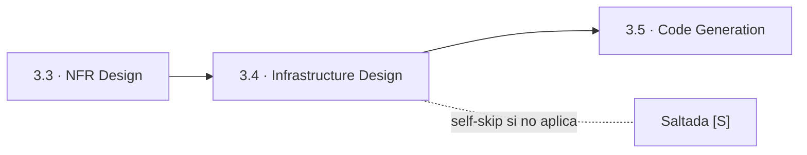
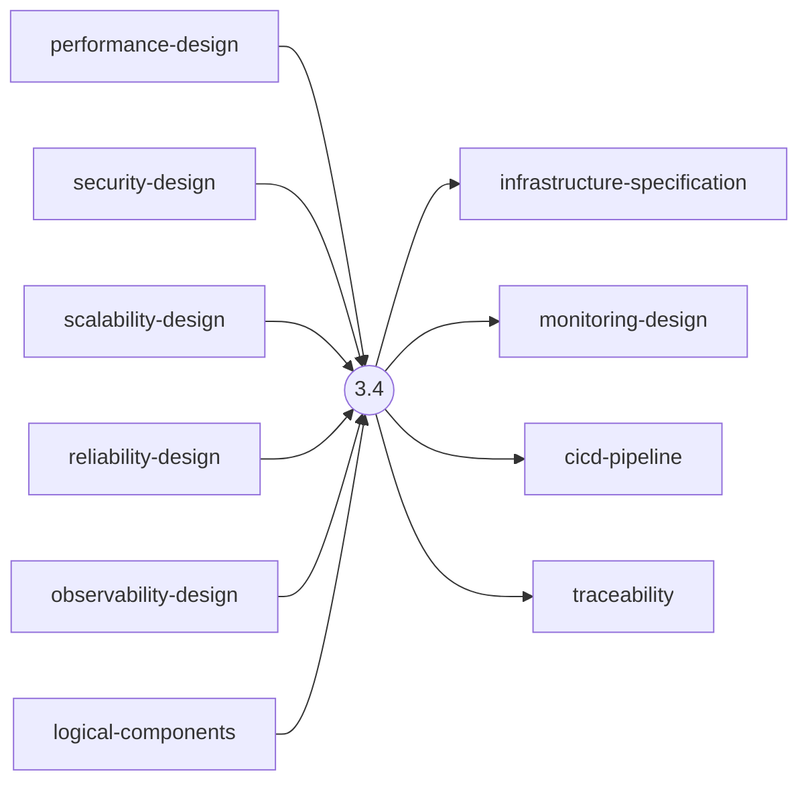
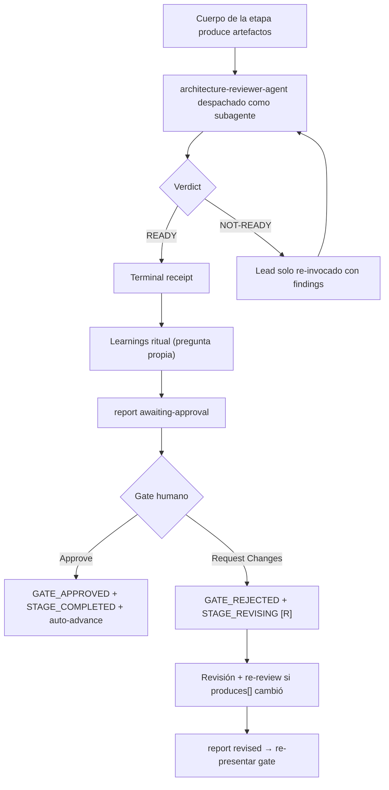

> [Inicio](README) › [Fases](01-fases/README) › [Fase 3 · Construction](01-fases/fase-3-construccion) › **Infrastructure Design**

# 3.4 · Infrastructure Design

**CONDITIONAL** · **Fase 3 · Construction** · Lead **aws-platform** · Modo **inline**

> Condición: Infrastructure services need mapping, deployment architecture required, or cloud resources needed. Skip if no infrastructure changes and infrastructure already defined.

## Ficha de metadatos

| Campo | Valor |
|---|---|
| Número | **3.4** |
| Fase | Fase 3 · Construction |
| slug | `infrastructure-design` |
| execution | **CONDITIONAL** |
| lead_agent | `aidlc-aws-platform-agent` |
| support_agents | `aidlc-devsecops-agent`, `aidlc-compliance-agent` |
| mode (topología) | **inline** |
| reviewer | `aidlc-architecture-reviewer-agent` (**adversarial**, max 2 iter.) |
| review_artifact | `cicd-pipeline` |
| summary_confirmation | `required` (checkpoint consolidado obligatorio) |
| sensors | `required-sections`, `upstream-coverage`, `linter`, `type-check`, `traceability` |
| requires_stage | `units-generation`, `nfr-design` |

## Qué hace esta etapa

Etapa CONDITIONAL per-unit del **AWS Platform Agent**: mapea la infraestructura, arquitectura de despliegue (containers/serverless/VMs, topología de red, layout de entornos), servicios (bases de datos, caches, colas, CDN, balanceadores) y diseño de monitoreo. Produce infrastructure-specification.md, monitoring-design.md y cicd-pipeline.md. Es el puente hacia Operation: Environment Provisioning (4.2) provisiona exactamente lo que aquí se especifica. Review adversarial del Architecture Reviewer.

- El DevSecOps Agent apoya como voz de revisión de seguridad en entornos regulados.
- infra (scope) ejecuta esta etapa como su columna vertebral junto a 4.1/4.2/4.4.

## Posición en el flujo

*Posición dentro de Fase 3 · Construction: 4 de 7.*

**Anterior:** [3.3 · NFR Design](02-etapas/construction/nfr-design) · **Siguiente:** [3.5 · Code Generation](02-etapas/construction/code-generation)

## Paso a paso

**Execution Modes**: QUESTION-ONLY / ARTIFACT-ONLY / Full.

**Step 1: Read Prior Artifacts**: Los 5 NFR designs + logical-components + components + functional-spec + contract-summary.

**Step 2: Generate Infrastructure Questions**: Estrategia de despliegue (containerized/serverless/hybrid/multi-region), compute/storage/networking con sizing, layout dev/staging/prod.

**Step 3: Collect and Analyze Answers**: Detecta vaguedad ('cloud-based', 'auto-scale', 'standard monitoring') y contradicciones.

**Step 4: Design Infrastructure**: Deployment architecture + servicios con tipo/sizing/replicación.

**Step 5: Generate Artifacts**: infrastructure-specification.md (tablas por facet), monitoring-design.md, cicd-pipeline.md + traceability.json.

**Step 6-7: Completion Handoff + Completion**: Ritual + receipts.

## Artefactos

| Dirección | Artefactos |
|---|---|
| **produce** | `infrastructure-specification`, `monitoring-design`, `cicd-pipeline`, `traceability` |
| **consume** | `performance-design`, `security-design`, `scalability-design`, `reliability-design`, `observability-design`, `logical-components`, `components`, `functional-spec`, `contract-summary` |

## Agentes implicados

- **Lead:** [aidlc-aws-platform-agent](03-agentes/aidlc-aws-platform-agent), posee los artefactos `produces[]` de la etapa.
- **Soporte:** [aidlc-devsecops-agent](03-agentes/aidlc-devsecops-agent), voz inline en la sesión
- **Soporte:** [aidlc-compliance-agent](03-agentes/aidlc-compliance-agent), voz inline en la sesión
- **Reviewer:** [aidlc-architecture-reviewer-agent](03-agentes/aidlc-architecture-reviewer-agent), verifica desde fuera; su veredicto llega al gate.
- **Conductor:** el orquestador es el bus: los agentes NUNCA se invocan entre sí, solo el conductor delega. Ver [el oficio del conductor](06-maquinaria/conductor).

## Topología y ejecución

**Inline.** El lead corre en la propia sesión del conductor, cargando su persona; los supports (si los hay) son voces que el conductor adopta. Sin contribution files. 29 de las 33 etapas usan esta topología.

## Mecánica del gate

Con reviewer **adversarial** declarado, el flujo es:

Reglas de oro: HARD STOP (el conductor termina su turno y espera al humano), NO EMERGENT BEHAVIOR (menús de 2 opciones en Construction/Operation; 3ª opción solo en ideation/inception para recuperar etapas saltadas), y tras 3 ciclos de Request Changes aparece **Accept as-is** (escape hatch). Detalle completo en [ciclo de gate](06-maquinaria/ciclo-de-gate).

## Sensores declarados

| Sensor | dispara en | categoría | qué verifica |
|---|---|---|---|
| `required-sections` | gate | document-shape | Chequea que el output contenga los encabezados H2 requeridos (default: ≥2 H2) o los del template resuelto. |
| `upstream-coverage` | gate | document-shape | Compara la prosa del output con el `consumes:` declarado: cada artefacto upstream debe aparecer referenciado. |
| `linter` | (write) | code-quality | Corre el linter del proyecto sobre archivos .ts/.js coincidentes con el glob. |
| `type-check` | (write) | code-quality | Corre el type-checker (tsc) sobre .ts/.tsx coincidentes. |
| `traceability` | (write/gate) | document-traceability | Valida el traceability.json: cobertura upstream, targets downstream y huérfanos derivados por elemento (FR/US/AC/U/BR). |

Un sensor `fire_on: gate` corre al entrar el gate; `advisory` solo emite findings; un sensor **blocking** exige pass verificado (o el override respaldado por humano) antes de abrir la gate. Detalle en [sensores](06-maquinaria/sensores).

## En qué scopes ejecuta

**Ejecutan esta etapa:** `classic`, `enterprise`, `feature`, `infra`, `mvp`, `workshop`

**La saltan:** `bugfix`, `express`, `poc`, `refactor`, `security-patch`

Cada scope es una rejilla EXECUTE/SKIP sobre las 33 etapas. Ver [la matriz completa de scopes](05-scopes/README).

## Conexiones

- [Ficha de la Fase 3 · Construction](01-fases/fase-3-construccion)
- [Etapa anterior: 3.3](02-etapas/construction/nfr-design)
- [Etapa siguiente: 3.5](02-etapas/construction/code-generation)
- [Ficha del lead: aidlc-aws-platform-agent](03-agentes/aidlc-aws-platform-agent)
- [Ficha del reviewer: aidlc-architecture-reviewer-agent](03-agentes/aidlc-architecture-reviewer-agent)
- [Protocolos que gobiernan la etapa](04-protocolos/README)
