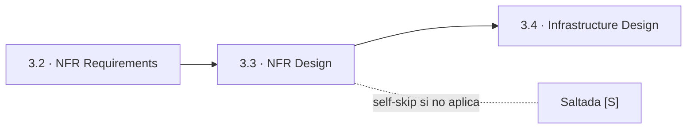
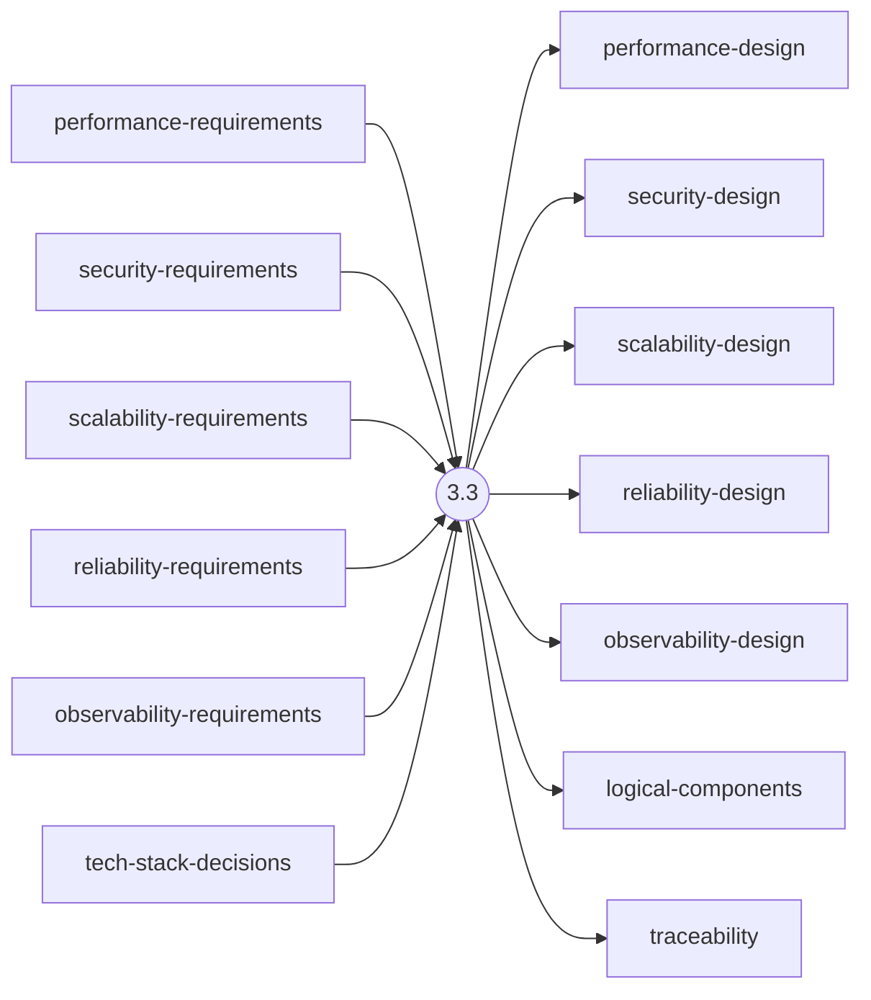
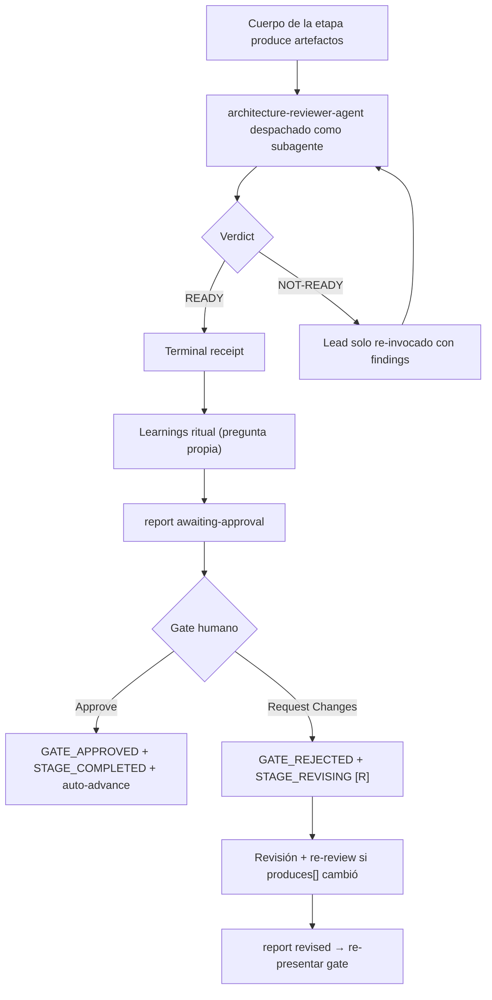

> [Inicio](README) › [Fases](01-fases/README) › [Fase 3 · Construction](01-fases/fase-3-construccion) › **NFR Design**

# 3.3 · NFR Design

**CONDITIONAL** · **Fase 3 · Construction** · Lead **architect** · Modo **inline**

> Condición: NFR Requirements was executed and NFR patterns need design. Skip if NFR Requirements was skipped.

## Ficha de metadatos

| Campo | Valor |
|---|---|
| Número | **3.3** |
| Fase | Fase 3 · Construction |
| slug | `nfr-design` |
| execution | **CONDITIONAL** |
| lead_agent | `aidlc-architect-agent` |
| support_agents | `aidlc-aws-platform-agent` |
| mode (topología) | **inline** |
| reviewer | `aidlc-architecture-reviewer-agent` (**adversarial**, max 2 iter.) |
| review_artifact | `security-design` |
| summary_confirmation | `required` (checkpoint consolidado obligatorio) |
| sensors | `required-sections`, `upstream-coverage`, `linter`, `type-check`, `traceability` |
| requires_stage | `units-generation`, `nfr-requirements` |

## Qué hace esta etapa

Etapa CONDITIONAL per-unit del Architect: para cada NFR requirement diseña la solución técnica, caching, circuit breakers, bulkheads, partitioning, flujos de autenticación, cifrado, estrategia de observabilidad. Produce performance-design, security-design, scalability-design, reliability-design, observability-design y logical-components. Review adversarial del Architecture Reviewer.

- Skip si nfr-requirements se saltó (dependencia directa).
- observability-design alimenta Observability Setup (4.4); monitoring-design sale de infra-design (3.4).

## Posición en el flujo

*Posición dentro de Fase 3 · Construction: 3 de 7.*

**Anterior:** [3.2 · NFR Requirements](02-etapas/construction/nfr-requirements) · **Siguiente:** [3.4 · Infrastructure Design](02-etapas/construction/infrastructure-design)

## Paso a paso

**Execution Modes**: QUESTION-ONLY / ARTIFACT-ONLY / Full.

**Step 1: Read Prior Artifacts**: performance/security/...-requirements + functional-spec + contract-summary.

**Step 2: Generate Design Questions**: Patrones de resiliencia (circuit breakers, fallbacks), escalabilidad (horizontal vs vertical, partitioning, caching tiers), seguridad (zero trust, defense in depth).

**Step 3: Collect and Analyze Answers**: Vaguedad y contradicciones (p.ej. offline-first + colaboración real-time).

**Step 4: Design NFR Solutions**: Solución por categoría anclada al target medible del requisito.

**Step 5: Generate Artifacts**: 5 design docs + logical-components.md + traceability.json.

**Step 6-7: Completion Handoff + Completion**: Ritual + receipts.

## Artefactos

| Dirección | Artefactos |
|---|---|
| **produce** | `performance-design`, `security-design`, `scalability-design`, `reliability-design`, `observability-design`, `logical-components`, `traceability` |
| **consume** | `performance-requirements`, `security-requirements`, `scalability-requirements`, `reliability-requirements`, `observability-requirements`, `tech-stack-decisions`, `functional-spec`, `contract-summary` |

## Agentes implicados

- **Lead:** [aidlc-architect-agent](03-agentes/aidlc-architect-agent), posee los artefactos `produces[]` de la etapa.
- **Soporte:** [aidlc-aws-platform-agent](03-agentes/aidlc-aws-platform-agent), voz inline en la sesión
- **Reviewer:** [aidlc-architecture-reviewer-agent](03-agentes/aidlc-architecture-reviewer-agent), verifica desde fuera; su veredicto llega al gate.
- **Conductor:** el orquestador es el bus: los agentes NUNCA se invocan entre sí, solo el conductor delega. Ver [el oficio del conductor](06-maquinaria/conductor).

## Topología y ejecución

**Inline.** El lead corre en la propia sesión del conductor, cargando su persona; los supports (si los hay) son voces que el conductor adopta. Sin contribution files. 29 de las 33 etapas usan esta topología.

## Mecánica del gate

Con reviewer **adversarial** declarado, el flujo es:

Reglas de oro: HARD STOP (el conductor termina su turno y espera al humano), NO EMERGENT BEHAVIOR (menús de 2 opciones en Construction/Operation; 3ª opción solo en ideation/inception para recuperar etapas saltadas), y tras 3 ciclos de Request Changes aparece **Accept as-is** (escape hatch). Detalle completo en [ciclo de gate](06-maquinaria/ciclo-de-gate).

## Sensores declarados

| Sensor | dispara en | categoría | qué verifica |
|---|---|---|---|
| `required-sections` | gate | document-shape | Chequea que el output contenga los encabezados H2 requeridos (default: ≥2 H2) o los del template resuelto. |
| `upstream-coverage` | gate | document-shape | Compara la prosa del output con el `consumes:` declarado: cada artefacto upstream debe aparecer referenciado. |
| `linter` | (write) | code-quality | Corre el linter del proyecto sobre archivos .ts/.js coincidentes con el glob. |
| `type-check` | (write) | code-quality | Corre el type-checker (tsc) sobre .ts/.tsx coincidentes. |
| `traceability` | (write/gate) | document-traceability | Valida el traceability.json: cobertura upstream, targets downstream y huérfanos derivados por elemento (FR/US/AC/U/BR). |

Un sensor `fire_on: gate` corre al entrar el gate; `advisory` solo emite findings; un sensor **blocking** exige pass verificado (o el override respaldado por humano) antes de abrir la gate. Detalle en [sensores](06-maquinaria/sensores).

## En qué scopes ejecuta

**Ejecutan esta etapa:** `classic`, `enterprise`, `feature`, `infra`, `mvp`, `workshop`

**La saltan:** `bugfix`, `express`, `poc`, `refactor`, `security-patch`

Cada scope es una rejilla EXECUTE/SKIP sobre las 33 etapas. Ver [la matriz completa de scopes](05-scopes/README).

## Conexiones

- [Ficha de la Fase 3 · Construction](01-fases/fase-3-construccion)
- [Etapa anterior: 3.2](02-etapas/construction/nfr-requirements)
- [Etapa siguiente: 3.4](02-etapas/construction/infrastructure-design)
- [Ficha del lead: aidlc-architect-agent](03-agentes/aidlc-architect-agent)
- [Ficha del reviewer: aidlc-architecture-reviewer-agent](03-agentes/aidlc-architecture-reviewer-agent)
- [Protocolos que gobiernan la etapa](04-protocolos/README)
