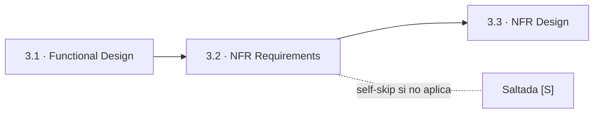
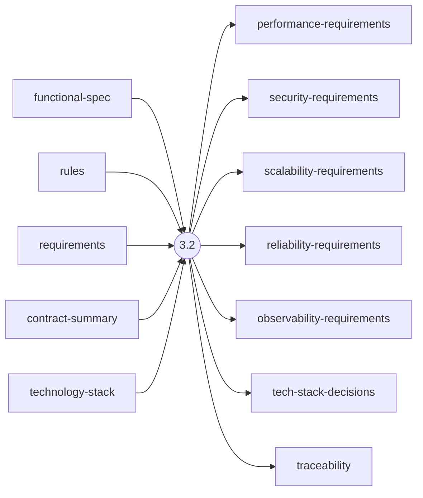
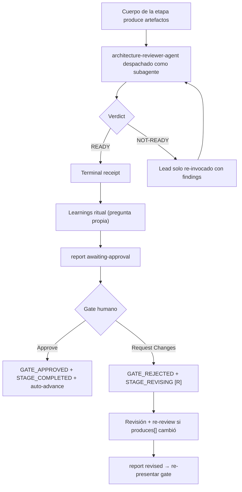

> [Inicio](README) › [Fases](01-fases/README) › [Fase 3 · Construction](01-fases/fase-3-construccion) › **NFR Requirements**

# 3.2 · NFR Requirements

**CONDITIONAL** · **Fase 3 · Construction** · Lead **architect** · Modo **inline**

> Condición: Performance, security, scalability, reliability, or observability requirements needed, or tech stack selection needed. Skip if no NFR requirements and tech stack already determined.

## Ficha de metadatos

| Campo | Valor |
|---|---|
| Número | **3.2** |
| Fase | Fase 3 · Construction |
| slug | `nfr-requirements` |
| execution | **CONDITIONAL** |
| lead_agent | `aidlc-architect-agent` |
| support_agents | `aidlc-devsecops-agent`, `aidlc-compliance-agent`, `aidlc-quality-agent` |
| mode (topología) | **inline** |
| reviewer | `aidlc-architecture-reviewer-agent` (**adversarial**, max 2 iter.) |
| review_artifact | `security-requirements` |
| summary_confirmation | `required` (checkpoint consolidado obligatorio) |
| sensors | `required-sections`, `upstream-coverage`, `linter`, `type-check`, `traceability` |
| requires_stage | `units-generation`, `functional-design` |

## Qué hace esta etapa

Etapa CONDITIONAL per-unit del Architect: especifica NFRs medibles por categoría, performance (targets de latencia/throughput), security (authn/z, protección de datos, compliance), scalability, reliability, observability, y decide el tech stack (tech-stack-decisions.md). Regla de fase: prohibido lenguaje ambiguo ('fast', 'secure') sin umbral medible. Review adversarial del Architecture Reviewer.

- security-patch ejecuta esta etapa como su núcleo: registra la CVE como constraint de seguridad.
- Los NFRs heredan del requirements-analysis (2.3) y se anclan a `NFR{n}` / `NFRx.y` para trazabilidad.

## Posición en el flujo

*Posición dentro de Fase 3 · Construction: 2 de 7.*

**Anterior:** [3.1 · Functional Design](02-etapas/construction/functional-design) · **Siguiente:** [3.3 · NFR Design](02-etapas/construction/nfr-design)

## Paso a paso

**Execution Modes**: QUESTION-ONLY / ARTIFACT-ONLY / Full.

**Step 1: Read Prior Artifacts**: functional-spec, rules, requirements, contract-summary, technology-stack (brownfield: del CodeKB).

**Step 2: Assess NFR Categories**: Por categoría evalúa si aplica a esta unidad (una API pública necesita security NFRs; un job batch necesita throughput).

**Step 3: Generate Questions**: Targets medibles por categoría: p95/p99, RPS, disponibilidad, RPO/RTO, retención de datos.

**Step 4: Collect and Analyze Answers**: Detecta targets vagos ('fast enough', 'highly available') y contradicciones entre NFRs.

**Step 5: Generate Artifacts**: performance-requirements.md, security-requirements.md, scalability/reliability/observability-requirements.md, tech-stack-decisions.md + traceability.json.

**Step 6-7: Completion Handoff + Completion**: Ritual por unidad y receipts de lifecycle.

## Artefactos

| Dirección | Artefactos |
|---|---|
| **produce** | `performance-requirements`, `security-requirements`, `scalability-requirements`, `reliability-requirements`, `observability-requirements`, `tech-stack-decisions`, `traceability` |
| **consume** | `functional-spec`, `rules`, `requirements`, `contract-summary`, `technology-stack` |

## Agentes implicados

- **Lead:** [aidlc-architect-agent](03-agentes/aidlc-architect-agent), posee los artefactos `produces[]` de la etapa.
- **Soporte:** [aidlc-devsecops-agent](03-agentes/aidlc-devsecops-agent), voz inline en la sesión
- **Soporte:** [aidlc-compliance-agent](03-agentes/aidlc-compliance-agent), voz inline en la sesión
- **Soporte:** [aidlc-quality-agent](03-agentes/aidlc-quality-agent), voz inline en la sesión
- **Reviewer:** [aidlc-architecture-reviewer-agent](03-agentes/aidlc-architecture-reviewer-agent), verifica desde fuera; su veredicto llega al gate.
- **Conductor:** el orquestador es el bus: los agentes NUNCA se invocan entre sí, solo el conductor delega. Ver [el oficio del conductor](06-maquinaria/conductor).

## Topología y ejecución

**Inline.** El lead corre en la propia sesión del conductor, cargando su persona; los supports (si los hay) son voces que el conductor adopta. Sin contribution files. 29 de las 33 etapas usan esta topología.

## Mecánica del gate

Con reviewer **adversarial** declarado, el flujo es:

Reglas de oro: HARD STOP (el conductor termina su turno y espera al humano), NO EMERGENT BEHAVIOR (menús de 2 opciones en Construction/Operation; 3ª opción solo en ideation/inception para recuperar etapas saltadas), y tras 3 ciclos de Request Changes aparece **Accept as-is** (escape hatch). Detalle completo en [ciclo de gate](06-maquinaria/ciclo-de-gate).

## Sensores declarados

| Sensor | dispara en | categoría | qué verifica |
|---|---|---|---|
| `required-sections` | gate | document-shape | Chequea que el output contenga los encabezados H2 requeridos (default: ≥2 H2) o los del template resuelto. |
| `upstream-coverage` | gate | document-shape | Compara la prosa del output con el `consumes:` declarado: cada artefacto upstream debe aparecer referenciado. |
| `linter` | (write) | code-quality | Corre el linter del proyecto sobre archivos .ts/.js coincidentes con el glob. |
| `type-check` | (write) | code-quality | Corre el type-checker (tsc) sobre .ts/.tsx coincidentes. |
| `traceability` | (write/gate) | document-traceability | Valida el traceability.json: cobertura upstream, targets downstream y huérfanos derivados por elemento (FR/US/AC/U/BR). |

Un sensor `fire_on: gate` corre al entrar el gate; `advisory` solo emite findings; un sensor **blocking** exige pass verificado (o el override respaldado por humano) antes de abrir la gate. Detalle en [sensores](06-maquinaria/sensores).

## En qué scopes ejecuta

**Ejecutan esta etapa:** `classic`, `enterprise`, `feature`, `infra`, `mvp`, `security-patch`, `workshop`

**La saltan:** `bugfix`, `express`, `poc`, `refactor`

Cada scope es una rejilla EXECUTE/SKIP sobre las 33 etapas. Ver [la matriz completa de scopes](05-scopes/README).

## Conexiones

- [Ficha de la Fase 3 · Construction](01-fases/fase-3-construccion)
- [Etapa anterior: 3.1](02-etapas/construction/functional-design)
- [Etapa siguiente: 3.3](02-etapas/construction/nfr-design)
- [Ficha del lead: aidlc-architect-agent](03-agentes/aidlc-architect-agent)
- [Ficha del reviewer: aidlc-architecture-reviewer-agent](03-agentes/aidlc-architecture-reviewer-agent)
- [Protocolos que gobiernan la etapa](04-protocolos/README)
