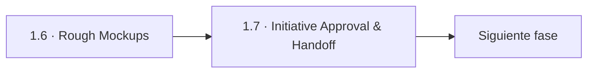
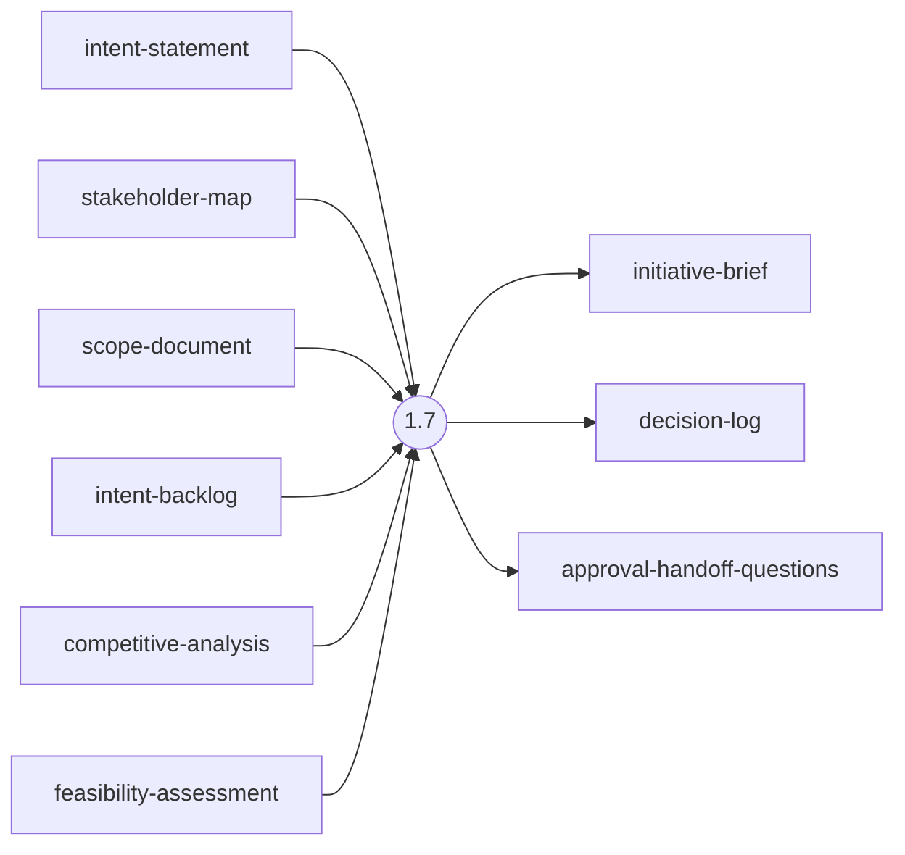
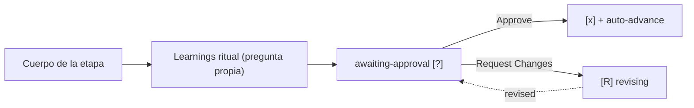

> [Inicio](README) › [Fases](01-fases/README) › [Fase 1 · Ideation](01-fases/fase-1-ideacion) › **Initiative Approval & Handoff**

# 1.7 · Initiative Approval & Handoff

**ALWAYS** · **Fase 1 · Ideation** · Lead **delivery** · Modo **inline**

> Condición: Always executes, compiles all Ideation artifacts into initiative brief for approval

## Ficha de metadatos

| Campo | Valor |
|---|---|
| Número | **1.7** |
| Fase | Fase 1 · Ideation |
| slug | `approval-handoff` |
| execution | **ALWAYS** |
| lead_agent | `aidlc-delivery-agent` |
| support_agents | `aidlc-product-agent` |
| mode (topología) | **inline** |
| summary_confirmation | `required` (checkpoint consolidado obligatorio) |
| sensors | `required-sections`, `upstream-coverage` |
| requires_stage | `intent-capture`, `feasibility`, `scope-definition`, `team-formation`, `rough-mockups` |

## Qué hace esta etapa

Etapa ALWAYS de cierre de Ideation: compila todos los artefactos de la fase en el **initiative brief** y pide la aprobación que abre Inception. Ejecuta el phase boundary verification (Intent → Scope → Intent Backlog; todo scope item con respaldo de viabilidad) y registra la transición. El Delivery Agent la lidera. Aprueba la iniciativa completa.

- La transición Ideation→Inception es approval-handoff → reverse-engineering.
- classic/workshop saltan toda ideation: esta etapa no corre y el boundary check no aplica.

## Posición en el flujo

*Posición dentro de Fase 1 · Ideation: 7 de 7. Es la última de su fase: precede al salto de fase.*

**Anterior:** [1.6 · Rough Mockups](02-etapas/ideation/rough-mockups)

## Paso a paso

**Step 1: Load Prior Context**: Reúne TODOS los artefactos de ideation: intent, stakeholders, market, feasibility, constraints, scope, backlog, team, wireframes.

**Step 2: Generate Approval Questions**: ¿Los stakeholders acuerdan intent y scope? ¿Los riesgos críticos tienen mitigaciones? ¿El brief refleja la decisión de avanzar?

**Step 3: Compile Initiative Brief**: brief con intent, validación de mercado, viabilidad, scope, riesgos, equipo y mockups, más el decision-log.

**Step 4: Phase Boundary Verification**: Chequeos de trazabilidad de la frontera; resultado en `<record>/verification/`; emite `PHASE_VERIFIED`.

**Step 5: Completion Handoff**: Learnings ritual.

**Step 6: Present Completion & Request Approval**: Gate de aprobación de iniciativa; la aprobación dispara la transición de fase (audit: eventos de fase/workflow).

## Artefactos

| Dirección | Artefactos |
|---|---|
| **produce** | `initiative-brief`, `decision-log`, `approval-handoff-questions` |
| **consume** | `intent-statement`, `stakeholder-map`, `scope-document`, `intent-backlog`, `competitive-analysis`, `feasibility-assessment`, `constraint-register`, `team-assessment`, `wireframes` |

## Agentes implicados

- **Lead:** [aidlc-delivery-agent](03-agentes/aidlc-delivery-agent), posee los artefactos `produces[]` de la etapa.
- **Soporte:** [aidlc-product-agent](03-agentes/aidlc-product-agent), voz inline en la sesión
- **Conductor:** el orquestador es el bus: los agentes NUNCA se invocan entre sí, solo el conductor delega. Ver [el oficio del conductor](06-maquinaria/conductor).

## Topología y ejecución

**Inline.** El lead corre en la propia sesión del conductor, cargando su persona; los supports (si los hay) son voces que el conductor adopta. Sin contribution files. 29 de las 33 etapas usan esta topología.

## Mecánica del gate

Sin reviewer declarado, el gate es directo:

Reglas de oro: HARD STOP (el conductor termina su turno y espera al humano), NO EMERGENT BEHAVIOR (menús de 2 opciones en Construction/Operation; 3ª opción solo en ideation/inception para recuperar etapas saltadas), y tras 3 ciclos de Request Changes aparece **Accept as-is** (escape hatch). Detalle completo en [ciclo de gate](06-maquinaria/ciclo-de-gate).

## Sensores declarados

| Sensor | dispara en | categoría | qué verifica |
|---|---|---|---|
| `required-sections` | gate | document-shape | Chequea que el output contenga los encabezados H2 requeridos (default: ≥2 H2) o los del template resuelto. |
| `upstream-coverage` | gate | document-shape | Compara la prosa del output con el `consumes:` declarado: cada artefacto upstream debe aparecer referenciado. |

Un sensor `fire_on: gate` corre al entrar el gate; `advisory` solo emite findings; un sensor **blocking** exige pass verificado (o el override respaldado por humano) antes de abrir la gate. Detalle en [sensores](06-maquinaria/sensores).

## En qué scopes ejecuta

**Ejecutan esta etapa:** `enterprise`, `feature`

**La saltan:** `bugfix`, `classic`, `express`, `infra`, `mvp`, `poc`, `refactor`, `security-patch`, `workshop`

Cada scope es una rejilla EXECUTE/SKIP sobre las 33 etapas. Ver [la matriz completa de scopes](05-scopes/README).

## Conexiones

- [Ficha de la Fase 1 · Ideation](01-fases/fase-1-ideacion)
- [Etapa anterior: 1.6](02-etapas/ideation/rough-mockups)
- [Ficha del lead: aidlc-delivery-agent](03-agentes/aidlc-delivery-agent)
- [Protocolos que gobiernan la etapa](04-protocolos/README)
