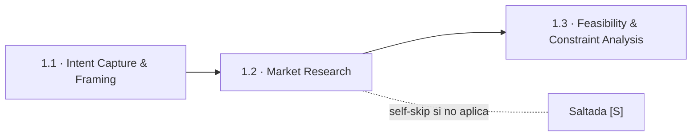
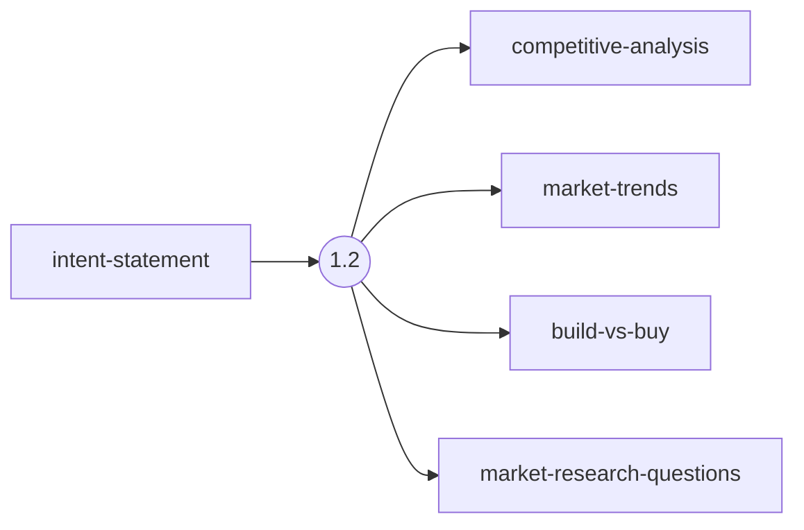
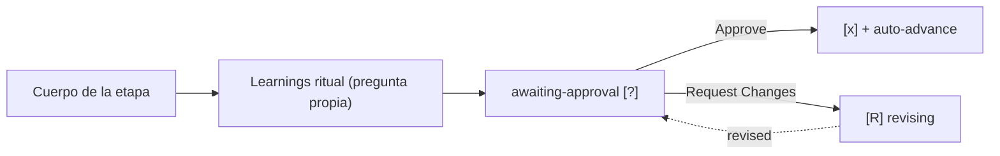

> [Inicio](README) › [Fases](01-fases/README) › [Fase 1 · Ideation](01-fases/fase-1-ideacion) › **Market Research**

# 1.2 · Market Research

**CONDITIONAL** · **Fase 1 · Ideation** · Lead **product** · Modo **inline**

> Condición: Execute when initiative has external market positioning or build-vs-buy considerations. Skip for internal tools, bug fixes, or refactors.

## Ficha de metadatos

| Campo | Valor |
|---|---|
| Número | **1.2** |
| Fase | Fase 1 · Ideation |
| slug | `market-research` |
| execution | **CONDITIONAL** |
| lead_agent | `aidlc-product-agent` |
| mode (topología) | **inline** |
| summary_confirmation | `required` (checkpoint consolidado obligatorio) |
| sensors | `required-sections`, `upstream-coverage` |
| requires_stage | `intent-capture` |

## Qué hace esta etapa

Etapa CONDITIONAL que se ejecuta cuando la iniciativa tiene posicionamiento externo en el mercado o consideraciones build-vs-buy. Para herramientas internas, bug fixes o refactors se salta. Produce el análisis competitivo, las tendencias de mercado y una recomendación build-vs-buy que alimentará la evaluación de viabilidad (1.3). No declara reviewer: el humano tria en el gate.

- El research aporta contexto: sus conclusiones no crean requisitos por sí solas.
- keywords del scope `poc`/`mvp` la excluyen, un MVP no paga el costo de discovery de mercado.

## Posición en el flujo

*Posición dentro de Fase 1 · Ideation: 2 de 7.*

**Anterior:** [1.1 · Intent Capture & Framing](02-etapas/ideation/intent-capture) · **Siguiente:** [1.3 · Feasibility & Constraint Analysis](02-etapas/ideation/feasibility)

## Paso a paso

**Step 1: Load Prior Context**: Lee el intent-statement e identifica los aspectos investigables del mercado.

**Step 2: Generate Clarifying Questions**: Pregunta por competidores, fortalezas/debilidades, modelos de precio, segmentos objetivo y tendencias relevantes.

**Step 3: Collect and Analyze Answers**: Protocolo estándar de preguntas con detección de ambigüedad.

**Step 4: Generate Artifacts**: Escribe competitive-analysis.md, market-trends.md y build-vs-buy.md.

**Step 5: Completion Handoff**: Learnings ritual + apertura de gate.

**Step 6: Present Completion & Request Approval**: Gate estándar de 2 opciones (fase Ideation: puede incluir 3ª opción para recuperar etapas saltadas).

## Artefactos

| Dirección | Artefactos |
|---|---|
| **produce** | `competitive-analysis`, `market-trends`, `build-vs-buy`, `market-research-questions` |
| **consume** | `intent-statement` |

## Agentes implicados

- **Lead:** [aidlc-product-agent](03-agentes/aidlc-product-agent), posee los artefactos `produces[]` de la etapa.
- **Conductor:** el orquestador es el bus: los agentes NUNCA se invocan entre sí, solo el conductor delega. Ver [el oficio del conductor](06-maquinaria/conductor).

## Topología y ejecución

**Inline.** El lead corre en la propia sesión del conductor, cargando su persona; los supports (si los hay) son voces que el conductor adopta. Sin contribution files. 29 de las 33 etapas usan esta topología.

## Mecánica del gate

Sin reviewer declarado, el gate es directo:

Reglas de oro: HARD STOP (el conductor termina su turno y espera al humano), NO EMERGENT BEHAVIOR (menús de 2 opciones en Construction/Operation; 3ª opción solo en ideation/inception para recuperar etapas saltadas), y tras 3 ciclos de Request Changes aparece **Accept as-is** (escape hatch). Detalle completo en [ciclo de gate](06-maquinaria/ciclo-de-gate).

## Sensores declarados

| Sensor | dispara en | categoría | qué verifica |
|---|---|---|---|
| `required-sections` | gate | document-shape | Chequea que el output contenga los encabezados H2 requeridos (default: ≥2 H2) o los del template resuelto. |
| `upstream-coverage` | gate | document-shape | Compara la prosa del output con el `consumes:` declarado: cada artefacto upstream debe aparecer referenciado. |

Un sensor `fire_on: gate` corre al entrar el gate; `advisory` solo emite findings; un sensor **blocking** exige pass verificado (o el override respaldado por humano) antes de abrir la gate. Detalle en [sensores](06-maquinaria/sensores).

## En qué scopes ejecuta

**Ejecutan esta etapa:** `enterprise`, `feature`

**La saltan:** `bugfix`, `classic`, `express`, `infra`, `mvp`, `poc`, `refactor`, `security-patch`, `workshop`

Cada scope es una rejilla EXECUTE/SKIP sobre las 33 etapas. Ver [la matriz completa de scopes](05-scopes/README).

## Conexiones

- [Ficha de la Fase 1 · Ideation](01-fases/fase-1-ideacion)
- [Etapa anterior: 1.1](02-etapas/ideation/intent-capture)
- [Etapa siguiente: 1.3](02-etapas/ideation/feasibility)
- [Ficha del lead: aidlc-product-agent](03-agentes/aidlc-product-agent)
- [Protocolos que gobiernan la etapa](04-protocolos/README)
