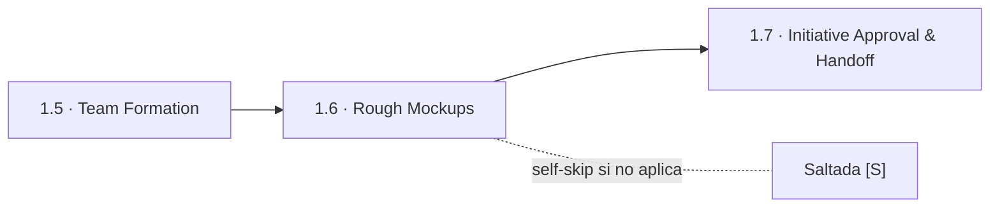
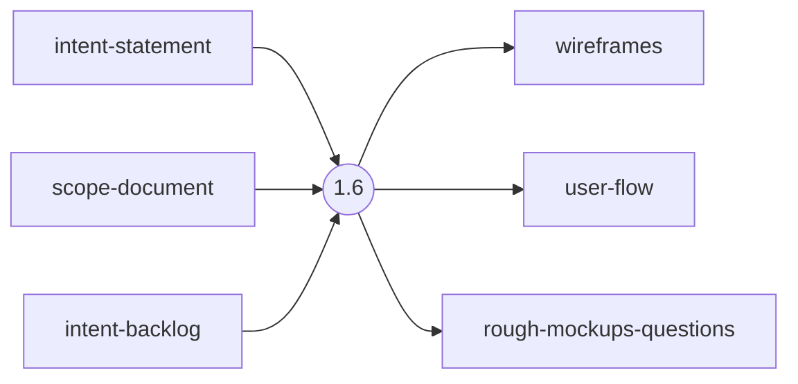
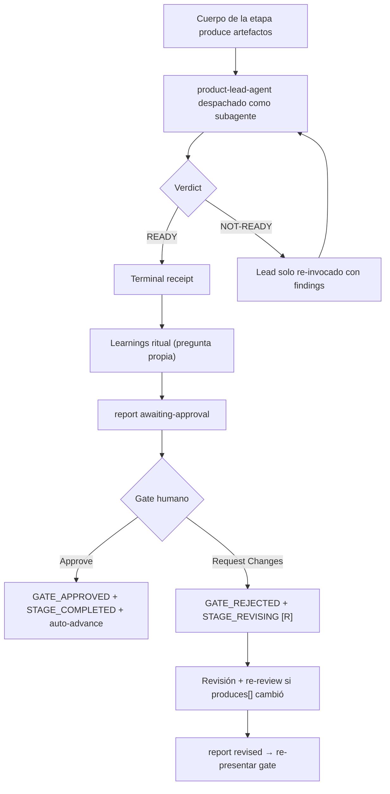

> [Inicio](README) › [Fases](01-fases/README) › [Fase 1 · Ideation](01-fases/fase-1-ideacion) › **Rough Mockups**

# 1.6 · Rough Mockups

**CONDITIONAL** · **Fase 1 · Ideation** · Lead **design** · Modo **inline**

> Condición: Execute when user-facing UI is part of the initiative; for API/backend, produce system interaction diagrams. Skip for non-UI, API-only, or infrastructure-only initiatives.

## Ficha de metadatos

| Campo | Valor |
|---|---|
| Número | **1.6** |
| Fase | Fase 1 · Ideation |
| slug | `rough-mockups` |
| execution | **CONDITIONAL** |
| lead_agent | `aidlc-design-agent` |
| support_agents | `aidlc-product-agent` |
| mode (topología) | **inline** |
| reviewer | `aidlc-product-lead-agent` (**advisory**, max 2 iter.) |
| review_artifact | `wireframes` |
| summary_confirmation | `required` (checkpoint consolidado obligatorio) |
| sensors | `required-sections`, `upstream-coverage` |
| requires_stage | `scope-definition`, `team-formation` |

## Qué hace esta etapa

Etapa CONDITIONAL del Design Agent: produce wireframes de concepto y el flujo de usuario del happy path cuando la iniciativa tiene UI. Para iniciativas API/backend produce diagramas de interacción de sistema; para infra pura se salta. Los mockups se refinarán en Inception (2.5) a partir de las user stories. Pasa por review advisory del Product Lead.

- En AI-DLC los wireframes usan markdown estructurado, versionable y trazable en el record.

## Posición en el flujo

*Posición dentro de Fase 1 · Ideation: 6 de 7.*

**Anterior:** [1.5 · Team Formation](02-etapas/ideation/team-formation) · **Siguiente:** [1.7 · Initiative Approval & Handoff](02-etapas/ideation/approval-handoff)

## Paso a paso

**Step 1: Load Prior Context**: Lee intent-statement y scope-definition/intent-backlog.

**Step 2: Generate Clarifying Questions**: Puntos de entrada del usuario, pantallas clave, flujo happy path, contenido esencial por vista.

**Step 3: Collect and Analyze Answers**: Protocolo estándar.

**Step 4: Generate Artifacts**: wireframes.md (ASCII/text markup low-fi) y user-flow.md.

**Step 5: Completion Handoff**: Learnings ritual.

**Step 6: Present Completion & Request Approval**: Gate estándar.

## Artefactos

| Dirección | Artefactos |
|---|---|
| **produce** | `wireframes`, `user-flow`, `rough-mockups-questions` |
| **consume** | `intent-statement`, `scope-document`, `intent-backlog` |

## Agentes implicados

- **Lead:** [aidlc-design-agent](03-agentes/aidlc-design-agent), posee los artefactos `produces[]` de la etapa.
- **Soporte:** [aidlc-product-agent](03-agentes/aidlc-product-agent), voz inline en la sesión
- **Reviewer:** [aidlc-product-lead-agent](03-agentes/aidlc-product-lead-agent), verifica desde fuera; su veredicto llega al gate.
- **Conductor:** el orquestador es el bus: los agentes NUNCA se invocan entre sí, solo el conductor delega. Ver [el oficio del conductor](06-maquinaria/conductor).

## Topología y ejecución

**Inline.** El lead corre en la propia sesión del conductor, cargando su persona; los supports (si los hay) son voces que el conductor adopta. Sin contribution files. 29 de las 33 etapas usan esta topología.

## Mecánica del gate

Con reviewer **advisory** declarado, el flujo es:

Reglas de oro: HARD STOP (el conductor termina su turno y espera al humano), NO EMERGENT BEHAVIOR (menús de 2 opciones en Construction/Operation; 3ª opción solo en ideation/inception para recuperar etapas saltadas), y tras 3 ciclos de Request Changes aparece **Accept as-is** (escape hatch). Detalle completo en [ciclo de gate](06-maquinaria/ciclo-de-gate).

## Sensores declarados

| Sensor | dispara en | categoría | qué verifica |
|---|---|---|---|
| `required-sections` | gate | document-shape | Chequea que el output contenga los encabezados H2 requeridos (default: ≥2 H2) o los del template resuelto. |
| `upstream-coverage` | gate | document-shape | Compara la prosa del output con el `consumes:` declarado: cada artefacto upstream debe aparecer referenciado. |

Un sensor `fire_on: gate` corre al entrar el gate; `advisory` solo emite findings; un sensor **blocking** exige pass verificado (o el override respaldado por humano) antes de abrir la gate. Detalle en [sensores](06-maquinaria/sensores).

## En qué scopes ejecuta

**Ejecutan esta etapa:** `enterprise`, `feature`, `mvp`

**La saltan:** `bugfix`, `classic`, `express`, `infra`, `poc`, `refactor`, `security-patch`, `workshop`

Cada scope es una rejilla EXECUTE/SKIP sobre las 33 etapas. Ver [la matriz completa de scopes](05-scopes/README).

## Conexiones

- [Ficha de la Fase 1 · Ideation](01-fases/fase-1-ideacion)
- [Etapa anterior: 1.5](02-etapas/ideation/team-formation)
- [Etapa siguiente: 1.7](02-etapas/ideation/approval-handoff)
- [Ficha del lead: aidlc-design-agent](03-agentes/aidlc-design-agent)
- [Ficha del reviewer: aidlc-product-lead-agent](03-agentes/aidlc-product-lead-agent)
- [Protocolos que gobiernan la etapa](04-protocolos/README)
