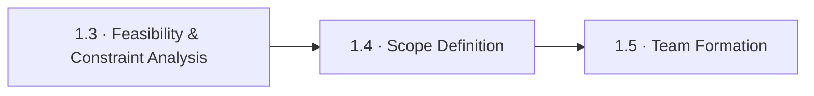
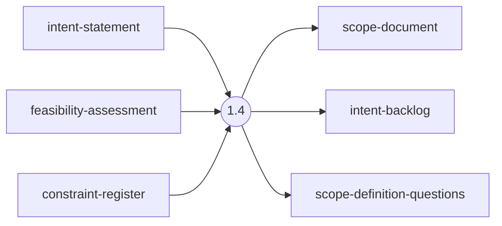
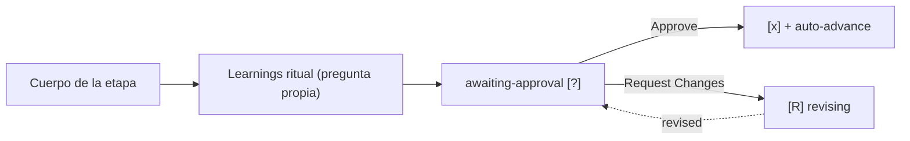

> [Inicio](README) › [Fases](01-fases/README) › [Fase 1 · Ideation](01-fases/fase-1-ideacion) › **Scope Definition**

# 1.4 · Scope Definition

**ALWAYS** · **Fase 1 · Ideation** · Lead **product** · Modo **inline**

> Condición: Always executes, defines the scope boundary and prioritized backlog

## Ficha de metadatos

| Campo | Valor |
|---|---|
| Número | **1.4** |
| Fase | Fase 1 · Ideation |
| slug | `scope-definition` |
| execution | **ALWAYS** |
| lead_agent | `aidlc-product-agent` |
| support_agents | `aidlc-delivery-agent` |
| mode (topología) | **inline** |
| summary_confirmation | `required` (checkpoint consolidado obligatorio) |
| sensors | `required-sections`, `upstream-coverage` |
| requires_stage | `intent-capture`, `feasibility` |

## Qué hace esta etapa

Etapa ALWAYS que fija la frontera de la iniciativa: qué entra, qué queda fuera y en qué orden. Produce el scope-document y el intent-backlog priorizado (mostrar/doing/later). El Product Agent la lidera consumiendo el intent, la viabilidad y las restricciones. La definición de este scope de negocio es distinta del scope del workflow (la rejilla EXECUTE/SKIP): este documento delimita el producto; el sistema de scopes delimita el proceso.

- El boundary verification Ideation→Inception exige 'Intent → Scope → Intent Backlog consistency'.

## Posición en el flujo

*Posición dentro de Fase 1 · Ideation: 4 de 7.*

**Anterior:** [1.3 · Feasibility & Constraint Analysis](02-etapas/ideation/feasibility) · **Siguiente:** [1.5 · Team Formation](02-etapas/ideation/team-formation)

## Paso a paso

**Step 1: Load Prior Context**: Lee intent-statement y feasibility-assessment/constraint-register si existen.

**Step 2: Generate Clarifying Questions**: ¿Cuál es el alcance mínimo viable que entrega valor? ¿Qué capacidades son must-have vs nice-to-have? ¿Qué queda explícitamente fuera?

**Step 3: Collect and Analyze Answers**: Análisis de contradicciones, un scope que pida 'lo simple' con features enterprise-grade se detecta aquí.

**Step 4: Generate Artifacts**: scope-document.md (in-scope, out-of-scope, prioridades) e intent-backlog.md.

**Step 5: Completion Handoff**: Learnings ritual.

**Step 6: Present Completion & Request Approval**: Gate estándar.

## Artefactos

| Dirección | Artefactos |
|---|---|
| **produce** | `scope-document`, `intent-backlog`, `scope-definition-questions` |
| **consume** | `intent-statement`, `feasibility-assessment`, `constraint-register` |

## Agentes implicados

- **Lead:** [aidlc-product-agent](03-agentes/aidlc-product-agent), posee los artefactos `produces[]` de la etapa.
- **Soporte:** [aidlc-delivery-agent](03-agentes/aidlc-delivery-agent), voz inline en la sesión
- **Conductor:** el orquestador es el bus: los agentes NUNCA se invocan entre sí, solo el conductor delega. Ver [el oficio del conductor](06-maquinaria/conductor).

## Topología y ejecución

**Inline.** El lead corre en la propia sesión del conductor, cargando su persona; los supports (si los hay) son voces que el conductor adopta. Sin contribution files. 29 de las 33 etapas usan esta topología.

## Mecánica del gate

Sin reviewer declarado, el gate es directo:

Reglas de oro: HARD STOP (el conductor termina su turno y espera al humano), NO EMERGENT BEHAVIOR (menús de 2 opciones en Construction/Operation; 3ª opción solo en ideation/inception para recuperar etapas saltadas), y tras 3 ciclos de Request Changes aparece **Accept as-is** (escape hatch). Detalle completo en [ciclo de gate](06-maquinaria/ciclo-de-gate).

## Sensores declarados

| Sensor | dispara en | categoría | qué verifica |
|---|---|---|---|
| `required-sections` | gate | document-shape | Chequea que el output contenga los encabezados H2 requeridos (default: ≥2 H2) o los del template resuelto. |
| `upstream-coverage` | gate | document-shape | Compara la prosa del output con el `consumes:` declarado: cada artefacto upstream debe aparecer referenciado. |

Un sensor `fire_on: gate` corre al entrar el gate; `advisory` solo emite findings; un sensor **blocking** exige pass verificado (o el override respaldado por humano) antes de abrir la gate. Detalle en [sensores](06-maquinaria/sensores).

## En qué scopes ejecuta

**Ejecutan esta etapa:** `enterprise`, `feature`, `mvp`

**La saltan:** `bugfix`, `classic`, `express`, `infra`, `poc`, `refactor`, `security-patch`, `workshop`

Cada scope es una rejilla EXECUTE/SKIP sobre las 33 etapas. Ver [la matriz completa de scopes](05-scopes/README).

## Conexiones

- [Ficha de la Fase 1 · Ideation](01-fases/fase-1-ideacion)
- [Etapa anterior: 1.3](02-etapas/ideation/feasibility)
- [Etapa siguiente: 1.5](02-etapas/ideation/team-formation)
- [Ficha del lead: aidlc-product-agent](03-agentes/aidlc-product-agent)
- [Protocolos que gobiernan la etapa](04-protocolos/README)
