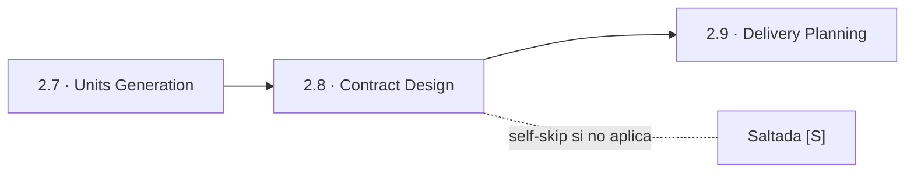
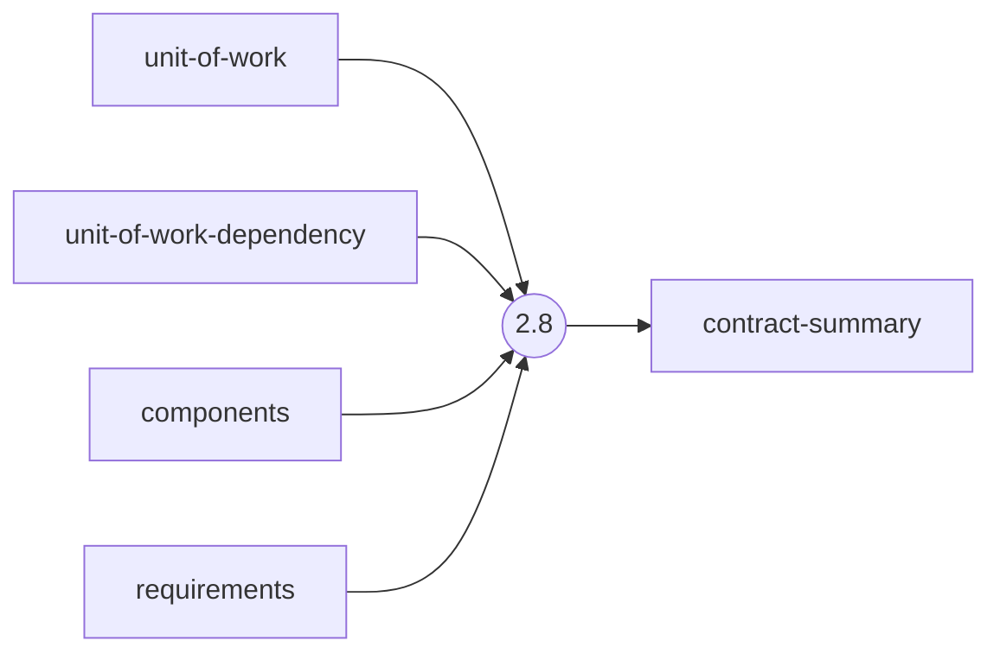
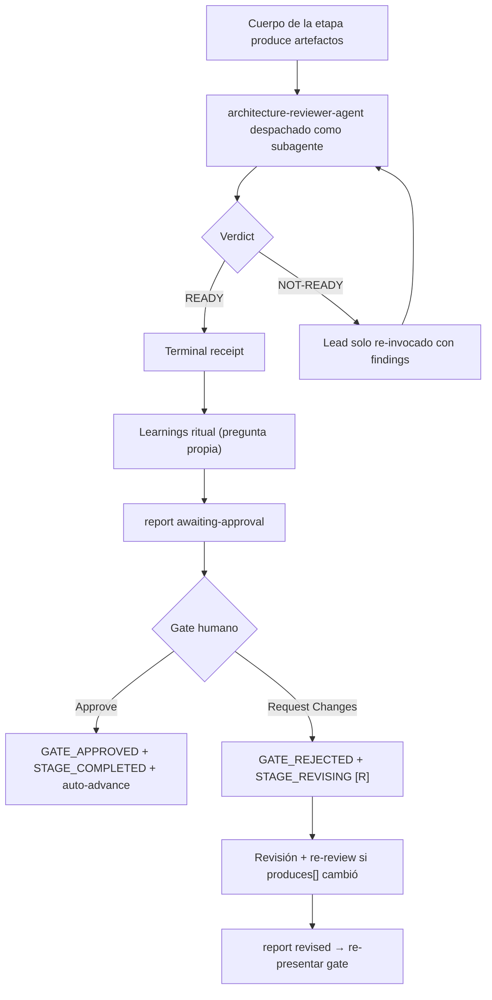

> [Inicio](README) › [Fases](01-fases/README) › [Fase 2 · Inception](01-fases/fase-2-inception) › **Contract Design**

# 2.8 · Contract Design

**CONDITIONAL** · **Fase 2 · Inception** · Lead **architect** · Modo **inline**

> Condición: Execute when the system has any formal contract to pin down — an inter-unit boundary (more than one unit that must integrate) OR a unit that exposes a public/external API consumed outside the system. Skip only for a single self-contained unit with no inter-unit boundaries and no externally consumed API.

## Ficha de metadatos

| Campo | Valor |
|---|---|
| Número | **2.8** |
| Fase | Fase 2 · Inception |
| slug | `contract-design` |
| execution | **CONDITIONAL** |
| lead_agent | `aidlc-architect-agent` |
| support_agents | `aidlc-aws-platform-agent` |
| mode (topología) | **inline** |
| reviewer | `aidlc-architecture-reviewer-agent` (**advisory**, max 2 iter.) |
| review_artifact | `contract-summary` |
| summary_confirmation | `required` (checkpoint consolidado obligatorio) |
| sensors | `required-sections`, `upstream-coverage` |
| requires_stage | `units-generation` |

## Qué hace esta etapa

Etapa CONDITIONAL del Architect: fija los contratos formales entre unidades (y de APIs públicas) para que se pueda construir en paralelo sin ambigüedad. Trigger: >1 unidad que debe integrar, o una unidad que expone API externa. Produce contract-summary.md: un contrato por boundary con mecanismo (REST → OpenAPI YAML, eventos → AsyncAPI YAML, shared schema), data shapes, semántica de fallo y propiedad. Review advisory del Architecture Reviewer.

- En Minimal se suele saltar (unidad autocontenida); una API pública solitaria recibe un contrato ligero.
- El reviewer verifica los contratos contra components.md y el DAG, no contra la prosa de unidades hermanas.

## Posición en el flujo

*Posición dentro de Fase 2 · Inception: 8 de 9.*

**Anterior:** [2.7 · Units Generation](02-etapas/inception/units-generation) · **Siguiente:** [2.9 · Delivery Planning](02-etapas/inception/delivery-planning)

## Paso a paso

**Step 1: Load Prior Context** — unit-of-work.md, unit-of-work-dependency.md (cada edge del DAG es un contrato candidato), components.md, requirements.md.

**Step 2: Create Contract Plan with Questions** — Superficie pública/externa (trigger single-unit), mecanismo de integración por boundary (REST/eventos/schema compartido/gRPC), ownership de cada contrato.

**Step 3: Collect and Analyze Answers** — Análisis de ambigüedad obligatorio.

**Step 4: Generate the Contract Summary** — contract-summary.md: OpenAPI para sync REST, AsyncAPI para eventos; retry/timeout/error budgets y política de breaking changes en depth Standard/Comprehensive.

**Step 5: Completion Handoff** — Learnings ritual.

**Step 6: Present Completion & Request Approval** — Summary: contratos por mecanismo y ownership.

## Artefactos

| Dirección | Artefactos |
|---|---|
| **produce** | `contract-summary` |
| **consume** | `unit-of-work`, `unit-of-work-dependency`, `components`, `requirements` |

## Agentes implicados

- **Lead:** [aidlc-architect-agent](03-agentes/aidlc-architect-agent) — posee los artefactos `produces[]` de la etapa.
- **Soporte:** [aidlc-aws-platform-agent](03-agentes/aidlc-aws-platform-agent) — voz inline en la sesión
- **Reviewer:** [aidlc-architecture-reviewer-agent](03-agentes/aidlc-architecture-reviewer-agent) — verifica desde fuera; su veredicto llega al gate.
- **Conductor:** el orquestador es el bus: los agentes NUNCA se invocan entre sí — solo el conductor delega. Ver [el oficio del conductor](06-maquinaria/conductor).

## Topología y ejecución

**Inline.** El lead corre en la propia sesión del conductor, cargando su persona; los supports (si los hay) son voces que el conductor adopta. Sin contribution files. 29 de las 33 etapas usan esta topología.

## Mecánica del gate

Con reviewer **advisory** declarado, el flujo es:

Reglas de oro: HARD STOP (el conductor termina su turno y espera al humano), NO EMERGENT BEHAVIOR (menús de 2 opciones en Construction/Operation; 3ª opción solo en ideation/inception para recuperar etapas saltadas), y tras 3 ciclos de Request Changes aparece **Accept as-is** (escape hatch). Detalle completo en [ciclo de gate](06-maquinaria/ciclo-de-gate).

## Sensores declarados

| Sensor | dispara en | categoría | qué verifica |
|---|---|---|---|
| `required-sections` | gate | document-shape | Chequea que el output contenga los encabezados H2 requeridos (default: ≥2 H2) o los del template resuelto. |
| `upstream-coverage` | gate | document-shape | Compara la prosa del output con el `consumes:` declarado: cada artefacto upstream debe aparecer referenciado. |

Un sensor `fire_on: gate` corre al entrar el gate; `advisory` solo emite findings; un sensor **blocking** exige pass verificado (o el override respaldado por humano) antes de abrir la gate. Detalle en [sensores](06-maquinaria/sensores).

## En qué scopes ejecuta

**Ejecutan esta etapa:** `classic`, `enterprise`, `feature`, `mvp`, `workshop`

**La saltan:** `bugfix`, `express`, `infra`, `poc`, `refactor`, `security-patch`

Cada scope es una rejilla EXECUTE/SKIP sobre las 33 etapas. Ver [la matriz completa de scopes](05-scopes/README).

## Conexiones

- [Ficha de la Fase 2 · Inception](01-fases/fase-2-inception)
- [Etapa anterior: 2.7](02-etapas/inception/units-generation)
- [Etapa siguiente: 2.9](02-etapas/inception/delivery-planning)
- [Ficha del lead: aidlc-architect-agent](03-agentes/aidlc-architect-agent)
- [Ficha del reviewer: aidlc-architecture-reviewer-agent](03-agentes/aidlc-architecture-reviewer-agent)
- [Protocolos que gobiernan la etapa](04-protocolos/README)
