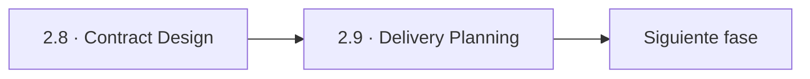
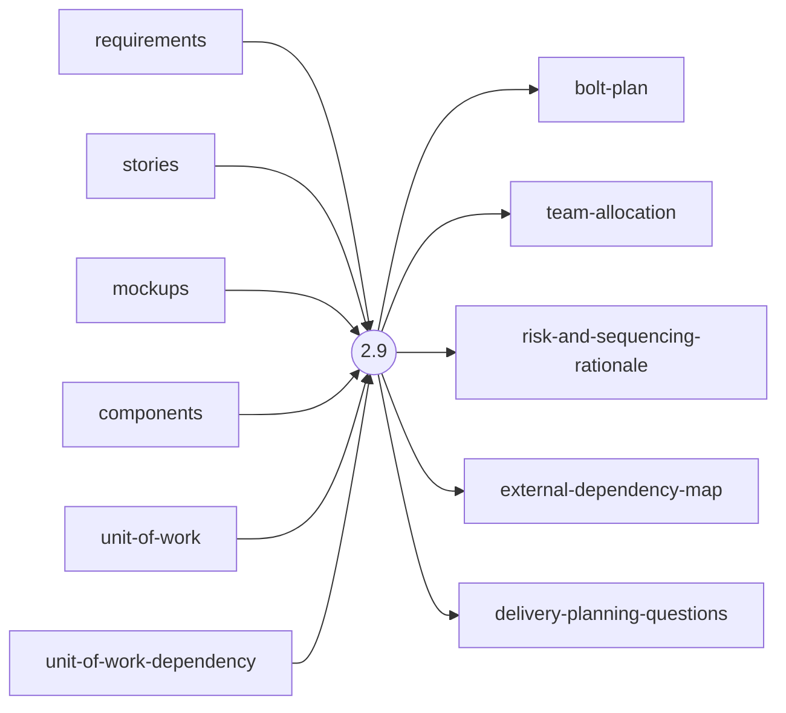
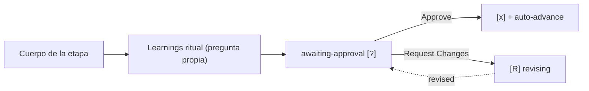

> [Inicio](README) › [Fases](01-fases/README) › [Fase 2 · Inception](01-fases/fase-2-inception) › **Delivery Planning**

# 2.9 · Delivery Planning

**ALWAYS** · **Fase 2 · Inception** · Lead **delivery** · Modo **inline**

> Condición: Always executes — capstone Inception stage, produces the detailed execution plan for Construction and Operation

## Ficha de metadatos

| Campo | Valor |
|---|---|
| Número | **2.9** |
| Fase | Fase 2 · Inception |
| slug | `delivery-planning` |
| execution | **ALWAYS** |
| lead_agent | `aidlc-delivery-agent` |
| support_agents | `aidlc-architect-agent` |
| mode (topología) | **inline** |
| summary_confirmation | `required` (checkpoint consolidado obligatorio) |
| sensors | `required-sections`, `upstream-coverage` |
| requires_stage | `units-generation` |

## Qué hace esta etapa

Etapa ALWAYS de cierre de Inception, liderada por el Delivery Agent: produce el plan de ejecución de Construction y Operation. **bolt-plan.md** ordena los Bolts (slices de entrega con Units, Definition of Done y confidence hypothesis — qué comportamiento observable valida enviar ese Bolt), **team-allocation.md** asigna Bolt→mob (o declara ejecución AI total si 1.5 no corrió), más risk-rationale y external-dependency-map. Ejecuta el phase boundary verification Inception→Construction y registra `PHASE_VERIFIED`.

- Nota del protocolo: el walk runtime por defecto es **stage-major**: bolt-plan.md queda como artefacto de planeamiento; el motor no lo usa como boundary de orden. Los batches runtime salen del DAG.
- La transición Inception→Construction es delivery-planning → functional-design.
- Set de `Construction Iteration: unit-major` ocurre aquí (`aidlc-state.ts set-construction-iteration`).

## Posición en el flujo

*Posición dentro de Fase 2 · Inception: 9 de 9. Es la última de su fase: precede al salto de fase.*

**Anterior:** [2.8 · Contract Design](02-etapas/inception/contract-design)

## Paso a paso

**Step 1: Load Prior Context** — Todo inception: requirements, stories, mockups, components, units, DAG, contracts, team-practices.

**Step 2: Generate Clarifying Questions** — Definiciones: Bolt, confidence hypothesis, Definition of Done, walking skeleton. Preguntas: secuencia, prioridades, riesgos de secuencia, dependencias externas.

**Step 3: Collect and Analyze Answers** — Protocolo estándar.

**Step 4: Generate Artifacts** — bolt-plan.md, team-allocation.md, risk-and-sequencing-rationale.md, external-dependency-map.md.

**Step 5: Phase Boundary Verification** — Requirements → Stories → Architecture: toda story traza a requisito, la arquitectura cubre todas las stories; escribe `<record>/verification/` y emite PHASE_VERIFIED.

**Step 6: Completion Handoff** — Learnings ritual.

**Step 7: Present Completion & Request Approval** — Gate que abre Construction: la aprobación habilita el walking skeleton.

## Artefactos

| Dirección | Artefactos |
|---|---|
| **produce** | `bolt-plan`, `team-allocation`, `risk-and-sequencing-rationale`, `external-dependency-map`, `delivery-planning-questions` |
| **consume** | `requirements`, `stories`, `mockups`, `components`, `unit-of-work`, `unit-of-work-dependency`, `unit-of-work-story-map`, `contract-summary`, `team-practices` |

## Agentes implicados

- **Lead:** [aidlc-delivery-agent](03-agentes/aidlc-delivery-agent) — posee los artefactos `produces[]` de la etapa.
- **Soporte:** [aidlc-architect-agent](03-agentes/aidlc-architect-agent) — voz inline en la sesión
- **Conductor:** el orquestador es el bus: los agentes NUNCA se invocan entre sí — solo el conductor delega. Ver [el oficio del conductor](06-maquinaria/conductor).

## Topología y ejecución

**Inline.** El lead corre en la propia sesión del conductor, cargando su persona; los supports (si los hay) son voces que el conductor adopta. Sin contribution files. 29 de las 33 etapas usan esta topología.

## Mecánica del gate

Sin reviewer declarado — el gate es directo:

Reglas de oro: HARD STOP (el conductor termina su turno y espera al humano), NO EMERGENT BEHAVIOR (menús de 2 opciones en Construction/Operation; 3ª opción solo en ideation/inception para recuperar etapas saltadas), y tras 3 ciclos de Request Changes aparece **Accept as-is** (escape hatch). Detalle completo en [ciclo de gate](06-maquinaria/ciclo-de-gate).

## Sensores declarados

| Sensor | dispara en | categoría | qué verifica |
|---|---|---|---|
| `required-sections` | gate | document-shape | Chequea que el output contenga los encabezados H2 requeridos (default: ≥2 H2) o los del template resuelto. |
| `upstream-coverage` | gate | document-shape | Compara la prosa del output con el `consumes:` declarado: cada artefacto upstream debe aparecer referenciado. |

Un sensor `fire_on: gate` corre al entrar el gate; `advisory` solo emite findings; un sensor **blocking** exige pass verificado (o el override respaldado por humano) antes de abrir la gate. Detalle en [sensores](06-maquinaria/sensores).

## En qué scopes ejecuta

**Ejecutan esta etapa:** `classic`, `enterprise`, `feature`, `mvp`, `workshop`

**La saltan:** `bugfix`, `express`, `infra`, `poc`, `refactor`, `security-patch`

Cada scope es una rejilla EXECUTE/SKIP sobre las 33 etapas. Ver [la matriz completa de scopes](05-scopes/README).

## Conexiones

- [Ficha de la Fase 2 · Inception](01-fases/fase-2-inception)
- [Etapa anterior: 2.8](02-etapas/inception/contract-design)
- [Ficha del lead: aidlc-delivery-agent](03-agentes/aidlc-delivery-agent)
- [Protocolos que gobiernan la etapa](04-protocolos/README)
