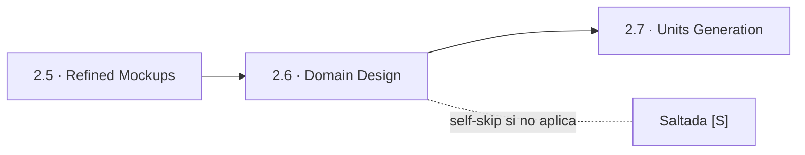
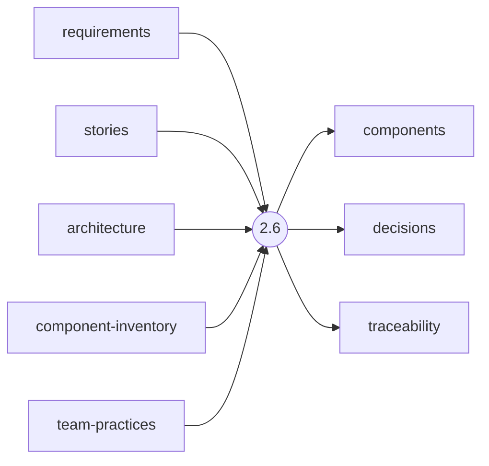
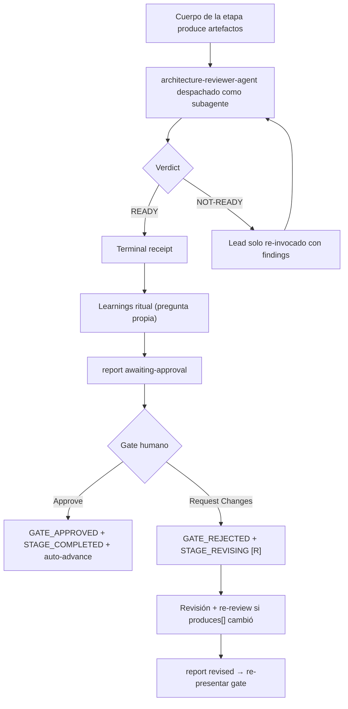

> [Inicio](README) › [Fases](01-fases/README) › [Fase 2 · Inception](01-fases/fase-2-inception) › **Domain Design**

# 2.6 · Domain Design

**CONDITIONAL** · **Fase 2 · Inception** · Lead **architect** · Modo **inline**

> Condición: Execute when new components or logical building blocks are needed. Skip when changes are modifications to existing components only.

## Ficha de metadatos

| Campo | Valor |
|---|---|
| Número | **2.6** |
| Fase | Fase 2 · Inception |
| slug | `domain-design` |
| execution | **CONDITIONAL** |
| lead_agent | `aidlc-architect-agent` |
| support_agents | `aidlc-aws-platform-agent`, `aidlc-design-agent` |
| mode (topología) | **inline** |
| reviewer | `aidlc-architecture-reviewer-agent` (**advisory**, max 2 iter.) |
| review_artifact | `components` |
| summary_confirmation | `required` (checkpoint consolidado obligatorio) |
| sensors | `required-sections`, `upstream-coverage`, `traceability` |
| requires_stage | `requirements-analysis`, `refined-mockups` |

## Qué hace esta etapa

Etapa CONDITIONAL del Architect: identifica los building blocks lógicos del sistema y produce el **component catalogue** (components.md con bloque YAML fuente-de-verdad + diagrama), los **ADRs** (decisions.md: Context, Decision, Consequences, Alternatives) y el traceability.json. Regla: cada entidad pertenece a exactamente un componente; la propiedad ambigua es un design smell. Aplica DDD (bounded contexts, aggregates). La topología de despliegue NO se decide aquí (eso es Units Generation). Review advisory del Architecture Reviewer.

- Skip cuando solo se modifican componentes existentes sin crear nuevos.
- components.md es el contrato compartido que Contract Design (2.8) formaliza y Functional Design (3.1) detalla.

## Posición en el flujo

*Posición dentro de Fase 2 · Inception: 6 de 9.*

**Anterior:** [2.5 · Refined Mockups](02-etapas/inception/refined-mockups) · **Siguiente:** [2.7 · Units Generation](02-etapas/inception/units-generation)

## Paso a paso

**Step 1: Load Prior Context** — requirements.md, stories.md (si existen), y en brownfield los artefactos de RE.

**Step 2: Create Design Plan with Questions** — Decisiones de boundary de componentes (qué es un bloque distinto y por qué), propiedad de entidades, opciones de descomposición con pros/contras/reversibilidad.

**Step 3: Collect and Analyze Answers** — Análisis de ambigüedad obligatorio.

**Step 4: Generate the Component Catalogue** — components.md: YAML block por componente (name, owns, entities) + diagrama Mermaid + summary + rationale.

**Step 5: Record Architecture Decisions (ADRs)** — decisions.md: ADR-NNN con Context/Decision/Consequences/Alternatives — cada ADR exige trade-off analysis de ≥2 alternativas (regla de fase inception).

**Step 6: Record Traceability** — traceability.json: componentes ↔ requirements.

**Step 7: Completion Handoff** — Learnings ritual.

**Step 8: Present Completion & Request Approval** — Summary de componentes, boundaries clave y ADRs.

## Artefactos

| Dirección | Artefactos |
|---|---|
| **produce** | `components`, `decisions`, `traceability` |
| **consume** | `requirements`, `stories`, `architecture`, `component-inventory`, `team-practices` |

## Agentes implicados

- **Lead:** [aidlc-architect-agent](03-agentes/aidlc-architect-agent) — posee los artefactos `produces[]` de la etapa.
- **Soporte:** [aidlc-aws-platform-agent](03-agentes/aidlc-aws-platform-agent) — voz inline en la sesión
- **Soporte:** [aidlc-design-agent](03-agentes/aidlc-design-agent) — voz inline en la sesión
- **Reviewer:** [aidlc-architecture-reviewer-agent](03-agentes/aidlc-architecture-reviewer-agent) — verifica desde fuera; su veredicto llega al gate.
- **Conductor:** el orquestador es el bus: los agentes NUNCA se invocan entre sí — solo el conductor delega. Ver [el oficio del conductor](06-maquinaria/conductor).

## Topología y ejecución

**Inline.** El lead corre en la propia sesión del conductor, cargando su persona; los supports (si los hay) son voces que el conductor adopta. Sin contribution files. 29 de las 33 etapas usan esta topología.

## Mecánica del gate

Con reviewer **advisory** declarado, el flujo es:

Reglas de oro: HARD STOP (el conductor termina su turno y espera al humano), NO EMERGENT BEHAVIOR (menús de 2 opciones en Construction/Operation; 3ª opción solo en ideation/inception para recuperar etapas saltadas), y tras 3 ciclos de Request Changes aparece **Accept as-is** (escape hatch). Detalle completo en [ciclo de gate](06-maquinaria/ciclo-de-gate).

## Sensores declarados

| Sensor | dispara en | categoría | qué verifica |
|---|---|---|---|
| `required-sections` | gate | document-shape | Chequea que el output contenga los encabezados H2 requeridos (default: ≥2 H2) o los del template resuelto. |
| `upstream-coverage` | gate | document-shape | Compara la prosa del output con el `consumes:` declarado: cada artefacto upstream debe aparecer referenciado. |
| `traceability` | (write/gate) | document-traceability | Valida el traceability.json: cobertura upstream, targets downstream y huérfanos derivados por elemento (FR/US/AC/U/BR). |

Un sensor `fire_on: gate` corre al entrar el gate; `advisory` solo emite findings; un sensor **blocking** exige pass verificado (o el override respaldado por humano) antes de abrir la gate. Detalle en [sensores](06-maquinaria/sensores).

## En qué scopes ejecuta

**Ejecutan esta etapa:** `classic`, `enterprise`, `feature`, `mvp`, `workshop`

**La saltan:** `bugfix`, `express`, `infra`, `poc`, `refactor`, `security-patch`

Cada scope es una rejilla EXECUTE/SKIP sobre las 33 etapas. Ver [la matriz completa de scopes](05-scopes/README).

## Conexiones

- [Ficha de la Fase 2 · Inception](01-fases/fase-2-inception)
- [Etapa anterior: 2.5](02-etapas/inception/refined-mockups)
- [Etapa siguiente: 2.7](02-etapas/inception/units-generation)
- [Ficha del lead: aidlc-architect-agent](03-agentes/aidlc-architect-agent)
- [Ficha del reviewer: aidlc-architecture-reviewer-agent](03-agentes/aidlc-architecture-reviewer-agent)
- [Protocolos que gobiernan la etapa](04-protocolos/README)
