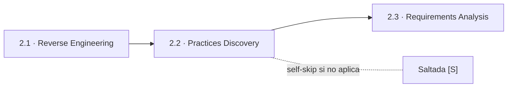
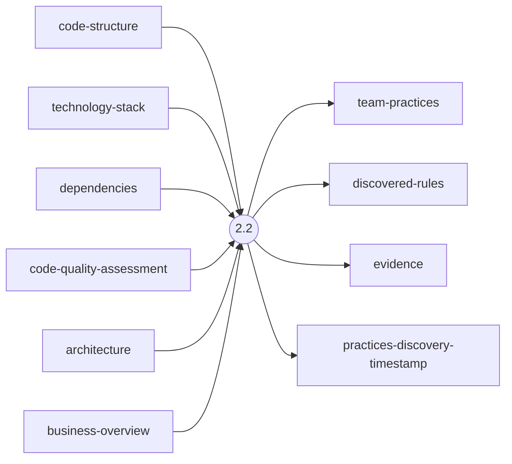
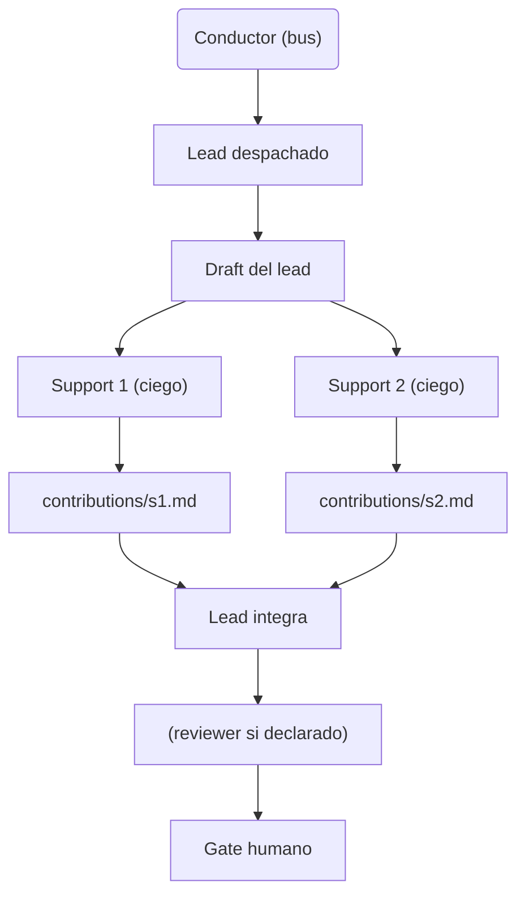
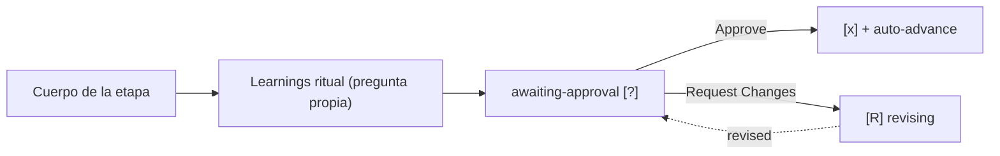

> [Inicio](README) › [Fases](01-fases/README) › [Fase 2 · Inception](01-fases/fase-2-inception) › **Practices Discovery**

# 2.2 · Practices Discovery

**CONDITIONAL** · **Fase 2 · Inception** · Lead **pipeline-deploy** · Modo **subagent**

> Condición: Always rerun for freshness. Brownfield discovers from evidence + reverse-engineering artifacts. Greenfield prompts user via structured questions using org.md defaults.

## Ficha de metadatos

| Campo | Valor |
|---|---|
| Número | **2.2** |
| Fase | Fase 2 · Inception |
| slug | `practices-discovery` |
| execution | **CONDITIONAL** |
| lead_agent | `aidlc-pipeline-deploy-agent` |
| support_agents | `aidlc-quality-agent`, `aidlc-developer-agent`, `aidlc-devsecops-agent` |
| mode (topología) | **subagent** |
| summary_confirmation | `required` (checkpoint consolidado obligatorio) |
| sensors | `required-sections`, `upstream-coverage` |
| requires_stage | `state-init`, `reverse-engineering` |

## Qué hace esta etapa

Descubre las prácticas reales del equipo y las registra en team.md como reglas afirmadas. En **brownfield** parte de la evidencia (git history, CI/deployment config, reverse-engineering) y solo pregunta lo que la evidencia no responde; en **greenfield** pregunta las cinco secciones usando org.md como default. Topología **subagent** (hub-and-spoke): el lead (Pipeline & Deploy) redacta, los supports (Developer y Quality) revisan a ciegas por contribution files, el lead integra y el affirmation gate promueve a team.md. Siempre se re-ejecuta por frescura.

- 1 de las 2 etapas subagent del grafo. Los supports ven el draft del lead pero NO las contribuciones de sus pares.
- La afirmación escribe en la memoria de MÉTODO (team.md), el mismo archivo que el resolver carga en cada etapa de ese equipo.
- Artefactos: team-practices (draft), discovered-rules, evidence + timestamp de frescura.

## Posición en el flujo

*Posición dentro de Fase 2 · Inception: 2 de 9.*

**Anterior:** [2.1 · Reverse Engineering](02-etapas/inception/reverse-engineering) · **Siguiente:** [2.3 · Requirements Analysis](02-etapas/inception/requirements-analysis)

## Paso a paso

**Step 1: Check Conditions** — Brownfield: usa RE artifacts + workspace. Greenfield: pregunta guiada por las 5 secciones de org.md.

**Step 2: Lead Draft (Always)** — El lead inspecciona evidencia (brownfield) o los defaults (greenfield) y redacta las prácticas propuestas.

**Step 3: Blind Support Review (Always)** — Developer y Quality revisan el borrador **a ciegas** (mutuamente ciegos) y escriben contribution files con posiciones AGREE/OBJECT.

**Step 4: Interview (Always)** — Brownfield: solo lo que el draft y las revisiones no pudieron responder. Greenfield: las cinco áreas.

**Step 5: Lead Integration** — Integra las contribuciones; fija Methodology (tdd/bdd/atdd/test-after/custom) y Ordering explícitos en team.md → Testing Posture.

**Step 6: Learnings + Affirmation Gate** — El gate de afirmación: el usuario aprueba que las prácticas descubiertas se escriban en team.md.

**Step 7: Promote (On Approve Only)** — Promueve las secciones a `memory/team.md`; revalida cada contribution y su identity marker.

**Step 8: Commit Approval** — Resume artefactos, 3 contributions y promociones; gate final.

## Artefactos

| Dirección | Artefactos |
|---|---|
| **produce** | `team-practices`, `discovered-rules`, `evidence`, `practices-discovery-timestamp` |
| **consume** | `code-structure`, `technology-stack`, `dependencies`, `code-quality-assessment`, `architecture`, `business-overview` |

## Agentes implicados

- **Lead:** [aidlc-pipeline-deploy-agent](03-agentes/aidlc-pipeline-deploy-agent) — posee los artefactos `produces[]` de la etapa.
- **Soporte:** [aidlc-quality-agent](03-agentes/aidlc-quality-agent) — colaborador despachado (escribe contribution file)
- **Soporte:** [aidlc-developer-agent](03-agentes/aidlc-developer-agent) — colaborador despachado (escribe contribution file)
- **Soporte:** [aidlc-devsecops-agent](03-agentes/aidlc-devsecops-agent) — colaborador despachado (escribe contribution file)
- **Conductor:** el orquestador es el bus: los agentes NUNCA se invocan entre sí — solo el conductor delega. Ver [el oficio del conductor](06-maquinaria/conductor).

## Topología y ejecución

**Subagent (hub-and-spoke).** El lead se despacha como subagente (carga su persona automáticamente); si hay supports, cada uno se despacha EN PARALELO contra el draft del lead — mutuamente ciegos — y escribe su contribution file; una pasada final del lead integra. 2 etapas: practices-discovery y code-generation.

## Mecánica del gate

Sin reviewer declarado — el gate es directo:

Reglas de oro: HARD STOP (el conductor termina su turno y espera al humano), NO EMERGENT BEHAVIOR (menús de 2 opciones en Construction/Operation; 3ª opción solo en ideation/inception para recuperar etapas saltadas), y tras 3 ciclos de Request Changes aparece **Accept as-is** (escape hatch). Detalle completo en [ciclo de gate](06-maquinaria/ciclo-de-gate).

## Sensores declarados

| Sensor | dispara en | categoría | qué verifica |
|---|---|---|---|
| `required-sections` | gate | document-shape | Chequea que el output contenga los encabezados H2 requeridos (default: ≥2 H2) o los del template resuelto. |
| `upstream-coverage` | gate | document-shape | Compara la prosa del output con el `consumes:` declarado: cada artefacto upstream debe aparecer referenciado. |

Un sensor `fire_on: gate` corre al entrar el gate; `advisory` solo emite findings; un sensor **blocking** exige pass verificado (o el override respaldado por humano) antes de abrir la gate. Detalle en [sensores](06-maquinaria/sensores).

## En qué scopes ejecuta

**Ejecutan esta etapa:** `classic`, `enterprise`, `feature`, `infra`, `mvp`, `workshop`

**La saltan:** `bugfix`, `express`, `poc`, `refactor`, `security-patch`

Cada scope es una rejilla EXECUTE/SKIP sobre las 33 etapas. Ver [la matriz completa de scopes](05-scopes/README).

## Conexiones

- [Ficha de la Fase 2 · Inception](01-fases/fase-2-inception)
- [Etapa anterior: 2.1](02-etapas/inception/reverse-engineering)
- [Etapa siguiente: 2.3](02-etapas/inception/requirements-analysis)
- [Ficha del lead: aidlc-pipeline-deploy-agent](03-agentes/aidlc-pipeline-deploy-agent)
- [Protocolos que gobiernan la etapa](04-protocolos/README)
