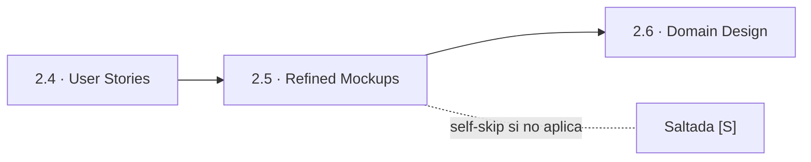
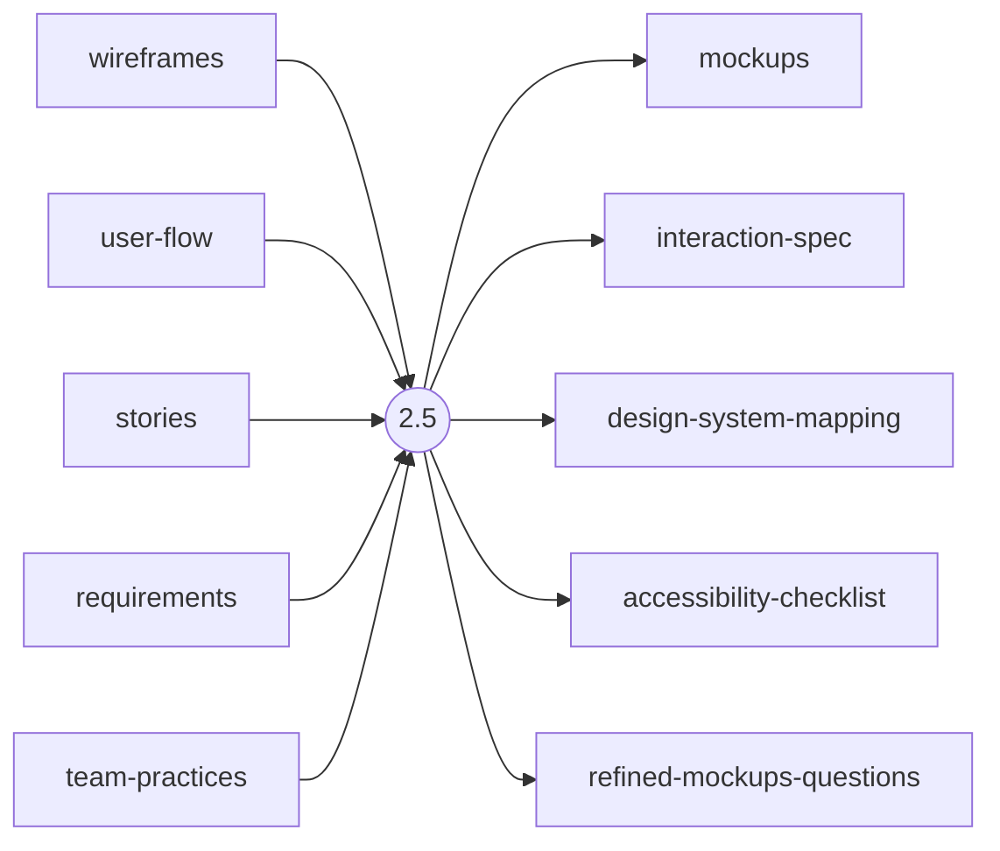
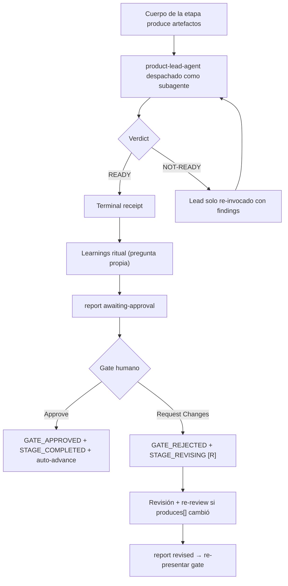

> [Inicio](README) › [Fases](01-fases/README) › [Fase 2 · Inception](01-fases/fase-2-inception) › **Refined Mockups**

# 2.5 · Refined Mockups

**CONDITIONAL** · **Fase 2 · Inception** · Lead **design** · Modo **inline**

> Condición: Execute when user-facing UI exists and rough mockups were produced in Ideation; for APIs, refine interaction diagrams

## Ficha de metadatos

| Campo | Valor |
|---|---|
| Número | **2.5** |
| Fase | Fase 2 · Inception |
| slug | `refined-mockups` |
| execution | **CONDITIONAL** |
| lead_agent | `aidlc-design-agent` |
| support_agents | `aidlc-product-agent` |
| mode (topología) | **inline** |
| reviewer | `aidlc-product-lead-agent` (**advisory**, max 2 iter.) |
| review_artifact | `mockups` |
| summary_confirmation | `required` (checkpoint consolidado obligatorio) |
| sensors | `required-sections`, `upstream-coverage` |
| requires_stage | `user-stories` |

## Qué hace esta etapa

Etapa CONDITIONAL del Design Agent que evoluciona los rough mockups (1.6) a mockups de fidelidad media/alta por user story: especificaciones de interacción (modales, edits inline, wizards), mapping al design system y checklist de accesibilidad WCAG. Consume stories + requirements + team practices. Review advisory del Product Lead.

- Domain Design (2.6) la requiere: el diseño de dominio parte de las stories y mockups refinados.

## Posición en el flujo

*Posición dentro de Fase 2 · Inception: 5 de 9.*

**Anterior:** [2.4 · User Stories](02-etapas/inception/user-stories) · **Siguiente:** [2.6 · Domain Design](02-etapas/inception/domain-design)

## Paso a paso

**Step 1: Load Prior Context** — Rough mockups, user stories, requirements y team-practices.

**Step 2: Generate Clarifying Questions** — Cómo se representa cada story en UI, patrones de interacción, estados de error/vacío/carga, responsive.

**Step 3: Collect and Analyze Answers** — Protocolo estándar.

**Step 4: Generate Artifacts** — mockups.md, interaction-spec.md, design-system-mapping.md, accessibility-checklist.md.

**Step 5: Completion Handoff** — Learnings ritual.

**Step 6: Present Completion & Request Approval** — Gate estándar con review brief.

## Artefactos

| Dirección | Artefactos |
|---|---|
| **produce** | `mockups`, `interaction-spec`, `design-system-mapping`, `accessibility-checklist`, `refined-mockups-questions` |
| **consume** | `wireframes`, `user-flow`, `stories`, `requirements`, `team-practices` |

## Agentes implicados

- **Lead:** [aidlc-design-agent](03-agentes/aidlc-design-agent) — posee los artefactos `produces[]` de la etapa.
- **Soporte:** [aidlc-product-agent](03-agentes/aidlc-product-agent) — voz inline en la sesión
- **Reviewer:** [aidlc-product-lead-agent](03-agentes/aidlc-product-lead-agent) — verifica desde fuera; su veredicto llega al gate.
- **Conductor:** el orquestador es el bus: los agentes NUNCA se invocan entre sí — solo el conductor delega. Ver [el oficio del conductor](06-maquinaria/conductor).

## Topología y ejecución

**Inline.** El lead corre en la propia sesión del conductor, cargando su persona; los supports (si los hay) son voces que el conductor adopta. Sin contribution files. 29 de las 33 etapas usan esta topología.

## Mecánica del gate

Con reviewer **advisory** declarado, el flujo es:

Reglas de oro: HARD STOP (el conductor termina su turno y espera al humano), NO EMERGENT BEHAVIOR (menús de 2 opciones en Construction/Operation; 3ª opción solo en ideation/inception para recuperar etapas saltadas), y tras 3 ciclos de Request Changes aparece **Accept as-is** (escape hatch). Detalle completo en [ciclo de gate](06-maquinaria/ciclo-de-gate).

## Sensores declarados

| Sensor | dispara en | categoría | qué verifica |
|---|---|---|---|
| `required-sections` | gate | document-shape | Chequea que el output contenga los encabezados H2 requeridos (default: ≥2 H2) o los del template resuelto. |
| `upstream-coverage` | gate | document-shape | Compara la prosa del output con el `consumes:` declarado: cada artefacto upstream debe aparecer referenciado. |

Un sensor `fire_on: gate` corre al entrar el gate; `advisory` solo emite findings; un sensor **blocking** exige pass verificado (o el override respaldado por humano) antes de abrir la gate. Detalle en [sensores](06-maquinaria/sensores).

## En qué scopes ejecuta

**Ejecutan esta etapa:** `classic`, `enterprise`, `feature`, `mvp`, `workshop`

**La saltan:** `bugfix`, `express`, `infra`, `poc`, `refactor`, `security-patch`

Cada scope es una rejilla EXECUTE/SKIP sobre las 33 etapas. Ver [la matriz completa de scopes](05-scopes/README).

## Conexiones

- [Ficha de la Fase 2 · Inception](01-fases/fase-2-inception)
- [Etapa anterior: 2.4](02-etapas/inception/user-stories)
- [Etapa siguiente: 2.6](02-etapas/inception/domain-design)
- [Ficha del lead: aidlc-design-agent](03-agentes/aidlc-design-agent)
- [Ficha del reviewer: aidlc-product-lead-agent](03-agentes/aidlc-product-lead-agent)
- [Protocolos que gobiernan la etapa](04-protocolos/README)
