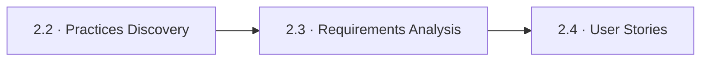
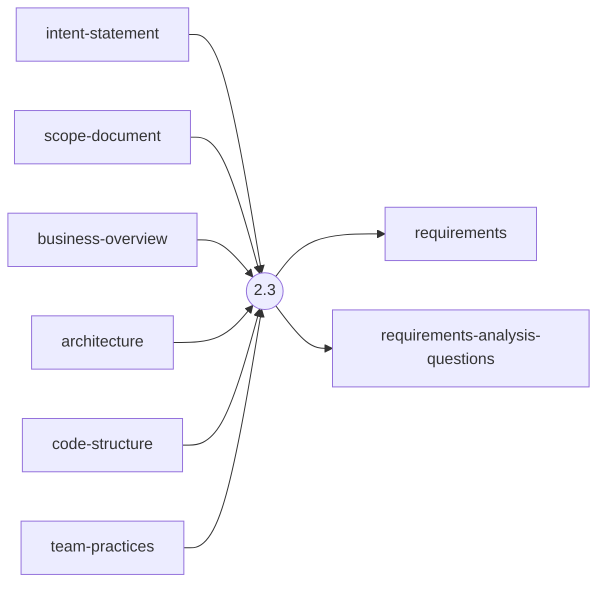
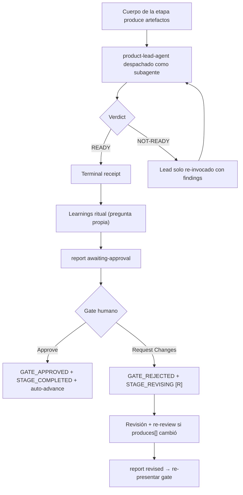

> [Inicio](README) › [Fases](01-fases/README) › [Fase 2 · Inception](01-fases/fase-2-inception) › **Requirements Analysis**

# 2.3 · Requirements Analysis

**ALWAYS** · **Fase 2 · Inception** · Lead **product** · Modo **inline**

> Condición: Always executes — depth scales with project complexity

## Ficha de metadatos

| Campo | Valor |
|---|---|
| Número | **2.3** |
| Fase | Fase 2 · Inception |
| slug | `requirements-analysis` |
| execution | **ALWAYS** |
| lead_agent | `aidlc-product-agent` |
| mode (topología) | **inline** |
| reviewer | `aidlc-product-lead-agent` (**advisory**, max 2 iter.) |
| review_artifact | `requirements` |
| summary_confirmation | `required` (checkpoint consolidado obligatorio) |
| sensors | `required-sections`, `upstream-coverage` |
| requires_stage | `approval-handoff`, `reverse-engineering` |

## Qué hace esta etapa

Etapa ALWAYS del Product Agent: transforma el intent aprobado en **requirements.md** estructurado: requisitos funcionales con IDs estables `FR{n}`/`FR{n}.{m}`, NFRs `NFR{n}`, clasificación por tipo y prioridad, criterios de aceptación. En brownfield parte de los artefactos CodeKB; la profundidad escala con el proyecto (Minimal 5-10, Standard 15-30, Comprehensive 30+). Es la etapa con el protocolo de preguntas más completo (12 steps): análisis de claridad, determinación de depth, chequeo de completitud, follow-ups y confirmación consolidada. Review advisory del Product Lead.

- Los IDs `FR1.2` sostienen la trazabilidad: user stories (`US`), business rules (`BR`) y unidades (`U`) se rastrean contra ellos vía traceability.json.
- Sensores: claim-sources, required-sections, upstream-coverage (verifica que cites los consumes).

## Posición en el flujo

*Posición dentro de Fase 2 · Inception: 3 de 9.*

**Anterior:** [2.2 · Practices Discovery](02-etapas/inception/practices-discovery) · **Siguiente:** [2.4 · User Stories](02-etapas/inception/user-stories)

## Paso a paso

**Step 1: Load Prior Context** — Brownfield: lee CodeKB. Siempre: corre el project-description fijo y lee intent/scope de ideation.

**Step 2: Analyze User Request** — Clarity (qué tan definida), Type (feature/mejora/refactor/bugfix/migración).

**Step 3: Determine Depth** — Minimal: petición clara, scope angosto. Standard: unknowns moderados. Comprehensive: múltiples stakeholders, dominio complejo.

**Step 4: Assess Current Requirements** — Requisitos explícitos e implícitos (incl. NFRs heredados del código existente).

**Step 5: Completeness Analysis** — Gaps entre lo pedido y lo necesario para construir.

**Step 6: Generate Clarifying Questions** — Preguntas por áreas temáticas dentro del rango de depth.

**Step 7: Collect and Analyze Answers** — Detección OBLIGATORIA de lenguaje vago y contradicciones.

**Step 8: Follow-Up Questions** — Resuelve ambigüedades antes de generar.

**Step 9: Confirm the Consolidated Summary** — Bullets no numerados + checkpoint 'Looks correct / Request changes' persistido.

**Step 10: Generate Requirements** — Intent analysis, FRs agrupados por área con IDs estables, NFRs, constraints, assumptions etiquetadas.

**Step 11: Completion Handoff** — Learnings ritual.

**Step 12: Present Completion & Request Approval** — Review brief del Product Lead + gate.

## Artefactos

| Dirección | Artefactos |
|---|---|
| **produce** | `requirements`, `requirements-analysis-questions` |
| **consume** | `intent-statement`, `scope-document`, `business-overview`, `architecture`, `code-structure`, `team-practices` |

## Agentes implicados

- **Lead:** [aidlc-product-agent](03-agentes/aidlc-product-agent) — posee los artefactos `produces[]` de la etapa.
- **Reviewer:** [aidlc-product-lead-agent](03-agentes/aidlc-product-lead-agent) — verifica desde fuera; su veredicto llega al gate.
- **Conductor:** el orquestador es el bus: los agentes NUNCA se invocan entre sí — solo el conductor delega. Ver [el oficio del conductor](06-maquinaria/conductor).

## Topología y ejecución

**Inline.** El lead corre en la propia sesión del conductor, cargando su persona; los supports (si los hay) son voces que el conductor adopta. Sin contribution files. 29 de las 33 etapas usan esta topología.

## Mecánica del gate

Con reviewer **advisory** declarado, el flujo es:

Reglas de oro: HARD STOP (el conductor termina su turno y espera al humano), NO EMERGENT BEHAVIOR (menús de 2 opciones en Construction/Operation; 3ª opción solo en ideation/inception para recuperar etapas saltadas), y tras 3 ciclos de Request Changes aparece **Accept as-is** (escape hatch). Detalle completo en [ciclo de gate](06-maquinaria/ciclo-de-gate).

## Sensores declarados

| Sensor | dispara en | categoría | qué verifica |
|---|---|---|---|
| `required-sections` | gate | document-shape | Chequea que el output contenga los encabezados H2 requeridos (default: ≥2 H2) o los del template resuelto. |
| `upstream-coverage` | gate | document-shape | Compara la prosa del output con el `consumes:` declarado: cada artefacto upstream debe aparecer referenciado. |

Un sensor `fire_on: gate` corre al entrar el gate; `advisory` solo emite findings; un sensor **blocking** exige pass verificado (o el override respaldado por humano) antes de abrir la gate. Detalle en [sensores](06-maquinaria/sensores).

## En qué scopes ejecuta

**Ejecutan esta etapa:** `bugfix`, `classic`, `enterprise`, `express`, `feature`, `infra`, `mvp`, `poc`, `refactor`, `security-patch`, `workshop`

**La saltan:** 

Cada scope es una rejilla EXECUTE/SKIP sobre las 33 etapas. Ver [la matriz completa de scopes](05-scopes/README).

## Conexiones

- [Ficha de la Fase 2 · Inception](01-fases/fase-2-inception)
- [Etapa anterior: 2.2](02-etapas/inception/practices-discovery)
- [Etapa siguiente: 2.4](02-etapas/inception/user-stories)
- [Ficha del lead: aidlc-product-agent](03-agentes/aidlc-product-agent)
- [Ficha del reviewer: aidlc-product-lead-agent](03-agentes/aidlc-product-lead-agent)
- [Protocolos que gobiernan la etapa](04-protocolos/README)
