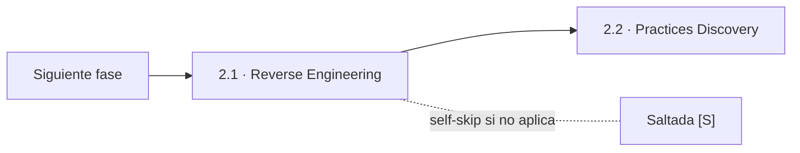
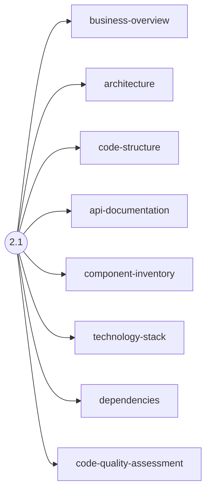
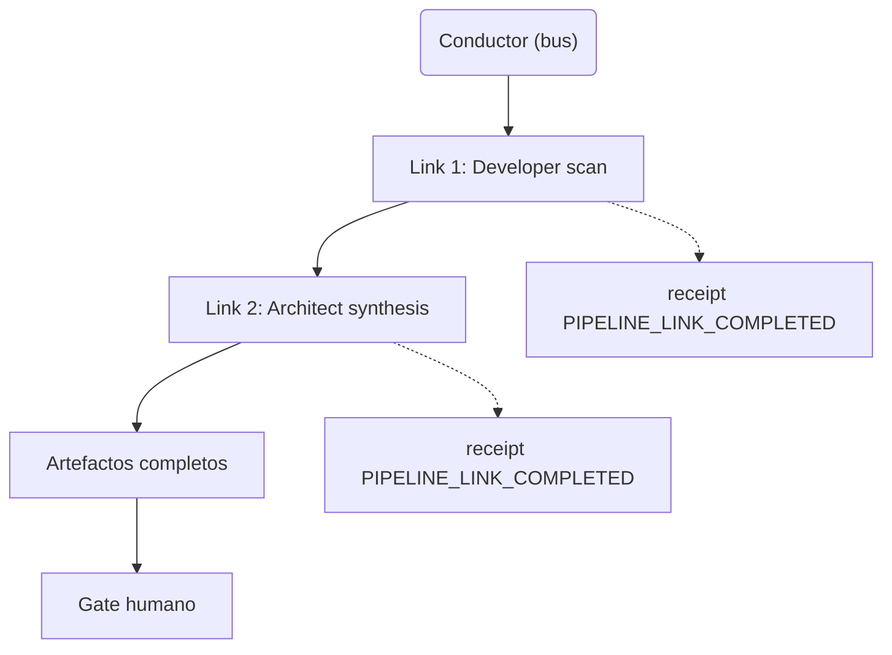
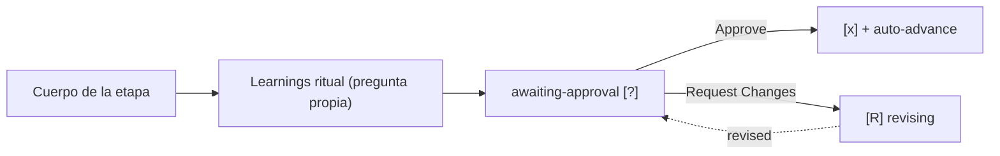

> [Inicio](README) › [Fases](01-fases/README) › [Fase 2 · Inception](01-fases/fase-2-inception) › **Reverse Engineering**

# 2.1 · Reverse Engineering

**CONDITIONAL** · **Fase 2 · Inception** · Lead **developer** · Modo **pipeline**

> Condición: Execute when project is brownfield. On rerun the Step 1 guard checks store freshness (codekb-scope-diff) - verified-CURRENT stores may be reused by human choice, anything else rescans. Skip for greenfield projects.

## Ficha de metadatos

| Campo | Valor |
|---|---|
| Número | **2.1** |
| Fase | Fase 2 · Inception |
| slug | `reverse-engineering` |
| execution | **CONDITIONAL** |
| lead_agent | `aidlc-developer-agent` |
| support_agents | `aidlc-architect-agent` |
| mode (topología) | **pipeline** |
| sensors | `required-sections`, `upstream-coverage` |
| requires_stage | `state-init` |

## Qué hace esta etapa

Etapa CONDITIONAL de brownfield con topología **pipeline** (cadena): el Developer Agent escanea el código y el Architect Agent sintetiza el conocimiento. Produce 9 artefactos de CodeKB **por repositorio** (business-overview, architecture, code-structure, api-documentation, component-inventory, technology-stack, dependencies, code-quality-assessment + timestamp). El guard de re-ejecución verifica la frescura del store (`codekb-scope-diff`): un store verificado CURRENT puede reutilizarse por decisión humana. Cada link del pipeline registra recibo `PIPELINE_LINK_COMPLETED`.

- Única etapa pipeline del grafo (1 de las 4 topologías no-inline). Los links avanzan el artefacto directamente. No hay contribution files.
- Los artefactos viven en `aidlc/spaces/<space>/codekb/<repo>/` — NO en el record del intent: son conocimiento reutilizable entre intents.
- En `infra` es la única etapa SKIP (los cambios de infra parten de la topología de despliegue, no del código).
- La evidencia de completitud: cada repo escaneado necesita cada link declarado (recibos current-attempt).

## Posición en el flujo

*Posición dentro de Fase 2 · Inception: 1 de 9.*

**Siguiente:** [2.2 · Practices Discovery](02-etapas/inception/practices-discovery)

## Paso a paso

**Step 1: Check Conditions** — Solo brownfield. Resuelve el repo set del intent (multi-repo soportado). Guard de re-run: NO_STORE → escanear; CURRENT → reutilizar con pregunta; STALE → re-escanear.

**Step 2: Developer Code Scan** — Dispatch del developer-agent: escanea código, extrae estructura, APIs, dependencias y calidad. La persona y knowledge se cargan automáticamente — jamás se inyectan a mano.

**Step 3: Architect Synthesis** — Dispatch del architect-agent: sintetiza el análisis del developer en los artefactos finales de CodeKB y los escribe.

**Step 4: Completion Handoff** — Learnings ritual.

**Step 5: Present Completion & Request Approval** — Anuncia los 9 artefactos **por repo**; el gate cierra la etapa completa.

## Artefactos

| Dirección | Artefactos |
|---|---|
| **produce** | `business-overview`, `architecture`, `code-structure`, `api-documentation`, `component-inventory`, `technology-stack`, `dependencies`, `code-quality-assessment`, `reverse-engineering-timestamp` |
| **consume** | — |

## Agentes implicados

- **Lead:** [aidlc-developer-agent](03-agentes/aidlc-developer-agent) — posee los artefactos `produces[]` de la etapa.
- **Soporte:** [aidlc-architect-agent](03-agentes/aidlc-architect-agent) — colaborador despachado (escribe contribution file)
- **Conductor:** el orquestador es el bus: los agentes NUNCA se invocan entre sí — solo el conductor delega. Ver [el oficio del conductor](06-maquinaria/conductor).

## Topología y ejecución

**Pipeline (cadena).** Los links co-autoresan el artefacto: lead primero, luego un Task por support en orden declarado; cada link ve todo lo upstream y AVANZA el artefacto directamente. El ÚLTIMO link deja los artefactos completos. Sin contribution files; cada retorno registra PIPELINE_LINK_COMPLETED. 1 etapa: reverse-engineering.

## Mecánica del gate

Sin reviewer declarado — el gate es directo:

Reglas de oro: HARD STOP (el conductor termina su turno y espera al humano), NO EMERGENT BEHAVIOR (menús de 2 opciones en Construction/Operation; 3ª opción solo en ideation/inception para recuperar etapas saltadas), y tras 3 ciclos de Request Changes aparece **Accept as-is** (escape hatch). Detalle completo en [ciclo de gate](06-maquinaria/ciclo-de-gate).

## Sensores declarados

| Sensor | dispara en | categoría | qué verifica |
|---|---|---|---|
| `required-sections` | gate | document-shape | Chequea que el output contenga los encabezados H2 requeridos (default: ≥2 H2) o los del template resuelto. |
| `upstream-coverage` | gate | document-shape | Compara la prosa del output con el `consumes:` declarado: cada artefacto upstream debe aparecer referenciado. |

Un sensor `fire_on: gate` corre al entrar el gate; `advisory` solo emite findings; un sensor **blocking** exige pass verificado (o el override respaldado por humano) antes de abrir la gate. Detalle en [sensores](06-maquinaria/sensores).

## En qué scopes ejecuta

**Ejecutan esta etapa:** `bugfix`, `classic`, `enterprise`, `express`, `feature`, `mvp`, `poc`, `refactor`, `security-patch`, `workshop`

**La saltan:** `infra`

Cada scope es una rejilla EXECUTE/SKIP sobre las 33 etapas. Ver [la matriz completa de scopes](05-scopes/README).

## Conexiones

- [Ficha de la Fase 2 · Inception](01-fases/fase-2-inception)
- [Etapa siguiente: 2.2](02-etapas/inception/practices-discovery)
- [Ficha del lead: aidlc-developer-agent](03-agentes/aidlc-developer-agent)
- [Protocolos que gobiernan la etapa](04-protocolos/README)
