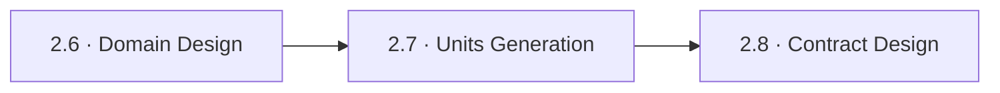
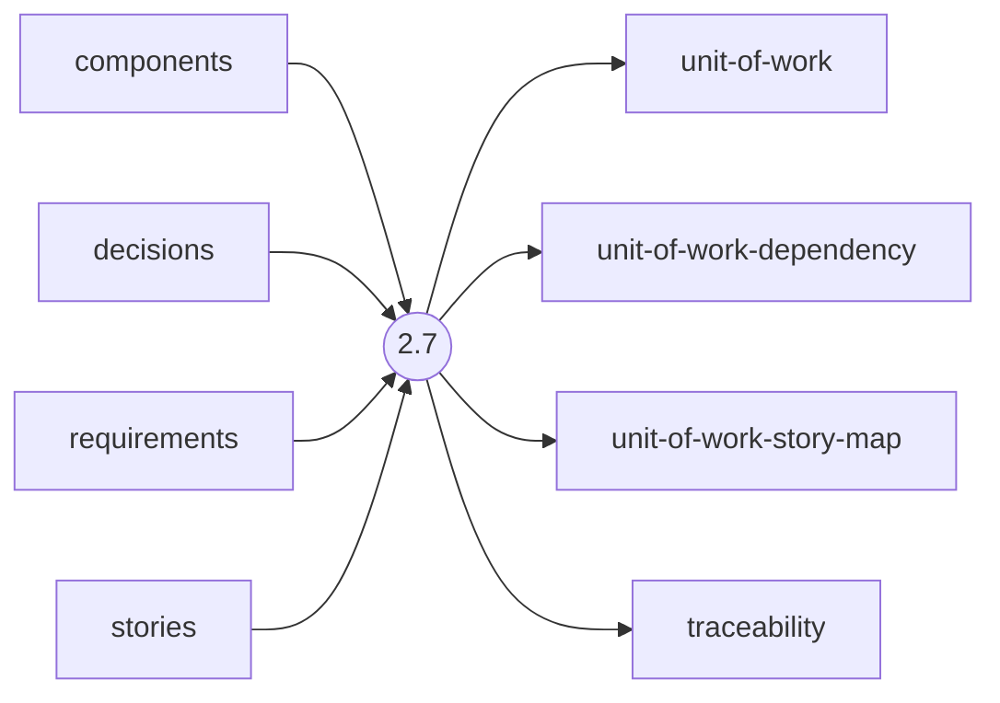
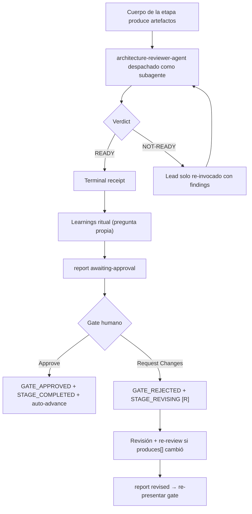

> [Inicio](README) › [Fases](01-fases/README) › [Fase 2 · Inception](01-fases/fase-2-inception) › **Units Generation**

# 2.7 · Units Generation

**ALWAYS** · **Fase 2 · Inception** · Lead **architect** · Modo **inline**

> Condición: Always executes when in scope. Produces the dependency DAG that Stage 2.9 Delivery Planning consumes for Bolt sequencing. In the compiled scope grid, 2.7 (Units Generation) and 2.9 (Delivery Planning) travel together — both EXECUTE or both SKIP per scope.

## Ficha de metadatos

| Campo | Valor |
|---|---|
| Número | **2.7** |
| Fase | Fase 2 · Inception |
| slug | `units-generation` |
| execution | **ALWAYS** |
| lead_agent | `aidlc-architect-agent` |
| support_agents | `aidlc-delivery-agent` |
| mode (topología) | **inline** |
| reviewer | `aidlc-architecture-reviewer-agent` (**advisory**, max 2 iter.) |
| review_artifact | `unit-of-work` |
| summary_confirmation | `required` (checkpoint consolidado obligatorio) |
| sensors | `required-sections`, `upstream-coverage`, `traceability` |
| requires_stage | `domain-design` |

## Qué hace esta etapa

Etapa ALWAYS del Architect: agrupa los componentes del domain design en **Units of Work**, piezas independientemente implementables y testeables, y produce el **dependency DAG** que gobierna todo Construction: `unit-of-work.md`, `unit-of-work-dependency.md` y el story-map. Cada unidad recibe ID estable `U{n}` y directorio `u{n}-{description}`. Aquí se decide la topología de despliegue (monolito/microservices/serverless). Tiene plan approval propio (Approve Plan / Revise Plan) ANTES de generar. Review advisory del Architecture Reviewer.

- El DAG es la entrada del engine para per-unit iteration, batches paralelos y Bolt sequencing.
- `express` salta esta etapa → sin Unit DAG el swarm es estructuralmente inalcanzable.
- Los batches paralelos de Construction salen de dependencias no mutuas en este DAG.

## Posición en el flujo

*Posición dentro de Fase 2 · Inception: 7 de 9.*

**Anterior:** [2.6 · Domain Design](02-etapas/inception/domain-design) · **Siguiente:** [2.8 · Contract Design](02-etapas/inception/contract-design)

## Paso a paso

**PART 1: Planning — Step 1: Load Prior Context** — components.md (catálogo + YAML) y decisions.md (los ADRs de boundary restringen el agrupamiento).

**Step 2: Create Decomposition Plan with Questions** — Estrategia de boundary (por servicio/feature/dominio/target de despliegue), granularidad (coarse vs fine), kind por unidad (service/spec/ui/packaging/library).

**Step 3: Collect and Analyze Answers** — Análisis de ambigüedad.

**Step 4: Get Plan Approval** — Gate de plan: Approve Plan / Revise Plan — confirma estrategia, conteo estimado, dependencias y kind por unidad.

**PART 2: Generation — Step 5: Execute Plan** — unit-of-work.md (definiciones + kind), unit-of-work-dependency.md (DAG), unit-of-work-story-map.md (tabla U↔US↔dir).

**Step 6: Completion Handoff** — Learnings ritual.

**Step 7: Present Completion & Request Approval** — Summary: unidades por kind, DAG, stories asignadas.

## Artefactos

| Dirección | Artefactos |
|---|---|
| **produce** | `unit-of-work`, `unit-of-work-dependency`, `unit-of-work-story-map`, `traceability` |
| **consume** | `components`, `decisions`, `requirements`, `stories` |

## Agentes implicados

- **Lead:** [aidlc-architect-agent](03-agentes/aidlc-architect-agent) — posee los artefactos `produces[]` de la etapa.
- **Soporte:** [aidlc-delivery-agent](03-agentes/aidlc-delivery-agent) — voz inline en la sesión
- **Reviewer:** [aidlc-architecture-reviewer-agent](03-agentes/aidlc-architecture-reviewer-agent) — verifica desde fuera; su veredicto llega al gate.
- **Conductor:** el orquestador es el bus: los agentes NUNCA se invocan entre sí — solo el conductor delega. Ver [el oficio del conductor](06-maquinaria/conductor).

## Topología y ejecución

**Inline.** El lead corre en la propia sesión del conductor, cargando su persona; los supports (si los hay) son voces que el conductor adopta. Sin contribution files. 29 de las 33 etapas usan esta topología.

## Mecánica del gate

Con reviewer **advisory** declarado, el flujo es:

Reglas de oro: HARD STOP (el conductor termina su turno y espera al humano), NO EMERGENT BEHAVIOR (menús de 2 opciones en Construction/Operation; 3ª opción solo en ideation/inception para recuperar etapas saltadas), y tras 3 ciclos de Request Changes aparece **Accept as-is** (escape hatch). Detalle completo en [ciclo de gate](06-maquinaria/ciclo-de-gate).

## Sensores declarados

| Sensor | dispara en | categoría | qué verifica |
|---|---|---|---|
| `required-sections` | gate | document-shape | Chequea que el output contenga los encabezados H2 requeridos (default: ≥2 H2) o los del template resuelto. |
| `upstream-coverage` | gate | document-shape | Compara la prosa del output con el `consumes:` declarado: cada artefacto upstream debe aparecer referenciado. |
| `traceability` | (write/gate) | document-traceability | Valida el traceability.json: cobertura upstream, targets downstream y huérfanos derivados por elemento (FR/US/AC/U/BR). |

Un sensor `fire_on: gate` corre al entrar el gate; `advisory` solo emite findings; un sensor **blocking** exige pass verificado (o el override respaldado por humano) antes de abrir la gate. Detalle en [sensores](06-maquinaria/sensores).

## En qué scopes ejecuta

**Ejecutan esta etapa:** `classic`, `enterprise`, `feature`, `mvp`, `workshop`

**La saltan:** `bugfix`, `express`, `infra`, `poc`, `refactor`, `security-patch`

Cada scope es una rejilla EXECUTE/SKIP sobre las 33 etapas. Ver [la matriz completa de scopes](05-scopes/README).

## Conexiones

- [Ficha de la Fase 2 · Inception](01-fases/fase-2-inception)
- [Etapa anterior: 2.6](02-etapas/inception/domain-design)
- [Etapa siguiente: 2.8](02-etapas/inception/contract-design)
- [Ficha del lead: aidlc-architect-agent](03-agentes/aidlc-architect-agent)
- [Ficha del reviewer: aidlc-architecture-reviewer-agent](03-agentes/aidlc-architecture-reviewer-agent)
- [Protocolos que gobiernan la etapa](04-protocolos/README)
