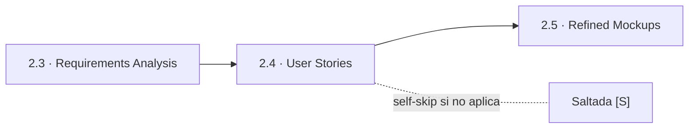
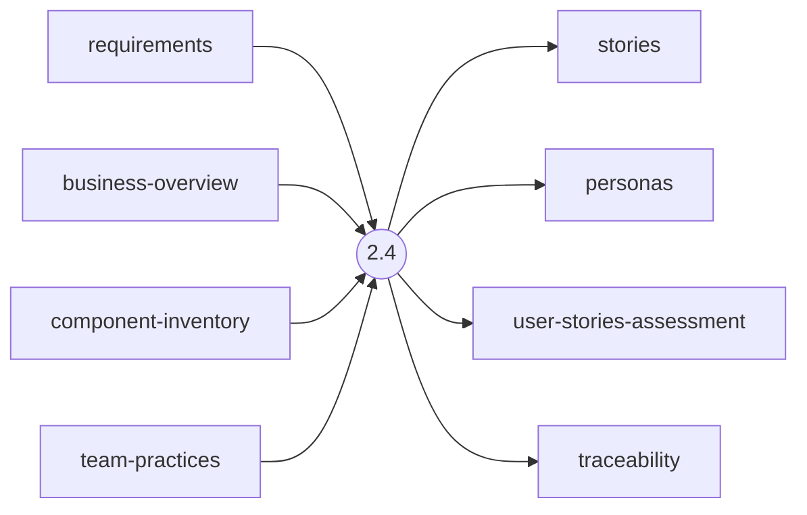
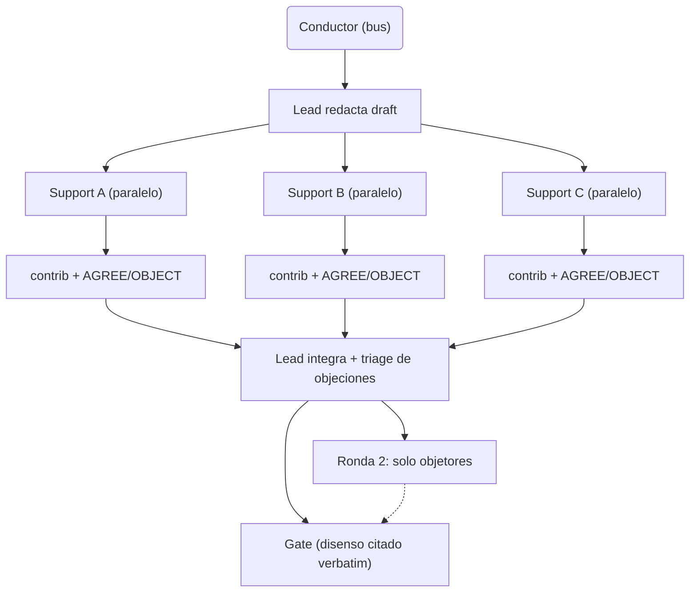
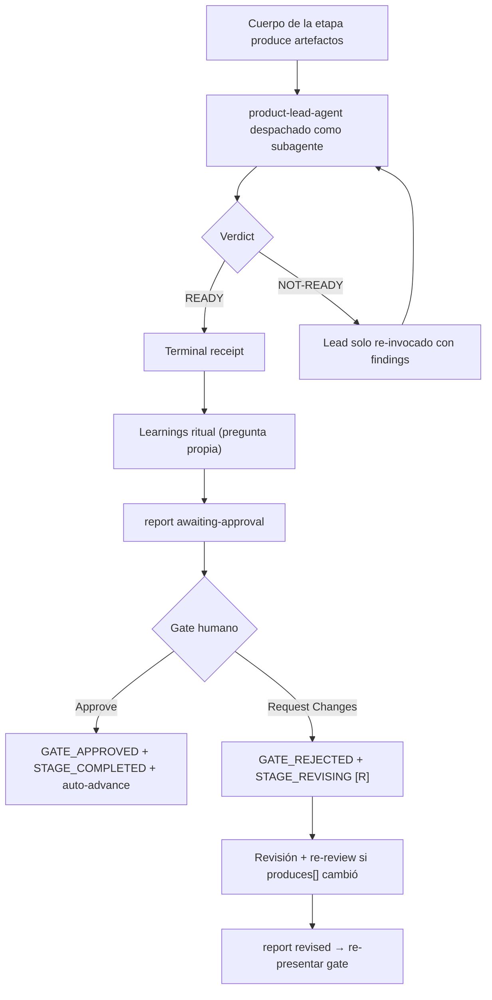

> [Inicio](README) › [Fases](01-fases/README) › [Fase 2 · Inception](01-fases/fase-2-inception) › **User Stories**

# 2.4 · User Stories

**CONDITIONAL** · **Fase 2 · Inception** · Lead **product** · Modo **mob**

> Condición: Execute when user-facing features, multiple personas, complex business logic, or cross-team work is involved. Skip for pure refactoring, isolated bug fixes, infrastructure-only changes, or developer tooling.

## Ficha de metadatos

| Campo | Valor |
|---|---|
| Número | **2.4** |
| Fase | Fase 2 · Inception |
| slug | `user-stories` |
| execution | **CONDITIONAL** |
| lead_agent | `aidlc-product-agent` |
| support_agents | `aidlc-design-agent`, `aidlc-developer-agent`, `aidlc-quality-agent` |
| mode (topología) | **mob** |
| reviewer | `aidlc-product-lead-agent` (**advisory**, max 2 iter.) |
| review_artifact | `stories` |
| summary_confirmation | `required` (checkpoint consolidado obligatorio) |
| sensors | `required-sections`, `upstream-coverage`, `traceability` |
| requires_stage | `requirements-analysis` |

## Qué hace esta etapa

Etapa CONDITIONAL con topología **mob** (mesh por rondas): el Product Agent redacta el borrador y todos los supports (Design, Developer, Quality) lo atacan en paralelo por contribution files; el lead integra, hace triage de objeciones (juicio → humano mid-stage; disputa de conocimiento → ronda 2 con solo los objetores; disenso mantenido → se cita verbatim en el gate). Produce personas, stories en formato INVEST con acceptance criteria Given/When/Then y el traceability.json US→FR.

- La única etapa mob del grafo. La evidencia de completitud: el engine rechaza el gate mientras falte algún contribution file o su identity marker.
- Cada story lleva acceptance criteria AC con IDs `AC{n}.{m}.{seq}` — la unidad de cobertura final de Build & Test (3.6).

## Posición en el flujo

*Posición dentro de Fase 2 · Inception: 4 de 9.*

**Anterior:** [2.3 · Requirements Analysis](02-etapas/inception/requirements-analysis) · **Siguiente:** [2.5 · Refined Mockups](02-etapas/inception/refined-mockups)

## Paso a paso

**Step 1: Load the Lead Persona (mob stage)** — El conductor carga la persona del lead ANTES de despachar a nadie — blocking precondition.

**Step 2: Validate User Stories Are Needed** — Execute si: features user-facing, múltiples personas, lógica de negocio compleja, coordinación cross-team. Skip: refactor puro, bugfix aislado, infra, tooling.

**Step 3: Load Prior Context** — Lee requirements.md y CodeKB (brownfield).

**PART 1: Planning — Step 4: Create Story Plan with Questions** — Enfoque de personas, formato de historia (INVEST), desglose por persona vs journey, criterios de aceptación.

**Step 5: Collect Answers / Step 6: Analyze Answers** — Protocolo estándar con detección de contradicciones.

**Step 7: Present plan and generate** — Confirma el plan de stories antes de abrir el mob.

**PART 2: Generation (mob elaboration) — Step 8: Execute Plan via the Mob** — Lead drafts → supports paralelo contra el draft → contribution files con Positions AGREE/OBJECT → integración + objection triage.

**Step 9: Open the Approval Gate** — Ritual §13 + awaiting-approval.

**Step 10: Present Completion & Request Approval** — Summary con disensos mantenidos citados verbatim.

## Artefactos

| Dirección | Artefactos |
|---|---|
| **produce** | `stories`, `personas`, `user-stories-assessment`, `traceability` |
| **consume** | `requirements`, `business-overview`, `component-inventory`, `team-practices` |

## Agentes implicados

- **Lead:** [aidlc-product-agent](03-agentes/aidlc-product-agent) — posee los artefactos `produces[]` de la etapa.
- **Soporte:** [aidlc-design-agent](03-agentes/aidlc-design-agent) — colaborador despachado (escribe contribution file)
- **Soporte:** [aidlc-developer-agent](03-agentes/aidlc-developer-agent) — colaborador despachado (escribe contribution file)
- **Soporte:** [aidlc-quality-agent](03-agentes/aidlc-quality-agent) — colaborador despachado (escribe contribution file)
- **Reviewer:** [aidlc-product-lead-agent](03-agentes/aidlc-product-lead-agent) — verifica desde fuera; su veredicto llega al gate.
- **Conductor:** el orquestador es el bus: los agentes NUNCA se invocan entre sí — solo el conductor delega. Ver [el oficio del conductor](06-maquinaria/conductor).

## Topología y ejecución

**Mob (mesh por rondas).** El lead redacta; TODOS los supports en paralelo contra el draft, cada uno escribiendo su contribution file con Positions AGREE/OBJECT; el lead integra y hace objection triage (juicio → humano mid-stage; disputa de conocimiento → ronda 2 solo objetores; disenso mantenido → citado VERBATIM en el gate). 1 etapa: user-stories.

## Mecánica del gate

Con reviewer **advisory** declarado, el flujo es:

Reglas de oro: HARD STOP (el conductor termina su turno y espera al humano), NO EMERGENT BEHAVIOR (menús de 2 opciones en Construction/Operation; 3ª opción solo en ideation/inception para recuperar etapas saltadas), y tras 3 ciclos de Request Changes aparece **Accept as-is** (escape hatch). Detalle completo en [ciclo de gate](06-maquinaria/ciclo-de-gate).

## Sensores declarados

| Sensor | dispara en | categoría | qué verifica |
|---|---|---|---|
| `required-sections` | gate | document-shape | Chequea que el output contenga los encabezados H2 requeridos (default: ≥2 H2) o los del template resuelto. |
| `upstream-coverage` | gate | document-shape | Compara la prosa del output con el `consumes:` declarado: cada artefacto upstream debe aparecer referenciado. |
| `traceability` | (write/gate) | document-traceability | Valida el traceability.json: cobertura upstream, targets downstream y huérfanos derivados por elemento (FR/US/AC/U/BR). |

Un sensor `fire_on: gate` corre al entrar el gate; `advisory` solo emite findings; un sensor **blocking** exige pass verificado (o el override respaldado por humano) antes de abrir la gate. Detalle en [sensores](06-maquinaria/sensores).

## En qué scopes ejecuta

**Ejecutan esta etapa:** `classic`, `enterprise`, `feature`, `mvp`, `workshop`

**La saltan:** `bugfix`, `express`, `infra`, `poc`, `refactor`, `security-patch`

Cada scope es una rejilla EXECUTE/SKIP sobre las 33 etapas. Ver [la matriz completa de scopes](05-scopes/README).

## Conexiones

- [Ficha de la Fase 2 · Inception](01-fases/fase-2-inception)
- [Etapa anterior: 2.3](02-etapas/inception/requirements-analysis)
- [Etapa siguiente: 2.5](02-etapas/inception/refined-mockups)
- [Ficha del lead: aidlc-product-agent](03-agentes/aidlc-product-agent)
- [Ficha del reviewer: aidlc-product-lead-agent](03-agentes/aidlc-product-lead-agent)
- [Protocolos que gobiernan la etapa](04-protocolos/README)
