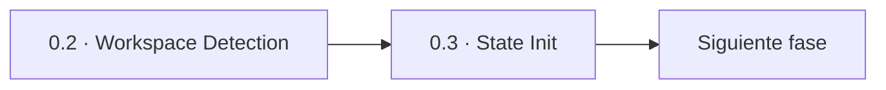

> [Inicio](README) › [Fases](01-fases/README) › [Fase 0 · Inicialización](01-fases/fase-0-inicializacion) › **State Init**

# 0.3 · State Init

**ALWAYS** · **Fase 0 · Inicialización** · Lead **orchestrator** · Modo **inline**

> Condición: Creates full populated state file and determines routing — auto-proceeds

## Ficha de metadatos

| Campo | Valor |
|---|---|
| Número | **0.3** |
| Fase | Fase 0 · Inicialización |
| slug | `state-init` |
| execution | **ALWAYS** |
| lead_agent | `orchestrator` |
| mode (topología) | **inline** |
| sensors | (ninguno declarado) |
| requires_stage | `workspace-detection` |

## Qué hace esta etapa

Crea el archivo de estado completo `aidlc-state.md`, la fuente de verdad del cursor del workflow, y determina el enrutamiento inicial. Persiste la descripción exacta del proyecto en `project-description.json` (inalterable, JSON-encoded), fija el scope activo, el depth y la test strategy, inicializa los checkboxes de las 33 etapas según la rejilla compilada del scope y establece la fase de vida como READY. Auto-procede y entrega el control al orquestador.

- El `project-description.json` es la descripción **autoritativa**: la etapa Intent Capture la lee con el comando fijo `aidlc-utility.ts project-description` y nunca la reconstruye de otras fuentes.
- El state version actual es 8 ( campo `State Version`).
- Tras esta fase, el usuario ya interviene: la fase 1 (Ideation) abre con preguntas y gates en cada etapa.

## Posición en el flujo

*Posición dentro de Fase 0 · Inicialización: 3 de 3. Es la última de su fase: precede al salto de fase.*

**Anterior:** [0.2 · Workspace Detection](02-etapas/initialization/workspace-detection)

## Paso a paso

**Step 1: Update State** — Sincroniza el estado.

**Step 2: Create Full State File** — Escribe `aidlc-state.md` con todas las secciones del template: Project Information, Scope Configuration, Workspace State, Execution Plan, Phase Progress, Stage Progress (checkboxes), Current Status, Session Resume Point. La descripción del proyecto se persiste como JSON exacto.

**Step 3: Determine Routing** — Brownfield → primera etapa post-init: reverse-engineering (Inception). Greenfield → requirements-analysis (Inception), con reverse-engineering saltada.

**Step 4: Finalize State** — Lifecycle Phase = READY; Current Stage = mensaje de listo para `/aidlc [scope]`.

**Step 5: Update State and Audit** — Emite `WORKSPACE_INITIALISED`.

**Step 6: Auto-Proceed** — Fin del bootstrap: el engine emite el primer `next` directive del workflow.

## Artefactos

| Dirección | Artefactos |
|---|---|
| **produce** | — |
| **consume** | — |

## Agentes implicados

- **Lead:** [el Conductor (orchestrator)](06-maquinaria/conductor) — corre el propio conductor — las etapas de bootstrap no tienen agente de dominio.
- **Conductor:** el orquestador es el bus: los agentes NUNCA se invocan entre sí — solo el conductor delega. Ver [el oficio del conductor](06-maquinaria/conductor).

## Topología y ejecución

**Inline.** El lead corre en la propia sesión del conductor, cargando su persona; los supports (si los hay) son voces que el conductor adopta. Sin contribution files. 29 de las 33 etapas usan esta topología.

## Mecánica del gate

Las etapas de Inicialización **no tienen gate de aprobación**: auto-proceden (bootstrap). El engine registra sus eventos (WORKSPACE_SCAFFOLDED/SCANNED/INITIALISED) y pasa el control.

## En qué scopes ejecuta

**Ejecutan esta etapa:** `bugfix`, `classic`, `enterprise`, `express`, `feature`, `infra`, `mvp`, `poc`, `refactor`, `security-patch`, `workshop`

**La saltan:** 

Cada scope es una rejilla EXECUTE/SKIP sobre las 33 etapas. Ver [la matriz completa de scopes](05-scopes/README).

## Conexiones

- [Ficha de la Fase 0 · Inicialización](01-fases/fase-0-inicializacion)
- [Etapa anterior: 0.2](02-etapas/initialization/workspace-detection)
- [El conductor que ejecuta esta etapa de bootstrap](06-maquinaria/conductor)
- [Protocolos que gobiernan la etapa](04-protocolos/README)
