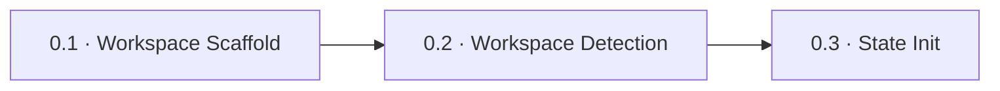

> [Inicio](README) › [Fases](01-fases/README) › [Fase 0 · Inicialización](01-fases/fase-0-inicializacion) › **Workspace Detection**

# 0.2 · Workspace Detection

**ALWAYS** · **Fase 0 · Inicialización** · Lead **orchestrator** · Modo **inline**

> Condición: Scans and classifies workspace — auto-proceeds (no approval gate)

## Ficha de metadatos

| Campo | Valor |
|---|---|
| Número | **0.2** |
| Fase | Fase 0 · Inicialización |
| slug | `workspace-detection` |
| execution | **ALWAYS** |
| lead_agent | `orchestrator` |
| mode (topología) | **inline** |
| sensors | (ninguno declarado) |
| requires_stage | `workspace-scaffold` |

## Qué hace esta etapa

Escanea el workspace real y lo clasifica como **greenfield** (proyecto nuevo, sin código) o **brownfield** (código existente). La clasificación determina el enrutamiento del ciclo: un brownfield entra por Reverse Engineering (2.1) para entender el código heredado; un greenfield entra directo a Requirements Analysis. Detecta lenguajes, frameworks y build system, y emite la advertencia de submódulos si los hay. Auto-procede sin gate.

- La salida `Project Type: Greenfield/Brownfield` alimenta el routing de State Init (0.3).
- En multi-repo, cada repositorio se analiza por separado; Reverse Engineering (2.1) itera por repo.

## Posición en el flujo

*Posición dentro de Fase 0 · Inicialización: 2 de 3.*

**Anterior:** [0.1 · Workspace Scaffold](02-etapas/initialization/workspace-scaffold) · **Siguiente:** [0.3 · State Init](02-etapas/initialization/state-init)

## Paso a paso

**Step 1: Update State** — Sincroniza el estado de la etapa.

**Step 2: Scan Workspace** — Escanea estructura de directorios y archivos de configuración (package.json, pom.xml, build.gradle, Cargo.toml, pyproject.toml…).

**Step 3: Detect Project Type** — Aplica reglas: código fuente existente y/o framework detectado → brownfield; vacío o solo docs → greenfield.

**Step 4: Verify Classification** — Verifica la clasificación detectada antes de persistirla (evita falsos brownfields por restos de archivos).

**Step 5: Identify Technology Stack** — Extrae lenguajes primarios/secundarios, frameworks y build system, que quedarán en `aidlc-state.md` → Workspace State.

**Step 6: Update State and Audit** — Emite `WORKSPACE_SCANNED` con el tipo de proyecto.

**Step 6a: Relay the Submodule Warning** — Si hay git submódulos, advierte que el escaneo puede no cubrirlos.

**Step 7: Auto-Proceed** — Continúa a State Init.

## Artefactos

| Dirección | Artefactos |
|---|---|
| **produce** | — |
| **consume** | — |

## Agentes implicados

- **Lead:** [el Conductor (orchestrator)](06-maquinaria/conductor) — corre el propio conductor — las etapas de bootstrap no tienen agente de dominio.
- **Conductor:** el orquestador es el bus: los agentes NUNCA se invocan entre sí — solo el conductor delega. Ver [el oficio del conductor](06-maquinaria/conductor).

## Topología y ejecución

**Inline.** El lead corre en la propia sesión del conductor, cargando su persona; los supports (si los hay) son voces que el conductor adopta. Sin contribution files. 29 de las 33 etapas usan esta topología.

## Mecánica del gate

Las etapas de Inicialización **no tienen gate de aprobación**: auto-proceden (bootstrap). El engine registra sus eventos (WORKSPACE_SCAFFOLDED/SCANNED/INITIALISED) y pasa el control.

## En qué scopes ejecuta

**Ejecutan esta etapa:** `bugfix`, `classic`, `enterprise`, `express`, `feature`, `infra`, `mvp`, `poc`, `refactor`, `security-patch`, `workshop`

**La saltan:** 

Cada scope es una rejilla EXECUTE/SKIP sobre las 33 etapas. Ver [la matriz completa de scopes](05-scopes/README).

## Conexiones

- [Ficha de la Fase 0 · Inicialización](01-fases/fase-0-inicializacion)
- [Etapa anterior: 0.1](02-etapas/initialization/workspace-scaffold)
- [Etapa siguiente: 0.3](02-etapas/initialization/state-init)
- [El conductor que ejecuta esta etapa de bootstrap](06-maquinaria/conductor)
- [Protocolos que gobiernan la etapa](04-protocolos/README)
