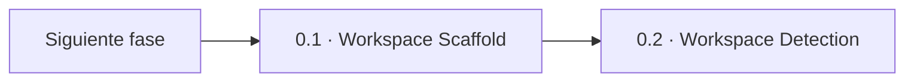

> [Inicio](README) › [Fases](01-fases/README) › [Fase 0 · Inicialización](01-fases/fase-0-inicializacion) › **Workspace Scaffold**

# 0.1 · Workspace Scaffold

**ALWAYS** · **Fase 0 · Inicialización** · Lead **orchestrator** · Modo **inline**

> Condición: Ensure-exists the per-intent record and in-scope phase dirs, idempotent (creates on demand, skips existing)

## Ficha de metadatos

| Campo | Valor |
|---|---|
| Número | **0.1** |
| Fase | Fase 0 · Inicialización |
| slug | `workspace-scaffold` |
| execution | **ALWAYS** |
| lead_agent | `orchestrator` |
| mode (topología) | **inline** |
| sensors | (ninguno declarado) |
| requires_stage | — |

## Qué hace esta etapa

Primera etapa de todo workflow: garantiza que exista la estructura de directorios por-intent y por-fase que el resto del ciclo escribirá. Es **idempotente**, crea lo que falta, conserva lo que ya existe, y no tiene gate de aprobación: avanza automáticamente. Asegura los directorios compartidos del space (`spaces/<active-space>/`) y un directorio de artefactos por cada fase que el scope activo ejecuta, más el directorio `verification/` que existe siempre.

- Las 3 etapas de Initialization son las únicas **sin gate de aprobación** (excepto en scopes especiales).
- El `<record>` se resuelve como `aidlc/spaces/<active-space>/intents/<active-intent>/` — un directorio de trabajo por intent del workflow.
- La idempotencia es crítica: reanudar un workflow nunca destruye artefactos previos.
- `sensors: []` — esta etapa no declara sensores.

## Posición en el flujo

*Posición dentro de Fase 0 · Inicialización: 1 de 3.*

**Siguiente:** [0.2 · Workspace Detection](02-etapas/initialization/workspace-detection)

## Paso a paso

**Step 1: Update State** — Marca la etapa en progreso; el hook PostToolUse sincroniza `aidlc-state.md` automáticamente a partir del `activeForm` con `[slug]`.

**Step 2: Ensure the Space Shared Directories** — Crea (si no existen) los directorios compartidos del space activo: memoria de método, knowledge del equipo y codekb.

**Step 3: Ensure Phase Artifact Directories** — Crea `<record>/<fase>/` por cada fase que el scope ejecuta y `<record>/verification/` siempre. El record vive en `aidlc/spaces/<space>/intents/<intent>/`.

**Step 4: Display Confirmation** — Muestra la estructura creada al usuario.

**Step 5: Update State and Audit** — El engine registra `WORKSPACE_SCAFFOLDED` en el shard de auditoría.

**Step 6: Auto-Proceed** — Sin gate humano: pasa directamente a Workspace Detection.

## Artefactos

| Dirección | Artefactos |
|---|---|
| **produce** | — |
| **consume** | — |

## Agentes implicados

- **Lead:** [el Conductor (orchestrator)](06-maquinaria/conductor) — corre el propio conductor — las etapas de bootstrap no tienen agente de dominio.
- **Conductor:** el orquestador es el bus: los agentes NUNCA se invocan entre sí — solo el conductor delega. Ver [el oficio del conductor](06-maquinaria/conductor).

## Topología y ejecución

**Inline.** El lead corre en la propia sesión del conductor, cargando su persona; los supports (si los hay) son voces que el conductor adopta. Sin contribution files. 29 de las 33 etapas usan esta topología.

## Mecánica del gate

Las etapas de Inicialización **no tienen gate de aprobación**: auto-proceden (bootstrap). El engine registra sus eventos (WORKSPACE_SCAFFOLDED/SCANNED/INITIALISED) y pasa el control.

## En qué scopes ejecuta

**Ejecutan esta etapa:** `bugfix`, `classic`, `enterprise`, `express`, `feature`, `infra`, `mvp`, `poc`, `refactor`, `security-patch`, `workshop`

**La saltan:** 

Cada scope es una rejilla EXECUTE/SKIP sobre las 33 etapas. Ver [la matriz completa de scopes](05-scopes/README).

## Conexiones

- [Ficha de la Fase 0 · Inicialización](01-fases/fase-0-inicializacion)
- [Etapa siguiente: 0.2](02-etapas/initialization/workspace-detection)
- [El conductor que ejecuta esta etapa de bootstrap](06-maquinaria/conductor)
- [Protocolos que gobiernan la etapa](04-protocolos/README)
