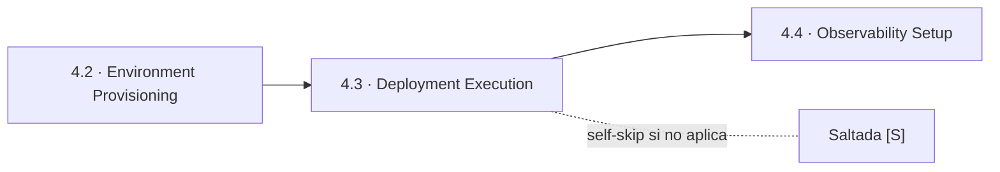
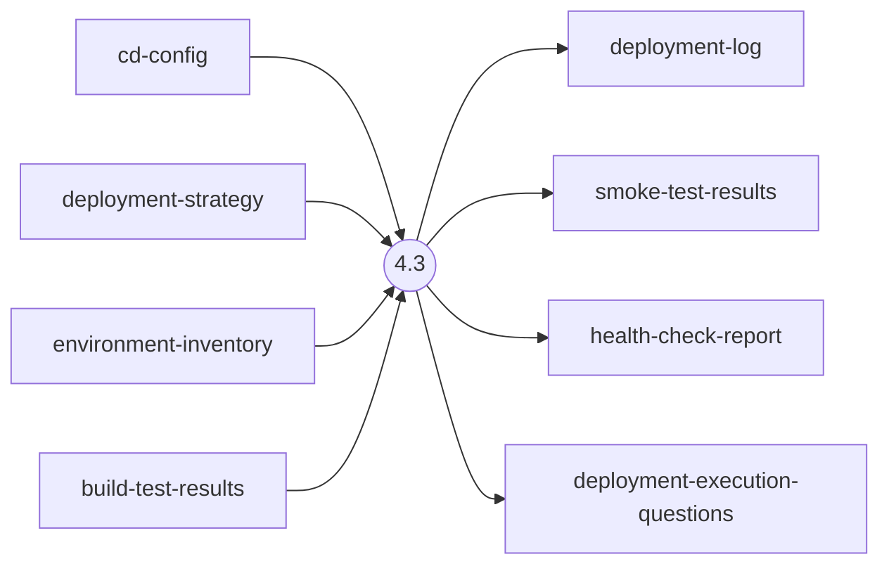
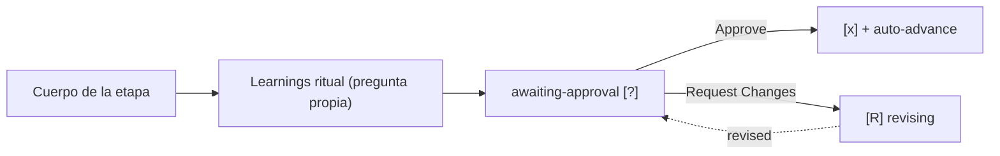

> [Inicio](README) › [Fases](01-fases/README) › [Fase 4 · Operation](01-fases/fase-4-operacion) › **Deployment Execution**

# 4.3 · Deployment Execution

**CONDITIONAL** · **Fase 4 · Operation** · Lead **pipeline-deploy** · Modo **inline**

> Condición: Execute after deployment pipeline and environment are ready

## Ficha de metadatos

| Campo | Valor |
|---|---|
| Número | **4.3** |
| Fase | Fase 4 · Operation |
| slug | `deployment-execution` |
| execution | **CONDITIONAL** |
| lead_agent | `aidlc-pipeline-deploy-agent` |
| support_agents | `aidlc-developer-agent` |
| mode (topología) | **inline** |
| summary_confirmation | `required` (checkpoint consolidado obligatorio) |
| sensors | `required-sections`, `upstream-coverage` |
| requires_stage | `deployment-pipeline`, `environment-provisioning` |

## Qué hace esta etapa

Etapa CONDITIONAL del Pipeline & Deploy Agent: ejecuta el despliegue real siguiendo cd-config y la estrategia elegida. Pre-deployment checks (checks verdes, migraciones probadas, rollback listo), despliegue, smoke tests y health checks post-deploy. Produce deployment-log, smoke-test-results y health-check-report. Brownfield safeguard: rollback plan documentado ANTES de ejecutar. En team-owned units, el merge gate pinned corre por aquí la estrategia merge.

- Los tres scopes incrementales (bugfix, refactor, security-patch) la retienen: un fix verificado que no despliega no cierra el ciclo.

## Posición en el flujo

*Posición dentro de Fase 4 · Operation: 3 de 7.*

**Anterior:** [4.2 · Environment Provisioning](02-etapas/operation/environment-provisioning) · **Siguiente:** [4.4 · Observability Setup](02-etapas/operation/observability-setup)

## Paso a paso

**Step 1: Load Prior Context** — cd-config + deployment-strategy + environment-inventory + build-test-results.

**Step 2: Pre-Deployment Checks** — Checks pasando, migraciones requeridas y probadas, plan de rollback vigente.

**Step 3: Execute Deployment** — Despliegue según estrategia (blue/green: switch de tráfico; canary: escalado gradual).

**Step 4: Generate Artifacts** — deployment-log.md, smoke-test-results.md, health-check-report.md.

**Steps 5-6: Handoff + Gate** — Learnings + gate.

## Artefactos

| Dirección | Artefactos |
|---|---|
| **produce** | `deployment-log`, `smoke-test-results`, `health-check-report`, `deployment-execution-questions` |
| **consume** | `cd-config`, `deployment-strategy`, `environment-inventory`, `build-test-results` |

## Agentes implicados

- **Lead:** [aidlc-pipeline-deploy-agent](03-agentes/aidlc-pipeline-deploy-agent) — posee los artefactos `produces[]` de la etapa.
- **Soporte:** [aidlc-developer-agent](03-agentes/aidlc-developer-agent) — voz inline en la sesión
- **Conductor:** el orquestador es el bus: los agentes NUNCA se invocan entre sí — solo el conductor delega. Ver [el oficio del conductor](06-maquinaria/conductor).

## Topología y ejecución

**Inline.** El lead corre en la propia sesión del conductor, cargando su persona; los supports (si los hay) son voces que el conductor adopta. Sin contribution files. 29 de las 33 etapas usan esta topología.

## Mecánica del gate

Sin reviewer declarado — el gate es directo:

Reglas de oro: HARD STOP (el conductor termina su turno y espera al humano), NO EMERGENT BEHAVIOR (menús de 2 opciones en Construction/Operation; 3ª opción solo en ideation/inception para recuperar etapas saltadas), y tras 3 ciclos de Request Changes aparece **Accept as-is** (escape hatch). Detalle completo en [ciclo de gate](06-maquinaria/ciclo-de-gate).

## Sensores declarados

| Sensor | dispara en | categoría | qué verifica |
|---|---|---|---|
| `required-sections` | gate | document-shape | Chequea que el output contenga los encabezados H2 requeridos (default: ≥2 H2) o los del template resuelto. |
| `upstream-coverage` | gate | document-shape | Compara la prosa del output con el `consumes:` declarado: cada artefacto upstream debe aparecer referenciado. |

Un sensor `fire_on: gate` corre al entrar el gate; `advisory` solo emite findings; un sensor **blocking** exige pass verificado (o el override respaldado por humano) antes de abrir la gate. Detalle en [sensores](06-maquinaria/sensores).

## En qué scopes ejecuta

**Ejecutan esta etapa:** `bugfix`, `classic`, `enterprise`, `express`, `feature`, `infra`, `refactor`, `security-patch`, `workshop`

**La saltan:** `mvp`, `poc`

Cada scope es una rejilla EXECUTE/SKIP sobre las 33 etapas. Ver [la matriz completa de scopes](05-scopes/README).

## Conexiones

- [Ficha de la Fase 4 · Operation](01-fases/fase-4-operacion)
- [Etapa anterior: 4.2](02-etapas/operation/environment-provisioning)
- [Etapa siguiente: 4.4](02-etapas/operation/observability-setup)
- [Ficha del lead: aidlc-pipeline-deploy-agent](03-agentes/aidlc-pipeline-deploy-agent)
- [Protocolos que gobiernan la etapa](04-protocolos/README)
