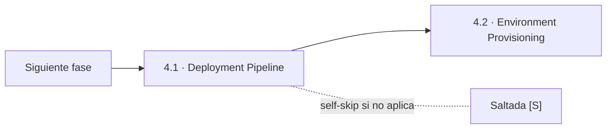
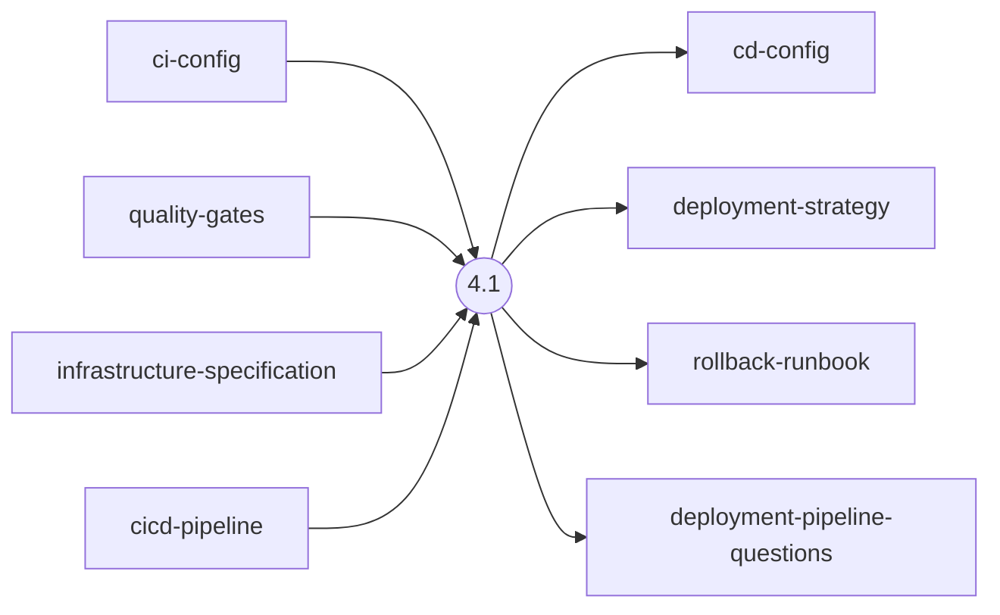
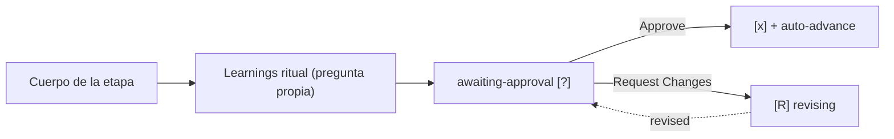

> [Inicio](README) › [Fases](01-fases/README) › [Fase 4 · Operation](01-fases/fase-4-operacion) › **Deployment Pipeline**

# 4.1 · Deployment Pipeline

**CONDITIONAL** · **Fase 4 · Operation** · Lead **pipeline-deploy** · Modo **inline**

> Condición: Execute when CD pipeline needs creation or significant modification

## Ficha de metadatos

| Campo | Valor |
|---|---|
| Número | **4.1** |
| Fase | Fase 4 · Operation |
| slug | `deployment-pipeline` |
| execution | **CONDITIONAL** |
| lead_agent | `aidlc-pipeline-deploy-agent` |
| mode (topología) | **inline** |
| summary_confirmation | `required` (checkpoint consolidado obligatorio) |
| sensors | `required-sections`, `upstream-coverage` |
| requires_stage | `ci-pipeline`, `infrastructure-design` |

## Qué hace esta etapa

Primera etapa de Operation (CONDITIONAL, lead Pipeline & Deploy Agent): diseña el pipeline de CD — estrategia de despliegue (blue/green, canary, rolling), gates de promoción entre entornos (dev → staging → prod), config (cd-config.md) y rollback-runbook.md. Consume la CI config y la infrastructure specification. El merge dispatch de units pinned en team mode consulta la estrategia aquí definida.

- El rollback runbook es parte del safeguard brownfield: se documenta ANTES de deploy (4.3).

## Posición en el flujo

*Posición dentro de Fase 4 · Operation: 1 de 7.*

**Siguiente:** [4.2 · Environment Provisioning](02-etapas/operation/environment-provisioning)

## Paso a paso

**Step 1: Load Prior Context** — ci-config, quality-gates, infrastructure-specification, cicd-pipeline.

**Step 2: Generate Clarifying Questions** — Estrategia de despliegue (blue/green/canary/rolling), gates de promoción, ventana de despliegue, rollback.

**Step 3: Generate Artifacts** — cd-config.md, deployment-strategy.md, rollback-runbook.md.

**Step 4: Completion Handoff** — Learnings ritual.

**Step 5: Present Completion & Request Approval** — Gate de Operation (2 opciones estrictas).

## Artefactos

| Dirección | Artefactos |
|---|---|
| **produce** | `cd-config`, `deployment-strategy`, `rollback-runbook`, `deployment-pipeline-questions` |
| **consume** | `ci-config`, `quality-gates`, `infrastructure-specification`, `cicd-pipeline` |

## Agentes implicados

- **Lead:** [aidlc-pipeline-deploy-agent](03-agentes/aidlc-pipeline-deploy-agent) — posee los artefactos `produces[]` de la etapa.
- **Conductor:** el orquestador es el bus: los agentes NUNCA se invocan entre sí — solo el conductor delega. Ver [el oficio del conductor](06-maquinaria/conductor).

## Topología y ejecución

**Inline.** El lead corre en la propia sesión del conductor, cargando su persona; los supports (si los hay) son voces que el conductor adopta. Sin contribution files. 29 de las 33 etapas usan esta topología.

## Mecánica del gate

Sin reviewer declarado — el gate es directo:

Reglas de oro: HARD STOP (el conductor termina su turno y espera al humano), NO EMERGENT BEHAVIOR (menús de 2 opciones en Construction/Operation; 3ª opción solo en ideation/inception para recuperar etapas saltadas), y tras 3 ciclos de Request Changes aparece **Accept as-is** (escape hatch). Detalle completo en [ciclo de gate](06-maquinaria/ciclo-de-gate).

## Sensores declarados

| Sensor | dispara en | categoría | qué verifica |
|---|---|---|---|
| `required-sections` | gate | document-shape | Chequea que el output contenga los encabezados H2 requeridos (default: ≥2 H2) o los del template resuelto. |
| `upstream-coverage` | gate | document-shape | Compara la prosa del output con el `consumes:` declarado: cada artefacto upstream debe aparecer referenciado. |

Un sensor `fire_on: gate` corre al entrar el gate; `advisory` solo emite findings; un sensor **blocking** exige pass verificado (o el override respaldado por humano) antes de abrir la gate. Detalle en [sensores](06-maquinaria/sensores).

## En qué scopes ejecuta

**Ejecutan esta etapa:** `bugfix`, `classic`, `enterprise`, `express`, `feature`, `infra`, `refactor`, `security-patch`, `workshop`

**La saltan:** `mvp`, `poc`

Cada scope es una rejilla EXECUTE/SKIP sobre las 33 etapas. Ver [la matriz completa de scopes](05-scopes/README).

## Conexiones

- [Ficha de la Fase 4 · Operation](01-fases/fase-4-operacion)
- [Etapa siguiente: 4.2](02-etapas/operation/environment-provisioning)
- [Ficha del lead: aidlc-pipeline-deploy-agent](03-agentes/aidlc-pipeline-deploy-agent)
- [Protocolos que gobiernan la etapa](04-protocolos/README)
