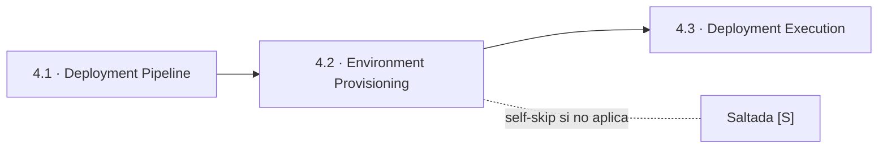
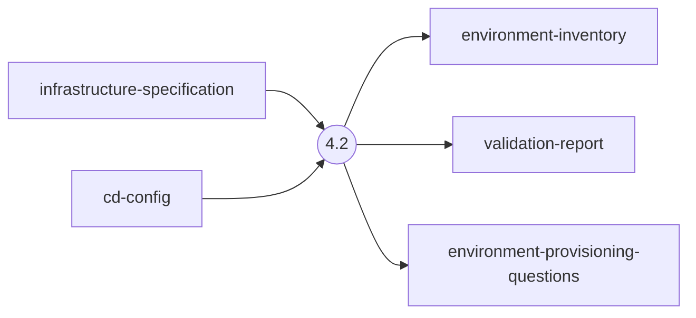
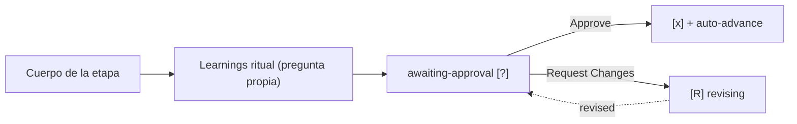

> [Inicio](README) › [Fases](01-fases/README) › [Fase 4 · Operation](01-fases/fase-4-operacion) › **Environment Provisioning**

# 4.2 · Environment Provisioning

**CONDITIONAL** · **Fase 4 · Operation** · Lead **aws-platform** · Modo **inline**

> Condición: Execute when AWS environments need provisioning or validation

## Ficha de metadatos

| Campo | Valor |
|---|---|
| Número | **4.2** |
| Fase | Fase 4 · Operation |
| slug | `environment-provisioning` |
| execution | **CONDITIONAL** |
| lead_agent | `aidlc-aws-platform-agent` |
| support_agents | `aidlc-devsecops-agent`, `aidlc-compliance-agent` |
| mode (topología) | **inline** |
| summary_confirmation | `required` (checkpoint consolidado obligatorio) |
| sensors | `required-sections`, `upstream-coverage` |
| requires_stage | `infrastructure-design`, `deployment-pipeline` |

## Qué hace esta etapa

Etapa CONDITIONAL del AWS Platform Agent: provisiona y valida los entornos cloud según infrastructure-design — VPCs, subnets, security groups, NACLs, servicios gestionados. Produce environment-inventory.md y validation-report.md. Consume infrastructure-specification + cd-config; DevSecOps apoya la validación de seguridad de red. Se salta si no hay infraestructura nueva que provisionar.

- En scope `infra` es etapa núcleo; en `express`/`poc` se salta.

## Posición en el flujo

*Posición dentro de Fase 4 · Operation: 2 de 7.*

**Anterior:** [4.1 · Deployment Pipeline](02-etapas/operation/deployment-pipeline) · **Siguiente:** [4.3 · Deployment Execution](02-etapas/operation/deployment-execution)

## Paso a paso

**Step 1: Load Prior Context** — infrastructure-specification + security-requirements.

**Step 2: Generate Clarifying Questions** — ¿Entornos provisionados según diseño? ¿VPC/subnets/SG/NACL correctos?

**Step 3: Provision and Validate** — Ejecuta/valida el provisionamiento (IaC) contra el diseño.

**Step 4: Generate Artifacts** — environment-inventory.md, validation-report.md.

**Steps 5-6: Handoff + Gate** — Learnings + gate.

## Artefactos

| Dirección | Artefactos |
|---|---|
| **produce** | `environment-inventory`, `validation-report`, `environment-provisioning-questions` |
| **consume** | `infrastructure-specification`, `cd-config` |

## Agentes implicados

- **Lead:** [aidlc-aws-platform-agent](03-agentes/aidlc-aws-platform-agent) — posee los artefactos `produces[]` de la etapa.
- **Soporte:** [aidlc-devsecops-agent](03-agentes/aidlc-devsecops-agent) — voz inline en la sesión
- **Soporte:** [aidlc-compliance-agent](03-agentes/aidlc-compliance-agent) — voz inline en la sesión
- **Conductor:** el orquestador es el bus: los agentes NUNCA se invocan entre sí — solo el conductor delega. Ver [el oficio del conductor](06-maquinaria/conductor).

## Topología y ejecución

**Inline.** El lead corre en la propia sesión del conductor, cargando su persona; los supports (si los hay) son voces que el conductor adopta. Sin contribution files. 29 de las 33 etapas usan esta topología.

## Mecánica del gate

Sin reviewer declarado — el gate es directo:

Reglas de oro: HARD STOP (el conductor termina su turno y espera al humano), NO EMERGENT BEHAVIOR (menús de 2 opciones en Construction/Operation; 3ª opción solo en ideation/inception para recuperar etapas saltadas), y tras 3 ciclos de Request Changes aparece **Accept as-is** (escape hatch). Detalle completo en [ciclo de gate](06-maquinaria/ciclo-de-gate).

## Sensores declarados

| Sensor | dispara en | categoría | qué verifica |
|---|---|---|---|
| `required-sections` | gate | document-shape | Chequea que el output contenga los encabezados H2 requeridos (default: ≥2 H2) o los del template resuelto. |
| `upstream-coverage` | gate | document-shape | Compara la prosa del output con el `consumes:` declarado: cada artefacto upstream debe aparecer referenciado. |

Un sensor `fire_on: gate` corre al entrar el gate; `advisory` solo emite findings; un sensor **blocking** exige pass verificado (o el override respaldado por humano) antes de abrir la gate. Detalle en [sensores](06-maquinaria/sensores).

## En qué scopes ejecuta

**Ejecutan esta etapa:** `classic`, `enterprise`, `feature`, `infra`, `workshop`

**La saltan:** `bugfix`, `express`, `mvp`, `poc`, `refactor`, `security-patch`

Cada scope es una rejilla EXECUTE/SKIP sobre las 33 etapas. Ver [la matriz completa de scopes](05-scopes/README).

## Conexiones

- [Ficha de la Fase 4 · Operation](01-fases/fase-4-operacion)
- [Etapa anterior: 4.1](02-etapas/operation/deployment-pipeline)
- [Etapa siguiente: 4.3](02-etapas/operation/deployment-execution)
- [Ficha del lead: aidlc-aws-platform-agent](03-agentes/aidlc-aws-platform-agent)
- [Protocolos que gobiernan la etapa](04-protocolos/README)
