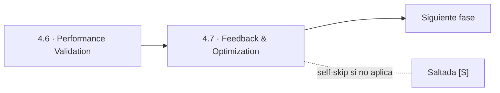
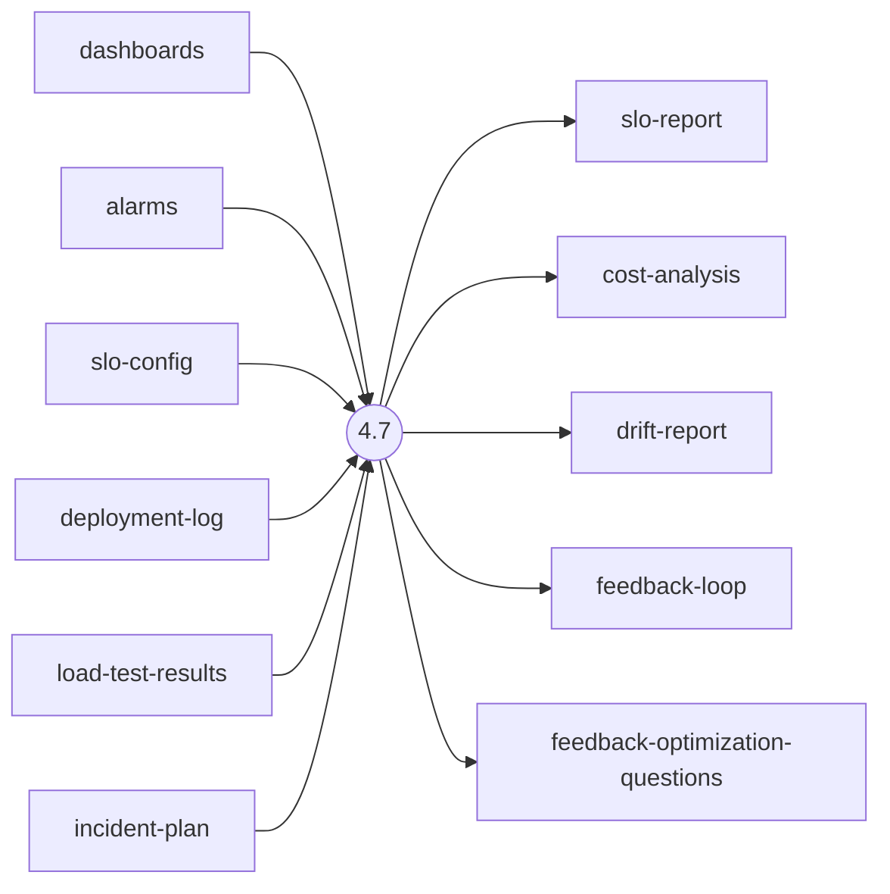
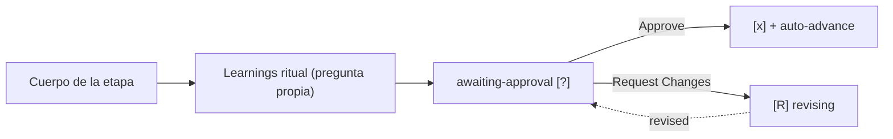

> [Inicio](README) › [Fases](01-fases/README) › [Fase 4 · Operation](01-fases/fase-4-operacion) › **Feedback & Optimization**

# 4.7 · Feedback & Optimization

**CONDITIONAL** · **Fase 4 · Operation** · Lead **operations** · Modo **inline**

> Condición: Execute when ongoing operational monitoring and optimization are needed

## Ficha de metadatos

| Campo | Valor |
|---|---|
| Número | **4.7** |
| Fase | Fase 4 · Operation |
| slug | `feedback-optimization` |
| execution | **CONDITIONAL** |
| lead_agent | `aidlc-operations-agent` |
| support_agents | `aidlc-aws-platform-agent` |
| mode (topología) | **inline** |
| summary_confirmation | `required` (checkpoint consolidado obligatorio) |
| sensors | `required-sections`, `upstream-coverage` |
| requires_stage | `observability-setup`, `deployment-execution`, `incident-response`, `performance-validation` |

## Qué hace esta etapa

Última etapa del ciclo (CONDITIONAL, Operations Agent): cierra el lazo de operación. Revisa SLOs vs realidad real (error budget burn rate), costos (cost-analysis), drift de código/config vs lo desplegado y devuelve el feedback-loop con learning accionables. Consume TODO operation (dashboards, deployment-log, load results, incident-plan). Sus hallazgos retroalimentan futuros intents — el ciclo de vida completo se repite por intent.

- La aprobación de esta gate (si es la última in-scope) dispara `Workflow Complete`: el engine completa estado y emite las filas de auditoría de cierre.

## Posición en el flujo

*Posición dentro de Fase 4 · Operation: 7 de 7. Es la última de su fase: precede al salto de fase.*

**Anterior:** [4.6 · Performance Validation](02-etapas/operation/performance-validation)

## Paso a paso

**Step 1: Load Prior Context** — observability-setup + performance-validation + deployment-execution + incident-response.

**Step 2: Generate Questions** — ¿SLOs cumplidos? ¿burn rate? ¿oportunidades de costo? ¿drift detectado?

**Step 3: Generate Artifacts** — slo-report.md, cost-analysis.md, drift-report.md, feedback-loop.md.

**Steps 4-5: Handoff + Gate** — Learnings final — el gate que completa el workflow (el engine emite complete-workflow).

## Artefactos

| Dirección | Artefactos |
|---|---|
| **produce** | `slo-report`, `cost-analysis`, `drift-report`, `feedback-loop`, `feedback-optimization-questions` |
| **consume** | `dashboards`, `alarms`, `slo-config`, `deployment-log`, `load-test-results`, `incident-plan` |

## Agentes implicados

- **Lead:** [aidlc-operations-agent](03-agentes/aidlc-operations-agent) — posee los artefactos `produces[]` de la etapa.
- **Soporte:** [aidlc-aws-platform-agent](03-agentes/aidlc-aws-platform-agent) — voz inline en la sesión
- **Conductor:** el orquestador es el bus: los agentes NUNCA se invocan entre sí — solo el conductor delega. Ver [el oficio del conductor](06-maquinaria/conductor).

## Topología y ejecución

**Inline.** El lead corre en la propia sesión del conductor, cargando su persona; los supports (si los hay) son voces que el conductor adopta. Sin contribution files. 29 de las 33 etapas usan esta topología.

## Mecánica del gate

Sin reviewer declarado — el gate es directo:

Reglas de oro: HARD STOP (el conductor termina su turno y espera al humano), NO EMERGENT BEHAVIOR (menús de 2 opciones en Construction/Operation; 3ª opción solo en ideation/inception para recuperar etapas saltadas), y tras 3 ciclos de Request Changes aparece **Accept as-is** (escape hatch). Detalle completo en [ciclo de gate](06-maquinaria/ciclo-de-gate).

## Sensores declarados

| Sensor | dispara en | categoría | qué verifica |
|---|---|---|---|
| `required-sections` | gate | document-shape | Chequea que el output contenga los encabezados H2 requeridos (default: ≥2 H2) o los del template resuelto. |
| `upstream-coverage` | gate | document-shape | Compara la prosa del output con el `consumes:` declarado: cada artefacto upstream debe aparecer referenciado. |

Un sensor `fire_on: gate` corre al entrar el gate; `advisory` solo emite findings; un sensor **blocking** exige pass verificado (o el override respaldado por humano) antes de abrir la gate. Detalle en [sensores](06-maquinaria/sensores).

## En qué scopes ejecuta

**Ejecutan esta etapa:** `classic`, `enterprise`, `feature`, `workshop`

**La saltan:** `bugfix`, `express`, `infra`, `mvp`, `poc`, `refactor`, `security-patch`

Cada scope es una rejilla EXECUTE/SKIP sobre las 33 etapas. Ver [la matriz completa de scopes](05-scopes/README).

## Conexiones

- [Ficha de la Fase 4 · Operation](01-fases/fase-4-operacion)
- [Etapa anterior: 4.6](02-etapas/operation/performance-validation)
- [Ficha del lead: aidlc-operations-agent](03-agentes/aidlc-operations-agent)
- [Protocolos que gobiernan la etapa](04-protocolos/README)
