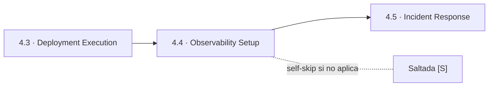
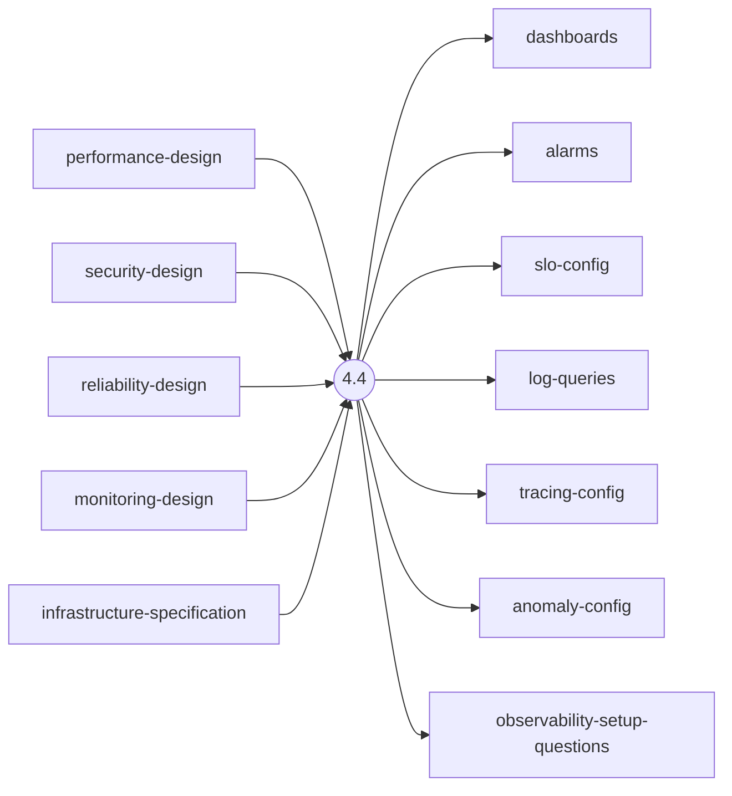
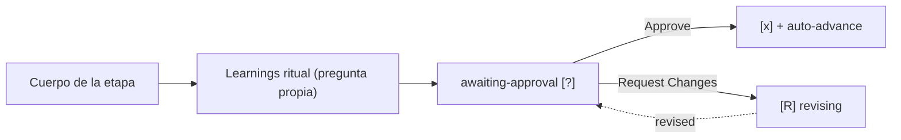

> [Inicio](README) › [Fases](01-fases/README) › [Fase 4 · Operation](01-fases/fase-4-operacion) › **Observability Setup**

# 4.4 · Observability Setup

**CONDITIONAL** · **Fase 4 · Operation** · Lead **operations** · Modo **inline**

> Condición: Execute when monitoring, dashboards, alarms, or tracing need configuration

## Ficha de metadatos

| Campo | Valor |
|---|---|
| Número | **4.4** |
| Fase | Fase 4 · Operation |
| slug | `observability-setup` |
| execution | **CONDITIONAL** |
| lead_agent | `aidlc-operations-agent` |
| mode (topología) | **inline** |
| summary_confirmation | `required` (checkpoint consolidado obligatorio) |
| sensors | `required-sections`, `upstream-coverage` |
| requires_stage | `nfr-design`, `infrastructure-design`, `deployment-execution` |

## Qué hace esta etapa

Etapa CONDITIONAL del Operations Agent: configura la observabilidad operativa — dashboards, alarms, SLOs/SLIs, log queries, tracing y detección de anomalías. Consume los NFR designs (observability-design) y monitoring-design de infra. Golden signals (latency, traffic, errors, saturation) como base. Produce dashboards, alarms, slo-config, log-queries, tracing-config, anomaly-config.

- Consumida por Incident Response (4.5), Performance Validation (4.6) y Feedback (4.7).
- express la retiene (deploy mínimo + observación); classic/workshop también.

## Posición en el flujo

*Posición dentro de Fase 4 · Operation: 4 de 7.*

**Anterior:** [4.3 · Deployment Execution](02-etapas/operation/deployment-execution) · **Siguiente:** [4.5 · Incident Response](02-etapas/operation/incident-response)

## Paso a paso

**Step 1: Load Prior Context** — nfr-design (observability strategy) + infrastructure-design (monitoring-design).

**Step 2: Generate Clarifying Questions** — Golden signals a trackear, SLOs/SLIs, umbrales de alarma, retención de logs.

**Step 3: Generate Artifacts** — Los 6 artefactos de observación (dashboards, alarms, slo-config, log-queries, tracing-config, anomaly-config).

**Steps 4-5: Handoff + Gate** — Learnings + gate.

## Artefactos

| Dirección | Artefactos |
|---|---|
| **produce** | `dashboards`, `alarms`, `slo-config`, `log-queries`, `tracing-config`, `anomaly-config`, `observability-setup-questions` |
| **consume** | `performance-design`, `security-design`, `reliability-design`, `monitoring-design`, `infrastructure-specification` |

## Agentes implicados

- **Lead:** [aidlc-operations-agent](03-agentes/aidlc-operations-agent) — posee los artefactos `produces[]` de la etapa.
- **Conductor:** el orquestador es el bus: los agentes NUNCA se invocan entre sí — solo el conductor delega. Ver [el oficio del conductor](06-maquinaria/conductor).

## Topología y ejecución

**Inline.** El lead corre en la propia sesión del conductor, cargando su persona; los supports (si los hay) son voces que el conductor adopta. Sin contribution files. 29 de las 33 etapas usan esta topología.

## Mecánica del gate

Sin reviewer declarado — el gate es directo:

Reglas de oro: HARD STOP (el conductor termina su turno y espera al humano), NO EMERGENT BEHAVIOR (menús de 2 opciones en Construction/Operation; 3ª opción solo en ideation/inception para recuperar etapas saltadas), y tras 3 ciclos de Request Changes aparece **Accept as-is** (escape hatch). Detalle completo en [ciclo de gate](06-maquinaria/ciclo-de-gate).

## Sensores declarados

| Sensor | dispara en | categoría | qué verifica |
|---|---|---|---|
| `required-sections` | gate | document-shape | Chequea que el output contenga los encabezados H2 requeridos (default: ≥2 H2) o los del template resuelto. |
| `upstream-coverage` | gate | document-shape | Compara la prosa del output con el `consumes:` declarado: cada artefacto upstream debe aparecer referenciado. |

Un sensor `fire_on: gate` corre al entrar el gate; `advisory` solo emite findings; un sensor **blocking** exige pass verificado (o el override respaldado por humano) antes de abrir la gate. Detalle en [sensores](06-maquinaria/sensores).

## En qué scopes ejecuta

**Ejecutan esta etapa:** `classic`, `enterprise`, `express`, `feature`, `infra`, `workshop`

**La saltan:** `bugfix`, `mvp`, `poc`, `refactor`, `security-patch`

Cada scope es una rejilla EXECUTE/SKIP sobre las 33 etapas. Ver [la matriz completa de scopes](05-scopes/README).

## Conexiones

- [Ficha de la Fase 4 · Operation](01-fases/fase-4-operacion)
- [Etapa anterior: 4.3](02-etapas/operation/deployment-execution)
- [Etapa siguiente: 4.5](02-etapas/operation/incident-response)
- [Ficha del lead: aidlc-operations-agent](03-agentes/aidlc-operations-agent)
- [Protocolos que gobiernan la etapa](04-protocolos/README)
