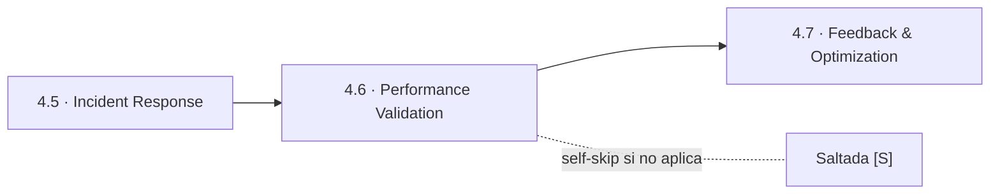
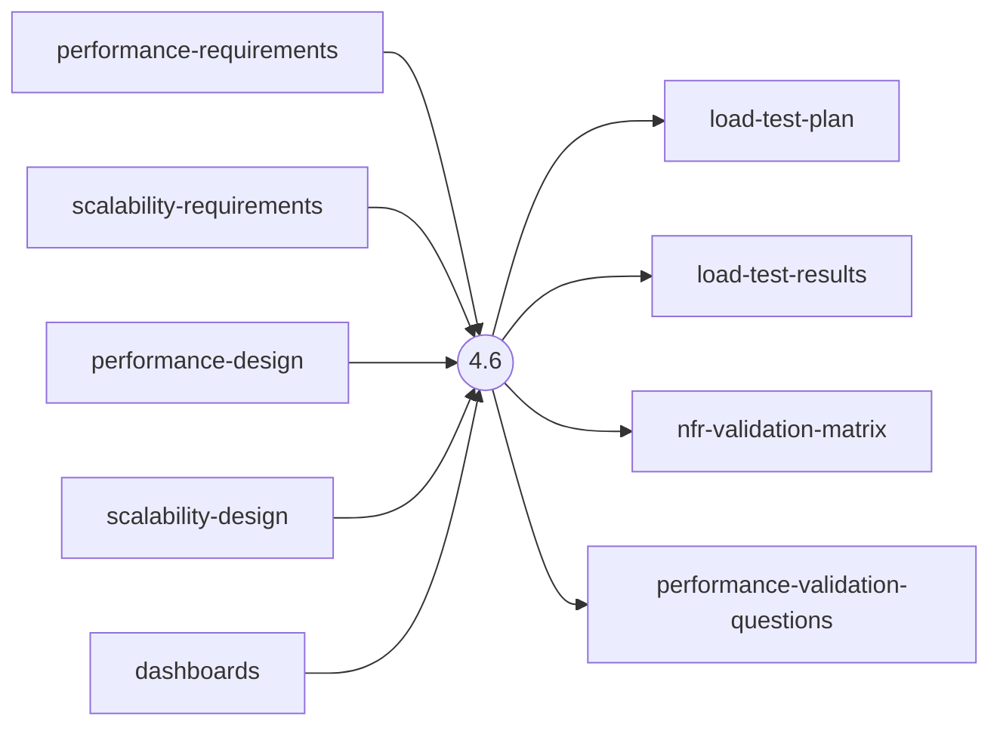
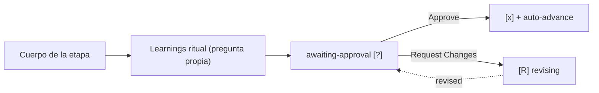

> [Inicio](README) › [Fases](01-fases/README) › [Fase 4 · Operation](01-fases/fase-4-operacion) › **Performance Validation**

# 4.6 · Performance Validation

**CONDITIONAL** · **Fase 4 · Operation** · Lead **quality** · Modo **inline**

> Condición: Execute when NFR performance targets need validation under load

## Ficha de metadatos

| Campo | Valor |
|---|---|
| Número | **4.6** |
| Fase | Fase 4 · Operation |
| slug | `performance-validation` |
| execution | **CONDITIONAL** |
| lead_agent | `aidlc-quality-agent` |
| mode (topología) | **inline** |
| summary_confirmation | `required` (checkpoint consolidado obligatorio) |
| sensors | `required-sections`, `upstream-coverage` |
| requires_stage | `nfr-requirements`, `nfr-design`, `observability-setup` |

## Qué hace esta etapa

Etapa CONDITIONAL del Quality Agent: valida bajo carga los targets de NFR performance definidos en 3.2/3.3. Diseña el load test (patrones de tráfico steady/peak/burst, percentiles objetivo p50/p95/p99), lo ejecuta y produce load-test-plan, load-test-results y la nfr-validation-matrix (target → resultado → pass/fail).

- Un NFR con target medible se cierra aquí con evidencia numérica.

## Posición en el flujo

*Posición dentro de Fase 4 · Operation: 6 de 7.*

**Anterior:** [4.5 · Incident Response](02-etapas/operation/incident-response) · **Siguiente:** [4.7 · Feedback & Optimization](02-etapas/operation/feedback-optimization)

## Paso a paso

**Step 1: Load Prior Context** — nfr-requirements + nfr-design + dashboards.

**Step 2: Generate Clarifying Questions** — Patrones de tráfico esperados, percentiles objetivo, presupuesto de latencia, puntos de ruptura.

**Step 3: Design and Execute Tests** — Load tests según plan; captura de métricas por escenario.

**Step 4: Generate Artifacts** — load-test-plan.md, load-test-results.md, nfr-validation-matrix.md.

**Steps 5-6: Handoff + Gate** — Learnings + gate.

## Artefactos

| Dirección | Artefactos |
|---|---|
| **produce** | `load-test-plan`, `load-test-results`, `nfr-validation-matrix`, `performance-validation-questions` |
| **consume** | `performance-requirements`, `scalability-requirements`, `performance-design`, `scalability-design`, `dashboards` |

## Agentes implicados

- **Lead:** [aidlc-quality-agent](03-agentes/aidlc-quality-agent) — posee los artefactos `produces[]` de la etapa.
- **Conductor:** el orquestador es el bus: los agentes NUNCA se invocan entre sí — solo el conductor delega. Ver [el oficio del conductor](06-maquinaria/conductor).

## Topología y ejecución

**Inline.** El lead corre en la propia sesión del conductor, cargando su persona; los supports (si los hay) son voces que el conductor adopta. Sin contribution files. 29 de las 33 etapas usan esta topología.

## Mecánica del gate

Sin reviewer declarado — el gate es directo:

Reglas de oro: HARD STOP (el conductor termina su turno y espera al humano), NO EMERGENT BEHAVIOR (menús de 2 opciones en Construction/Operation; 3ª opción solo en ideation/inception para recuperar etapas saltadas), y tras 3 ciclos de Request Changes aparece **Accept as-is** (escape hatch). Detalle completo en [ciclo de gate](06-maquinaria/ciclo-de-gate).

## Sensores declarados

| Sensor | dispara en | categoría | qué verifica |
|---|---|---|---|
| `required-sections` | gate | document-shape | Chequea que el output contenga los encabezados H2 requeridos (default: ≥2 H2) o los del template resuelto. |
| `upstream-coverage` | gate | document-shape | Compara la prosa del output con el `consumes:` declarado: cada artefacto upstream debe aparecer referenciado. |

Un sensor `fire_on: gate` corre al entrar el gate; `advisory` solo emite findings; un sensor **blocking** exige pass verificado (o el override respaldado por humano) antes de abrir la gate. Detalle en [sensores](06-maquinaria/sensores).

## En qué scopes ejecuta

**Ejecutan esta etapa:** `classic`, `enterprise`, `feature`, `workshop`

**La saltan:** `bugfix`, `express`, `infra`, `mvp`, `poc`, `refactor`, `security-patch`

Cada scope es una rejilla EXECUTE/SKIP sobre las 33 etapas. Ver [la matriz completa de scopes](05-scopes/README).

## Conexiones

- [Ficha de la Fase 4 · Operation](01-fases/fase-4-operacion)
- [Etapa anterior: 4.5](02-etapas/operation/incident-response)
- [Etapa siguiente: 4.7](02-etapas/operation/feedback-optimization)
- [Ficha del lead: aidlc-quality-agent](03-agentes/aidlc-quality-agent)
- [Protocolos que gobiernan la etapa](04-protocolos/README)
