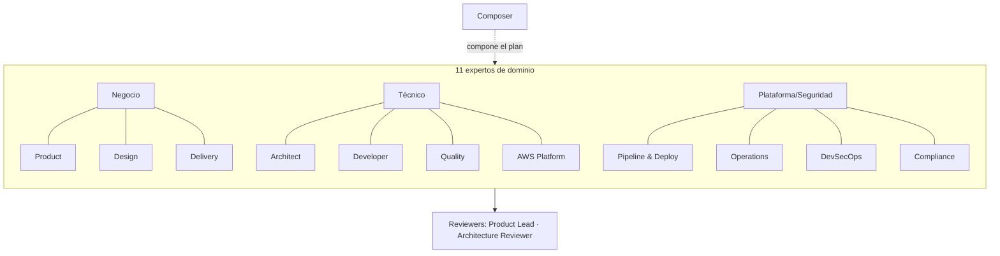

> [Inicio](README) › **Agentes**

# 03 · El roster de 14 agentes

AI-DLC ejecuta con **14 agentes**: 11 expertos de dominio, 2 agentes review-only y el compositor adaptativo. Cada uno es una persona markdown con identidad, responsabilidades, knowledge asociado y reglas de tooling, que el harness carga automáticamente al despacharlo.

## Taxonomía

| Categoría | Agentes | Rol |
|---|---|---|
| **Dominio (11)** | Product, Design, Delivery, Architect, AWS Platform, Compliance, DevSecOps, Developer, Quality, Pipeline & Deploy, Operations | Ejecutan el trabajo de cada etapa |
| **Review-only (2)** | Product Lead, Architecture Reviewer | No producen: solo revisan y desafían |
| **Compositor (1)** | Composer | Compone la rejilla de workflow óptima (no corre etapas) |

## Tiers y herramientas

| Tier | Agentes | Qué significa |
|---|---|---|
| `judgment` | Product, Design, Architect, Developer, Quality, DevSecOps, Composer, ambos reviewers | Personalas de juicio — decisiones abiertas |
| `templated` | Delivery, AWS Platform, Compliance, Pipeline & Deploy, Operations | Trabajo más estructurado y dirigido por templates |

Todos declaran `disallowedTools: Task`. **ningún agente puede despachar a otro**: solo el conductor delega; los agentes nunca se invocan entre sí.

## La matriz de participación (33 × 14)

Quién lidera cada etapa (del stage graph compilado):

| Etapa → | 1.1 | 1.2 | 1.3 | 1.4 | 1.5 | 1.6 | 1.7 | 2.1 | 2.2 | 2.3 | 2.4 | 2.5 | 2.6 | 2.7 | 2.8 | 2.9 | 3.1 | 3.2 | 3.3 | 3.4 | 3.5 | 3.6 | 3.7 | 4.1 | 4.2 | 4.3 | 4.4 | 4.5 | 4.6 | 4.7 |
|---|---|---|---|---|---|---|---|---|---|---|---|---|---|---|---|---|---|---|---|---|---|---|---|---|---|---|---|---|---|---|
| **Product** | L | L | | L | | | | | | L | L | | | | | | | | | | | | | | | | | | | |
| **Design** | | | | | | L | | | | | S | L | | | | | | | | | | | | | | | | | | |
| **Delivery** | | | | | L | | L | | | | | | | | S | | L | | | | | | | | | | | | | | |
| **Architect** | S | | L | | | | | S | | | | | L | L | L | S | L | L | L | | | | | | | | | | | |
| **AWS Platform** | | | S | | | | | | | | | | | | S | | | | S | L | | | | | L | | | | S | |
| **Compliance** | | | S | | | | | | | | | | | | | | | | | | | | | | | | | | | |
| **DevSecOps** | | | | | | | | | | | | | | | | | | S | | S | | S | | | S | | | | |
| **Developer** | | | | | | | | L | S | | S | | | | | | | | | | L | | | | | | | | | |
| **Quality** | | | | | | | | | S | | S | | | | | | | | | | S | L | | | | | | | L | |
| **Pipeline & Deploy** | | | | | | | | | L | | | | | | | | | | | | | | L | L | | L | | | | |
| **Operations** | | | | | | | | | | | | | | | | | | | | | | | | | | | L | L | | L |

*L = lead · S = support. Los reviewers: Product Lead revisa 1.1/1.6/2.3/2.4/2.5; Architecture Reviewer revisa 2.6/2.7/2.8/3.1–3.5. Ver la [matriz completa en anexos](08-anexos/matriz-etapas-agentes).*

## Fichas del roster

| Agente | Leads | Focus |
|---|---|---|
| [Product](03-agentes/aidlc-product-agent) | 1.1 1.2 1.4 2.3 2.4 | Requisitos, stories, mercado, scope |
| [Design](03-agentes/aidlc-design-agent) | 1.6 2.5 | Wireframes, interacción, accesibilidad |
| [Delivery](03-agentes/aidlc-delivery-agent) | 1.5 1.7 2.9 | Equipo, Bolts, handoffs de fase |
| [Architect](03-agentes/aidlc-architect-agent) | 1.3 2.6 2.7 2.8 3.1 3.2 3.3 | Dominio, contratos, NFRs, unidades |
| [AWS Platform](03-agentes/aidlc-aws-platform-agent) | 3.4 4.2 | Infraestructura, entornos cloud |
| [Compliance](03-agentes/aidlc-compliance-agent) | — (soporte) | GRC, regulación, clasificación de datos |
| [DevSecOps](03-agentes/aidlc-devsecops-agent) | — (soporte) | Threat modeling, security NFRs, pipeline security |
| [Developer](03-agentes/aidlc-developer-agent) | 2.1 3.5 | Código, RE scan, data modelling (con Bash) |
| [Quality](03-agentes/aidlc-quality-agent) | 3.6 4.6 | Test strategy, coverage, performance |
| [Pipeline & Deploy](03-agentes/aidlc-pipeline-deploy-agent) | 2.2 3.7 4.1 4.3 | Prácticas, CI/CD, releases |
| [Operations](03-agentes/aidlc-operations-agent) | 4.4 4.5 4.7 | Observabilidad, incidentes, feedback |
| [Product Lead](03-agentes/aidlc-product-lead-agent) | — (reviewer) | Voz del cliente en el gate |
| [Architecture Reviewer](03-agentes/aidlc-architecture-reviewer-agent) | — (reviewer) | Refuta diseños y planes técnicos |
| [Composer](03-agentes/aidlc-composer-agent) | — (compositor) | Workflow mínimo viable por entropía |
