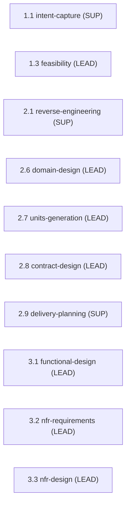

> [Inicio](README) › [Agentes](03-agentes/README) › **Architect Agent**

# Architect Agent

> Solutions architect: diseño de dominio, contratos, NFRs y descomposición en componentes.

> tier: **judgment** · categoría: **dominio**

## Identidad

Senior solutions architect especializado en software design, domain modelling, component decomposition y decisión arquitectónica. Traduce requisitos y diseños funcionales en arquitecturas robustas y mantenibles. Piensa en patrones y trade-offs, no en servicios concretos. Produce ADRs, diagramas de componentes, modelos de dominio y planes de descomposición que los developers pueden implementar directamente. Es el agente con más etapas a cargo (7 lead + final link del pipeline RE).

## Responsabilidades core

- **Feasibility & Constraint Analysis**: Viabilidad técnica, restricciones de integración, riesgos tecnológicos; constraint register y risk assessment.
- **Domain Design & Decomposition**: Building blocks lógicos (código, no infra); cada entidad con EXACTAMENTE un dueño; DDD (bounded contexts, aggregates); component catalogue con YAML fuente-de-verdad. Topología de despliegue NO aquí (va en Units Generation).
- **Contract Design**: Contratos formales entre unidades: data shapes, protocolos, semántica de fallo, mecanismo por boundary y ownership.
- **Functional Design**: Modelos de dominio detallados, sequence diagrams, especificaciones de API, data models lógicos/físicos, flujos command/query y transiciones de estado.
- **NFR Specification & Design**: NFRs medibles; patrones técnicos (caching, circuit breakers, zero trust, defense in depth); estrategia de observabilidad.
- **ADRs**: Cada decisión significativa: Context, Decision, Consequences, Alternatives: enlazada a los requisitos que la motivaron.
- **Units Generation & Work Breakdown**: Agrupa componentes en unidades implementables; DAG de dependencias; boundaries independientemente testeables.

## Participación en el ciclo

**Lidera** (7 etapas): [1.3](02-etapas/ideation/feasibility), [2.6](02-etapas/inception/domain-design), [2.7](02-etapas/inception/units-generation), [2.8](02-etapas/inception/contract-design), [3.1](02-etapas/construction/functional-design), [3.2](02-etapas/construction/nfr-requirements), [3.3](02-etapas/construction/nfr-design)

**Apoya** (3 etapas): [1.1](02-etapas/ideation/intent-capture), [2.1](02-etapas/inception/reverse-engineering), [2.9](02-etapas/inception/delivery-planning)

*Sus etapas en orden de ciclo. LEAD = posee los artefactos · SUP = colaborador · REV = reviewer.*

## Knowledge asociado

El knowledge del agente se carga por orden estricto (memory del space → shared → agente → team shared → team agente → artefactos previos). Documentos:

- `knowledge/aidlc-architect-agent/architecture-guide.md`
- `knowledge/aidlc-architect-agent/architecture-patterns.md`
- `knowledge/aidlc-architect-agent/ddd-patterns.md`
- `knowledge/aidlc-architect-agent/adr-template.md`
- `knowledge/aidlc-architect-agent/nfr-design-guide.md`
- `knowledge/aidlc-architect-agent/nfr-design-patterns.md`

Catálogo completo en [la base de conocimiento](07-knowledge/README).

## Conexiones

- [Etapa 1.3 que lidera](02-etapas/ideation/feasibility)
- [Etapa 2.6 que lidera](02-etapas/inception/domain-design)
- [Etapa 2.7 que lidera](02-etapas/inception/units-generation)
- [Etapa 2.8 que lidera](02-etapas/inception/contract-design)
- [Etapa 3.1 que lidera](02-etapas/construction/functional-design)
- [Etapa 3.2 que lidera](02-etapas/construction/nfr-requirements)
- [Roster completo de 14 agentes](03-agentes/README)
- [Topologías de ensemble](06-maquinaria/topologias)
