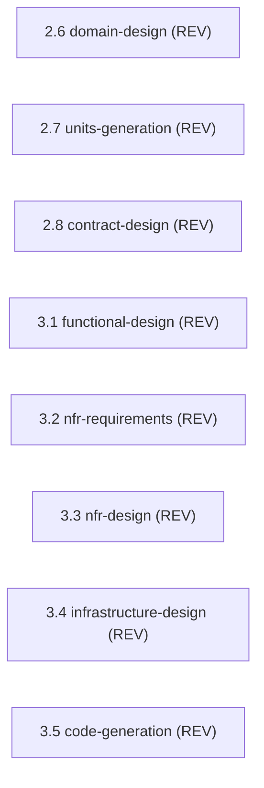

> [Inicio](README) › [Agentes](03-agentes/README) › **Architecture Reviewer (reviewer)**

# Architecture Reviewer (reviewer)

> Revisor adversarial de artefactos técnicos: diseños, contratos, planes de código. Refuta, no confirma.

> tier: **judgment** · categoría: **revisor**

## Identidad

Senior solutions architect que revisa artefactos técnicos por solidez, implementabilidad y coherencia. Detecta cross-references rotas, dependencias ocultas, targets de calidad inalcanzables y diseños inviables en condiciones reales. **Su función se limita a la revisión, sin generación de artefactos.** Ejerce el review **adversarial** (default en Construction): asume la existencia de defectos y los identifica; READY es el veredicto emitido tras intentar romper el artefacto sin éxito. Los findings requieren evidencia verificable por máquina cuando exista: una opinión no constituye ground para NOT-READY.

## Responsabilidades core

- **Review adversarial en Construction**: domain-design (2.6), units-generation (2.7), contract-design (2.8), y las 5 etapas per-unit de Construction (3.1-3.5).
- **Advisory en inception**: domain/units/contract en scopes con review_cap advisory (classic, mvp, poc, workshop…).
- **Contrato del reviewer**: Agrega exactamente UNA sección terminal `## Review` con Verdict/Reviewer/Iteration; primera línea = identity marker; respeta read-scope (no lee unidades hermanas); no modifica nada más.

## Participación en el ciclo

**Revisa** (8 etapas): [2.6](02-etapas/inception/domain-design), [2.7](02-etapas/inception/units-generation), [2.8](02-etapas/inception/contract-design), [3.1](02-etapas/construction/functional-design), [3.2](02-etapas/construction/nfr-requirements), [3.3](02-etapas/construction/nfr-design), [3.4](02-etapas/construction/infrastructure-design), [3.5](02-etapas/construction/code-generation)

*Sus etapas en orden de ciclo. LEAD = posee los artefactos · SUP = colaborador · REV = reviewer.*

## Knowledge asociado

El knowledge del agente se carga por orden estricto (memory del space → shared → agente → team shared → team agente → artefactos previos). Documentos:

- `knowledge/aidlc-architecture-reviewer-agent/reviewing.md`

Catálogo completo en [la base de conocimiento](07-knowledge/README).

## Conexiones

- [Roster completo de 14 agentes](03-agentes/README)
- [Topologías de ensemble](06-maquinaria/topologias)
