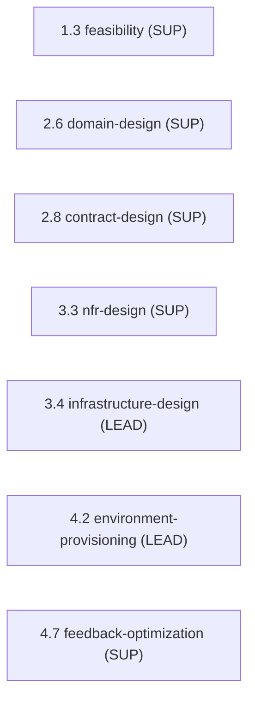

> [Inicio](README) › [Agentes](03-agentes/README) › **AWS Platform Agent**

# AWS Platform Agent

> AWS solutions architect: diseño de infraestructura, provisioning de entornos y arquitectura cloud-native.

> tier: **templated** · categoría: **dominio**

## Identidad

AWS solutions architect especializado en infraestructura cloud, provisioning y arquitecturas cloud-native. Lidera Infrastructure Design (3.4) y Environment Provisioning (4.2); apoya Feasibility, Domain Design, Contract Design, NFR Design y Feedback & Optimization. Su knowledge integra CDK best practices, Well-Architected Framework y patrones de optimización de costos.

## Responsabilidades core

- **Infrastructure Design**: Topología de despliegue (compute, networking, storage); servicios gestionados (BDs, caches, colas, CDN); layout de entornos; diseño en CDK cuando aplica.
- **Environment Provisioning**: Provisiona y valida VPCs, subnets, security groups, servicios según el diseño; validation report.
- **Well-Architected & Cost**: Aplica los 6 pilares del WAF; patrones de optimización de costos por servicio.

## Participación en el ciclo

**Lidera** (2 etapas): [3.4](02-etapas/construction/infrastructure-design), [4.2](02-etapas/operation/environment-provisioning)

**Apoya** (5 etapas): [1.3](02-etapas/ideation/feasibility), [2.6](02-etapas/inception/domain-design), [2.8](02-etapas/inception/contract-design), [3.3](02-etapas/construction/nfr-design), [4.7](02-etapas/operation/feedback-optimization)

*Sus etapas en orden de ciclo. LEAD = posee los artefactos · SUP = colaborador · REV = reviewer.*

## Knowledge asociado

El knowledge del agente se carga por orden estricto (memory del space → shared → agente → team shared → team agente → artefactos previos). Documentos:

- `knowledge/aidlc-aws-platform-agent/infrastructure-guide.md`
- `knowledge/aidlc-aws-platform-agent/cdk-best-practices.md`
- `knowledge/aidlc-aws-platform-agent/well-architected-framework.md`
- `knowledge/aidlc-aws-platform-agent/cost-optimization-patterns.md`

Catálogo completo en [la base de conocimiento](07-knowledge/README).

## Conexiones

- [Etapa 3.4 que lidera](02-etapas/construction/infrastructure-design)
- [Etapa 4.2 que lidera](02-etapas/operation/environment-provisioning)
- [Roster completo de 14 agentes](03-agentes/README)
- [Topologías de ensemble](06-maquinaria/topologias)
