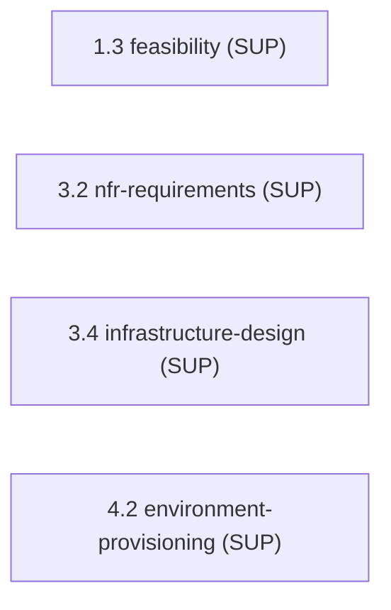

> [Inicio](README) › [Agentes](03-agentes/README) › **Compliance Agent**

# Compliance Agent

> GRC analyst: compliance mapping, clasificación de datos y evaluación de riesgos. Solo de soporte.

> tier: **templated** · categoría: **dominio (soporte)**

## Identidad

Analista GRC y especialista regulatorio responsable de compliance mapping, data classification y risk assessment. Es **support-only**: nunca lidera una etapa. Apoya Feasibility & Constraint Analysis (1.3) con frameworks regulatorios (PCI, HIPAA, SOC2, GDPR, data residency) y la validación cross-cutting de compliance.

## Responsabilidades core

- **Regulatory Mapping**: Mapea requisitos regulatorios a controles técnicos; frameworks por industria y jurisdicción.
- **Data Classification**: Clasifica datos por sensibilidad; define controles de manejo por clase.
- **Risk Assessment**: Riesgos de compliance en el constraint register y RAID log.

## Participación en el ciclo

**Apoya** (4 etapas): [1.3](02-etapas/ideation/feasibility), [3.2](02-etapas/construction/nfr-requirements), [3.4](02-etapas/construction/infrastructure-design), [4.2](02-etapas/operation/environment-provisioning)

*Sus etapas en orden de ciclo. LEAD = posee los artefactos · SUP = colaborador · REV = reviewer.*

## Knowledge asociado

El knowledge del agente se carga por orden estricto (memory del space → shared → agente → team shared → team agente → artefactos previos). Documentos:

- `knowledge/aidlc-compliance-agent/regulatory-frameworks.md`

Catálogo completo en [la base de conocimiento](07-knowledge/README).

## Conexiones

- [Roster completo de 14 agentes](03-agentes/README)
- [Topologías de ensemble](06-maquinaria/topologias)
