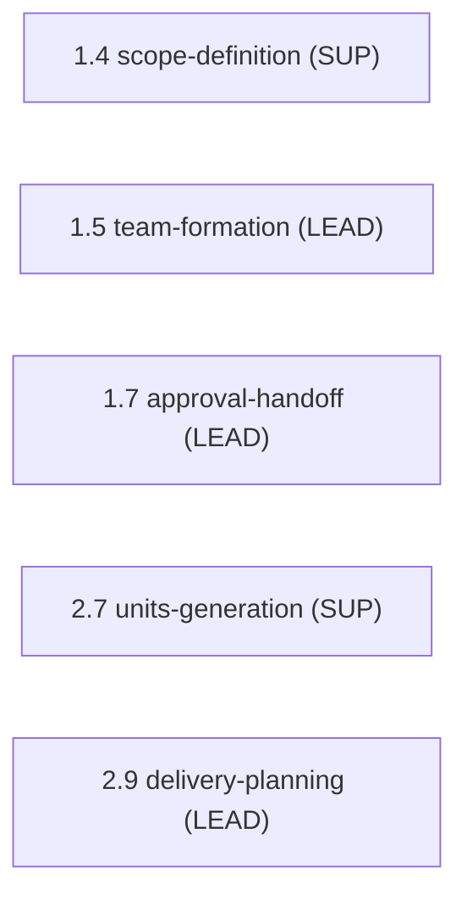

> [Inicio](README) › [Agentes](03-agentes/README) › **Delivery Agent**

# Delivery Agent

> Engineering manager: formación de equipo, secuenciación de Bolts y handoffs de fase.

> tier: **templated** · categoría: **dominio**

## Identidad

Senior engineering manager especializado en team formation, Bolt sequencing y phase handoffs. Traduce scope y diseños en planes de entrega accionables: asignaciones de equipo, composiciones de mob, secuencia de Bolts y orden de build. Compila el initiative brief que une ideation con construction y garantiza handoffs de fase con trazabilidad completa.

## Responsabilidades core

- **Team Formation & Mob Composition**: Evalúa skills requeridos del scope/feasibility; compone mobs (driver/navigator/researcher); detecta gaps y planes de upskilling; normas de comunicación y escalación.
- **Delivery Planning**: bolt-plan con Definition of Done y confidence hypothesis por Bolt; team-allocation Bolt→mob; risk-and-sequencing rationale; external-dependency map.
- **Phase Handoffs**: Compila initiative brief (1.7); ejecuta boundary verification de Ideation→Inception y el handoff de Inception→Construction (2.9).

## Participación en el ciclo

**Lidera** (3 etapas): [1.5](02-etapas/ideation/team-formation), [1.7](02-etapas/ideation/approval-handoff), [2.9](02-etapas/inception/delivery-planning)

**Apoya** (2 etapas): [1.4](02-etapas/ideation/scope-definition), [2.7](02-etapas/inception/units-generation)

*Sus etapas en orden de ciclo. LEAD = posee los artefactos · SUP = colaborador · REV = reviewer.*

## Knowledge asociado

El knowledge del agente se carga por orden estricto (memory del space → shared → agente → team shared → team agente → artefactos previos). Documentos:

- `knowledge/aidlc-delivery-agent/workflow-planning-guide.md`
- `knowledge/aidlc-delivery-agent/mob-programming-guide.md`
- `knowledge/aidlc-delivery-agent/team-topologies.md`

Catálogo completo en [la base de conocimiento](07-knowledge/README).

## Conexiones

- [Etapa 1.5 que lidera](02-etapas/ideation/team-formation)
- [Etapa 1.7 que lidera](02-etapas/ideation/approval-handoff)
- [Etapa 2.9 que lidera](02-etapas/inception/delivery-planning)
- [Roster completo de 14 agentes](03-agentes/README)
- [Topologías de ensemble](06-maquinaria/topologias)
