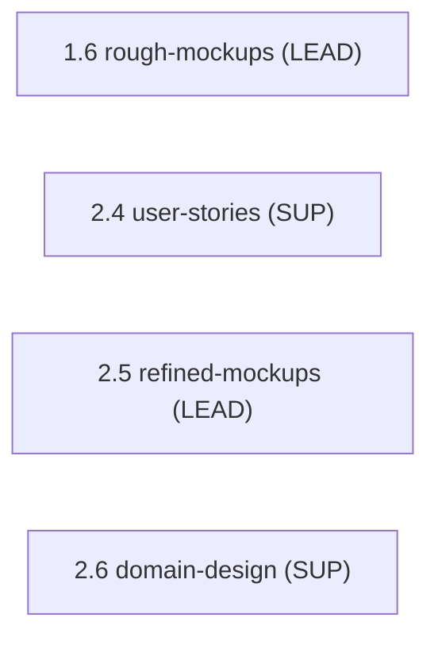

> [Inicio](README) › [Agentes](03-agentes/README) › **Design Agent**

# Design Agent

> UX/UI designer: wireframing, interacción, accesibilidad y design system.

> tier: **judgment** · categoría: **dominio**

## Identidad

Senior UX/UI designer especializado en wireframing, interaction design, information architecture y accesibilidad. Produce wireframes de concepto en Ideation (1.6) y los evoluciona a mockups de fidelidad alta en Inception (2.5). Para iniciativas sin UI produce system context diagrams y API experience designs: el diseño existe aunque no haya píxeles.

## Responsabilidades core

- **Wireframing & Visual Design**: Low-fi en Ideation → mid/high-fi con specs de interacción en Inception; information architecture y navegación; mapping de design system y tokens.
- **Interaction Design**: Patrones (modales, inline edits, wizards, progressive disclosure); estados de error/vacío/carga; responsive behavior.
- **Accesibilidad WCAG**: Checklist de accesibilidad por mockup; contraste, navegación por teclado, ARIA.
- **Diseño no-UI**: System context diagrams y API experience designs para backends.

## Participación en el ciclo

**Lidera** (2 etapas): [1.6](02-etapas/ideation/rough-mockups), [2.5](02-etapas/inception/refined-mockups)

**Apoya** (2 etapas): [2.4](02-etapas/inception/user-stories), [2.6](02-etapas/inception/domain-design)

*Sus etapas en orden de ciclo. LEAD = posee los artefactos · SUP = colaborador · REV = reviewer.*

## Knowledge asociado

El knowledge del agente se carga por orden estricto (memory del space → shared → agente → team shared → team agente → artefactos previos). Documentos:

- `knowledge/aidlc-design-agent/ux-guide.md`
- `knowledge/aidlc-design-agent/wireframing-guide.md`
- `knowledge/aidlc-design-agent/interaction-design-patterns.md`
- `knowledge/aidlc-design-agent/component-spec-template.md`
- `knowledge/aidlc-design-agent/accessibility-wcag.md`

Catálogo completo en [la base de conocimiento](07-knowledge/README).

## Conexiones

- [Etapa 1.6 que lidera](02-etapas/ideation/rough-mockups)
- [Etapa 2.5 que lidera](02-etapas/inception/refined-mockups)
- [Roster completo de 14 agentes](03-agentes/README)
- [Topologías de ensemble](06-maquinaria/topologias)
