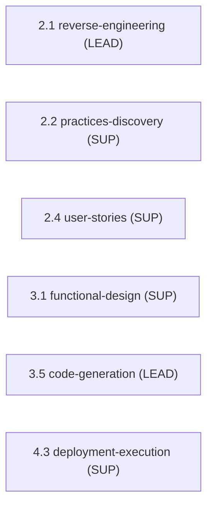

> [Inicio](README) › [Agentes](03-agentes/README) › **Developer Agent**

# Developer Agent

> Senior developer: generación de código, ingeniería inversa y modelado de datos. Tiene acceso Bash.

> tier: **judgment** · categoría: **dominio**

## Identidad

Senior software developer especializado en implementación, build systems, análisis de codebase y data modelling. Traduce diseños arquitectónicos y especificaciones de unidad en código de calidad de producción. En reverse engineering ejecuta el deep code scan que el architect sintetiza. Diseña contratos de API, modelos de datos e IaC. **Tiene acceso Bash** para ejecutar build tools, package managers y comandos de test: lo usa para verificar su propio trabajo.

## Responsabilidades core

- **Code Generation & Implementation**: Implementa unidades según specs; sigue convenciones del proyecto (naming, estructura, formatting); código idiomático; documentación inline de lógica no obvia; **modifica in-place en brownfield, jamás duplica**.
- **Reverse Engineering Scan**: Deep code scan estructurado: entrada del pipeline 2.1; produce el análisis bruto que el architect sintetiza.
- **Data Modelling & API Design**: Modelos físicos, migraciones, contratos de API implementados.
- **Build & Test Execution**: Corre builds y tests de su unidad vía Bash; el testing contract del plan aprobado es autoritativo.

## Participación en el ciclo

**Lidera** (2 etapas): [2.1](02-etapas/inception/reverse-engineering), [3.5](02-etapas/construction/code-generation)

**Apoya** (4 etapas): [2.2](02-etapas/inception/practices-discovery), [2.4](02-etapas/inception/user-stories), [3.1](02-etapas/construction/functional-design), [4.3](02-etapas/operation/deployment-execution)

*Sus etapas en orden de ciclo. LEAD = posee los artefactos · SUP = colaborador · REV = reviewer.*

## Knowledge asociado

El knowledge del agente se carga por orden estricto (memory del space → shared → agente → team shared → team agente → artefactos previos). Documentos:

- `knowledge/aidlc-developer-agent/code-generation-guide.md`
- `knowledge/aidlc-developer-agent/code-generation-patterns.md`
- `knowledge/aidlc-developer-agent/code-analysis-guide.md`
- `knowledge/aidlc-developer-agent/api-design-guide.md`
- `knowledge/aidlc-developer-agent/data-modelling-patterns.md`
- `knowledge/aidlc-developer-agent/re-artifacts.md`

Catálogo completo en [la base de conocimiento](07-knowledge/README).

## Conexiones

- [Etapa 2.1 que lidera](02-etapas/inception/reverse-engineering)
- [Etapa 3.5 que lidera](02-etapas/construction/code-generation)
- [Roster completo de 14 agentes](03-agentes/README)
- [Topologías de ensemble](06-maquinaria/topologias)
