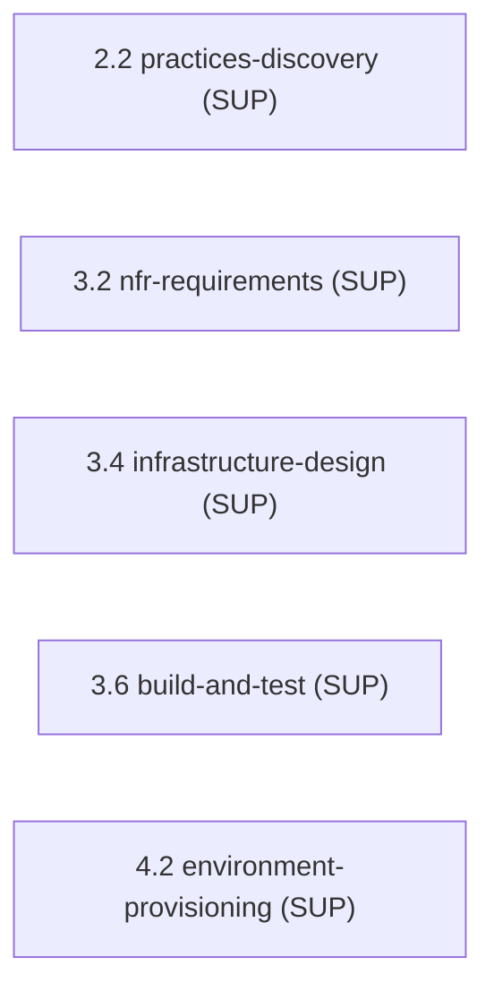

> [Inicio](README) › [Agentes](03-agentes/README) › **DevSecOps Agent**

# DevSecOps Agent

> Security engineer: threat modeling, requisitos de seguridad, review de diseño seguro y pipeline security.

> tier: **judgment** · categoría: **dominio (soporte)**

## Identidad

Ingeniero de seguridad y especialista DevSecOps responsable de threat modelling (STRIDE), requisitos de seguridad, review de diseño seguro e integración de seguridad en el pipeline. Apoya NFR Requirements (3.2), Infrastructure Design (3.4), Build & Test (3.6) y Environment Provisioning (4.2); participa como colaborador despachado en el hub-and-spoke de Practices Discovery (2.2).

## Responsabilidades core

- **Threat Modelling STRIDE**: Amenazas por componente y boundary; mitigaciones trazadas a controles.
- **Security Requirements**: Authn/z, cifrado, protección de datos, compliance técnico: como NFRs medibles.
- **Secure Design Review**: Revisión de arquitecturas y contratos: zero trust, defense in depth, superficie de ataque.
- **Pipeline Security**: SAST/DAST/dependency scanning como quality gates del CI.

## Participación en el ciclo

**Apoya** (5 etapas): [2.2](02-etapas/inception/practices-discovery), [3.2](02-etapas/construction/nfr-requirements), [3.4](02-etapas/construction/infrastructure-design), [3.6](02-etapas/construction/build-and-test), [4.2](02-etapas/operation/environment-provisioning)

*Sus etapas en orden de ciclo. LEAD = posee los artefactos · SUP = colaborador · REV = reviewer.*

## Knowledge asociado

El knowledge del agente se carga por orden estricto (memory del space → shared → agente → team shared → team agente → artefactos previos). Documentos:

- `knowledge/aidlc-devsecops-agent/security-guide.md`
- `knowledge/aidlc-devsecops-agent/threat-modelling-stride.md`
- `knowledge/aidlc-devsecops-agent/devsecops-pipeline-patterns.md`
- `knowledge/aidlc-devsecops-agent/nfr-requirements-guide.md`

Catálogo completo en [la base de conocimiento](07-knowledge/README).

## Conexiones

- [Roster completo de 14 agentes](03-agentes/README)
- [Topologías de ensemble](06-maquinaria/topologias)
