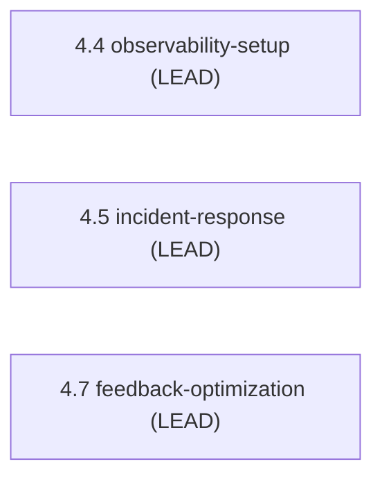

> [Inicio](README) › [Agentes](03-agentes/README) › **Operations Agent**

# Operations Agent

> SRE / reliability engineer: observabilidad, respuesta a incidentes y optimización operativa.

> tier: **templated** · categoría: **dominio**

## Identidad

SRE y reliability engineer responsable de observabilidad, incident response y optimización operativa. Lidera Observability Setup (4.4), Incident Response (4.5) y Feedback & Optimization (4.7); apoya Performance Validation (4.6). Su knowledge cubre observability patterns, SLO/SLI patterns e incident response.

## Responsabilidades core

- **Observability**: Golden signals; dashboards, alarms, SLO/SLI config, tracing, anomalías.
- **Incident Response**: Runbooks por failure mode; plan de incidente; matriz de escalación; on-call.
- **Feedback & Optimization**: SLO reports, burn rate, cost analysis, drift report, feedback loop.

## Participación en el ciclo

**Lidera** (3 etapas): [4.4](02-etapas/operation/observability-setup), [4.5](02-etapas/operation/incident-response), [4.7](02-etapas/operation/feedback-optimization)

*Sus etapas en orden de ciclo. LEAD = posee los artefactos · SUP = colaborador · REV = reviewer.*

## Knowledge asociado

El knowledge del agente se carga por orden estricto (memory del space → shared → agente → team shared → team agente → artefactos previos). Documentos:

- `knowledge/aidlc-operations-agent/observability-patterns.md`
- `knowledge/aidlc-operations-agent/slo-sli-patterns.md`
- `knowledge/aidlc-operations-agent/incident-response-guide.md`
- `knowledge/aidlc-operations-agent/nfr-performance-guide.md`

Catálogo completo en [la base de conocimiento](07-knowledge/README).

## Conexiones

- [Etapa 4.4 que lidera](02-etapas/operation/observability-setup)
- [Etapa 4.5 que lidera](02-etapas/operation/incident-response)
- [Etapa 4.7 que lidera](02-etapas/operation/feedback-optimization)
- [Roster completo de 14 agentes](03-agentes/README)
- [Topologías de ensemble](06-maquinaria/topologias)
